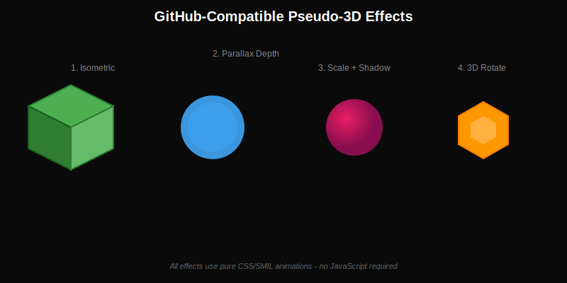
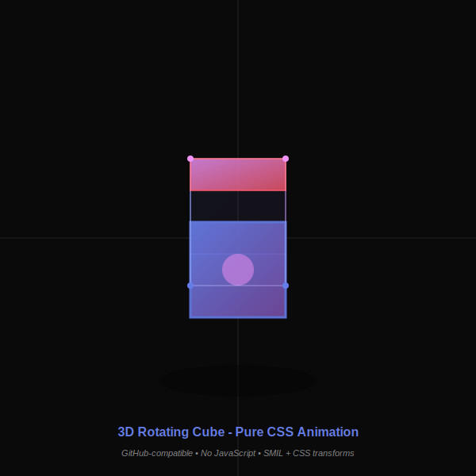
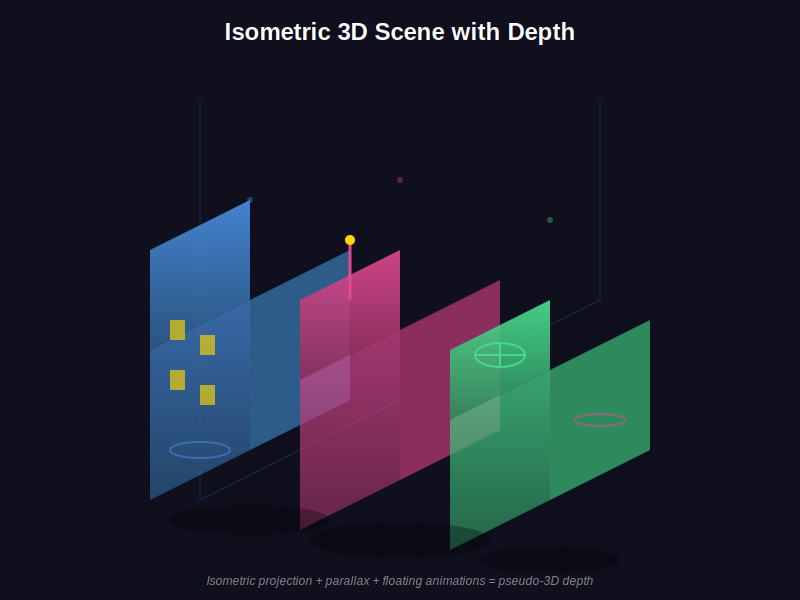

# 🎨 3D SVG Effects Gallery

All animations below are **GitHub-compatible** - they use only CSS and SMIL, no JavaScript.

---

## 1. Overview: All Techniques



This shows four different approaches:
- **Isometric**: Static 3D look using skewed polygons
- **Parallax**: Layers moving at different speeds create depth
- **Scale + Shadow**: Objects appear to move toward/away from viewer
- **3D Rotate**: SMIL rotation with depth shadows

---

## 2. Rotating 3D Cube



Pure CSS `rotateX()` and `rotateY()` transforms create real 3D rotation. Different faces have different opacity to show depth. The shadow beneath scales and fades to enhance the effect.

**Techniques:**
- CSS `@keyframes` with `rotateX()` and `rotateY()`
- Opacity layers for depth perception
- Drop shadows that animate
- Radial gradients for lighting

---

## 3. Isometric City



A complete isometric scene with multiple buildings at different depths. Each building floats independently, and glowing windows pulse at different rates.

**Techniques:**
- Isometric projection (30° angles)
- Staggered float animations
- Pulsing lights for life
- Ground plane grid
- Drop shadows positioned for realism

---

## 🔧 Key Principles

### Depth Through Opacity
Farther objects = more transparent. Simple but effective.

### Shadows = Distance
- Small shadow = far from ground
- Large shadow = close to ground
- Blurry shadow = high above ground

### Isometric Math
```
For isometric projection:
- Top face: skew by 30° and -30°
- Left face: vertical lines + 30° angle
- Right face: vertical lines + -30° angle
```

### Animation Timing
Stagger animation starts using `animation-delay` or SMIL `begin` attribute to create organic movement.

---

## 📚 Technical Details

**What works on GitHub:**
- ✅ CSS animations (`@keyframes`)
- ✅ SMIL animations (`<animate>`, `<animateTransform>`)
- ✅ 3D transforms (`rotateX`, `rotateY`, `rotateZ`)
- ✅ Filters (blur, shadow, lighting)
- ✅ Gradients
- ✅ Transform origins

**What doesn't work:**
- ❌ JavaScript (completely stripped)
- ❌ External resources
- ❌ `<foreignObject>` with HTML
- ❌ True randomness

---

## 💡 Use Cases

These techniques can enhance your profile with:
- **Rotating tech stack badges** (cubes with logos on faces)
- **Isometric architecture diagrams** (show system layers)
- **Floating skill bubbles** (parallax depth)
- **3D project cards** (flip on hover... wait, no hover on GitHub)
- **Depth-based timelines** (events at different Z-depths)

---

**All SVGs in this gallery render directly on GitHub.** No external hosting, no JavaScript, fully compatible.

*Created: 2026-01-29*
