# Daily Doodles

A running gallery of every daily doodle that has appeared at the top of this profile. Generated automatically by the `doodle` job in `.github/workflows/daily-highlights.yml`. Only the section between the `<!-- DOODLE-GALLERY:START -->` and `<!-- DOODLE-GALLERY:END -->` markers below is rewritten by automation — everything else (this header, the **Pinned** section) is hand-curated and stays put.

Today's doodle is shown live at the top of [README.md](./README.md). The moment a new run archives it, it gets a permanent slot in the gallery below. The SVG files themselves are stored under [`doodle-archive/`](./doodle-archive/).

## Pinned

---

## Gallery

Newest first. Multiple entries on the same date are intentional — every run that archives a live doodle prepends its own entry, so a single calendar day can hold more than one when the workflow fires more than once.

<!-- DOODLE-GALLERY:START -->
## August 10, 2026 — Smithsonian Institution — 180th Anniversary (August 10, 1846)

About this doodle

On 10 August 1846, President James K. Polk signed the Act of Congress establishing the Smithsonian Institution, funded by the surprise bequest of English scientist James Smithson — a man who never set foot in the United States — with the charge "for the increase and diffusion of knowledge." The red-sandstone "Castle" on the National Mall, in Norman Revival style, opened its doors in 1855; today the Institution stewards 21 museums, the National Zoo, and roughly 157 million objects. 180 years today.

A twilight tableau: a silhouette of the Castle rises against a warm-purple-to-amber sky, its arched windows glowing, its towers crenellated. Specimens — a T. rex, a rocket, an atom, a butterfly — drift steadily upward from the roofline into the dark sky, the visible act of knowledge diffusing outward. On the right, a large AUGUST 10, 2026 headline anchors a SMITHSONIAN subhead, chartering data, and the Smithson bequest as caption.

---

## August 10, 2026 — Perseid Meteor Shower — approaching peak (August 9, 2026)

About this doodle

The Perseid meteor shower, active mid-July through late August, approaches its 2026 peak on August 11–13, when up to ~100 meteors per hour streak from a radiant in the constellation Perseus. The debris trail belongs to comet Swift–Tuttle, whose fragments hit the atmosphere at 59 km/s.

A night-sky tableau: the stars of Perseus picked out over a twinkling starfield, with meteors continually streaking down and away from the marked radiant. On the right, a large AUGUST 9, 2026 headline over a PERSEIDS subhead, shower-status tertiary lines, and the caption "wishes falling from Perseus."

---

## August 9, 2026 — Netscape Communications IPO (August 9, 1995)

About this doodle

31st anniversary. On 9 August 1995 Netscape went public on NASDAQ (ticker NSCP): priced at $28, opened at $71, closed the day at $58.25, valuing a 16-month-old company that had never turned a profit at $2.2 billion — the moment web tech became public capital markets and the dot-com era started. Founders: Jim Clark and Marc Andreessen (who had co-authored NCSA Mosaic at UIUC).

Composition on the 800x200 canvas: on the left half, a retro Netscape Navigator 90s browser window (light-grey chrome, red/yellow/green Mac-style traffic lights, Back/Fwd/Reload/Home button row, URL bar reading "http://home.netscape.com/", and in the upper-right the signature big-N badge with a small white meteor continually shooting across it — the throbber that meant "loading"). Inside the window: a green stock-chart line rockets from $28 up to a $58.25 peak, with dotted price gridlines, an axis labelled OPEN 28 / HIGH 74 / CLOSE 58.25, and an ascending trail of tiny green triangles. A dashed orbital-style progress dot travels along the chart line. On the right, a huge cream AUGUST 9, 2026 headline underlined by a green-to-cream sweep, a Netscape-green NETSCAPE IPO subhead followed by cream · 31 YEARS, italic amber tertiary NSCP · NASDAQ · 9 AUGUST 1995 · $2.2B, dim-cyan tertiary CLARK · ANDREESSEN · MOSAIC · MOZILLA, and a Georgia-italic caption "the day the web went public" with a blinking Navigator-N cursor at the base.

---

## August 9, 2026 — International Cat Day (August 8, 2026)

About this doodle

Recognized annually on 8 August since 2002 (originally by the International Fund for Animal Welfare).

Composition on the 800x200 canvas: on the left half, a night-sky tableau — a big warm-cream full moon glows behind a silhouetted black cat sitting in profile on a rooftop, gazing up-left toward the moon; the cat's tail slowly swishes, its eyes blink, its whiskers twitch; a soft cream halo rings the moon, faint craters shade its face, and a few small stars twinkle across the sky; fireflies drift upward through the scene. On the right, a huge cream AUGUST 8, 2026 headline underlined by a warm pink-to-amber sweep, a hot-pink INTERNATIONAL CAT DAY subhead with a small pink paw glyph, italic amber tertiary SATURDAY · 8 AUGUST · MEOW · SINCE 2002, dim-green tertiary WHISKERS · MOONGAZING · NINE LIVES · PURR, and a Georgia-italic caption "In ancient times cats were worshipped as gods; they have not forgotten this." — Terry Pratchett — at the base.

---

## August 8, 2026 — Explorer 6 — First Photograph of Earth from Orbit (August 7, 1959)

About this doodle

NASA's Explorer 6 satellite launched from Cape Canaveral atop a Thor-Able III on 7 August 1959 and later that month transmitted the first crude photographic images of Earth from orbit, sent back as slow-scan facsimile — a "look back at ourselves" moment that predated Apollo 8's Earthrise by nearly a decade. 67 years today. The spacecraft's signature was its four-paddle "windmill" solar array.

Composition on the 800x200 canvas: on the left half, a black-of-space tableau — a large curved Earth limb arcs across the bottom-left (deep-blue oceans, muted khaki continents, drifting white cloud wisps, a soft cyan atmospheric glow crowning the rim); above the horizon in orbit hangs the small silhouette of Explorer 6 with its four solar paddles slowly rotating, tethered to a dashed orbital arc; a translucent cyan facsimile scan-line sweeps slowly down the whole canvas, echoing the slow-scan transmission of the first photo; a faint star field twinkles behind. On the right, a huge cream AUGUST 7, 2026 headline underlined by a sweeping cyan-to-green orbital bar, a cyan EXPLORER 6 subhead followed by cream · 67 YEARS, italic amber tertiary FIRST PHOTO OF EARTH · NASA · 7 AUGUST 1959, dim-green tertiary CAPE CANAVERAL · SLOW-SCAN · SOLAR PADDLES, and a Georgia-italic caption "we looked back at ourselves" at the base.

---

## August 7, 2026 — World Wide Web — 35th Anniversary of the Public Announcement (August 6, 1991)

About this doodle

On 6 August 1991 Tim Berners-Lee posted a short summary of the WorldWideWeb project to the alt.hypertext Usenet newsgroup, marking the first public announcement of the WWW; the first public website, info.cern.ch, was also served from a NeXT workstation at CERN that same period.

His 1989 proposal to CERN carried the famous marginal note from his boss Mike Sendall: "Vague, but exciting…" Composition on the 800x200 canvas: on the left half, a hypertext web-of-pages tableau — a slightly-larger central "info.cern.ch" paper node connected by animated blue hyperlink lines to five smaller paper nodes scattered around it, each holding a couple of cream text lines and one underlined-blue link, with tiny bright packets continually traveling along the connection lines; a faint dot-field twinkles behind. On the right, a huge cream AUGUST 6, 2026 headline underlined by a swept blue hyperlink bar, a blue underlined WORLD WIDE WEB subhead followed by cream · 35 YEARS, italic amber tertiary TIM BERNERS-LEE · CERN · 6 AUGUST 1991 · alt.hypertext, dim-cyan tertiary HYPERTEXT · HTTP · HTML · URI, and a Georgia-italic caption "Vague, but exciting…" with a blinking cursor at the base.

---

## August 6, 2026 — The Beatles' Revolver — 60th Anniversary (August 5, 1966)

About this doodle

Their seventh studio album, released by Parlophone on 5 August 1966, that closed the "touring years" and opened Beatles psychedelia: tape loops, artificial double-tracking, reversed guitars, Indian classical instruments, and studio-as-instrument techniques.

Signature tracks: "Eleanor Rigby," "Tomorrow Never Knows," "Taxman," "Yellow Submarine." Composition on the 800x200 canvas: on the left third, a large black vinyl LP with a magenta Parlophone-style center label spins continuously; behind and around the record, two concentric layers of kaleidoscopic elliptical petals in hot-pink/orange/teal/yellow/lavender rotate slowly in opposite directions; a stylized tone-arm angles in from the upper-right onto the record's edge; small psychedelic dots drift upward through the whole background. On the right, a huge cream AUGUST 5, 2026 headline underlined by a teal sweep, a hot-pink REVOLVER subhead trailed by teal · 60 YEARS, italic amber tertiary THE BEATLES · PARLOPHONE · 5 AUGUST 1966, dim-lavender tertiary TAPE LOOPS · SITAR · BACKMASKING · STUDIO AS INSTRUMENT, and a Georgia-italic quote "Turn off your mind, relax and float downstream" at the base.

---

## August 5, 2026 — U.S. Coast Guard Day (August 4, 1790)

About this doodle

236th anniversary of the founding of the Revenue Cutter Service by Treasury Secretary Alexander Hamilton, the direct precursor to the U.S. Coast Guard. Motto: Semper Paratus ("Always Ready").

Composition: a night-sea tableau on the 800x200 canvas. Dark navy sky gradient with a faint warm horizon glow along the sea line. On the left, a small silhouetted rocky islet supports a tall red-and-white-banded lighthouse; a bright golden lantern room at the top emits a wide beam that slowly swings across the upper-left sea/sky (kept out of the right-hand text column), with the beam fading softly with distance and the lamp itself pulsing. Small stars twinkle in the sky. Three horizontally-offset layers of stylized ocean waves undulate at the bottom of the frame. A tiny Coast Guard cutter with the signature red-and-blue racing stripe rides the middle wave line at mid-canvas, bobbing gently. On the right, a huge cream AUGUST 4, 2026 headline, a red U.S. COAST GUARD subhead followed by a white · 236 YEARS, italic tertiary lines FOUNDED 4 AUGUST 1790 · REVENUE CUTTER SERVICE and ALEXANDER HAMILTON · SEMPER PARATUS, and a Georgia-italic caption "So others may live" at the base.

---

## August 4, 2026 — Louis Armstrong's 125th Birthday (August 4, 1901)

About this doodle

Born 4 August 1901 in New Orleans, Louis "Satchmo" Armstrong transformed jazz with his virtuoso trumpet playing, gravelly vocals, and popularization of scat singing. Signature recordings: "West End Blues" (1928), "What a Wonderful World" (1967), "Hello, Dolly!" (1964).

Composition: a warm jazz-club tableau on the 800x200 canvas. Dark night background with a warm amber radial glow spilling from the left. A huge golden trumpet bell viewed head-on occupies the left third (a bright gold rim, a flared inner cone shading from gold through burnt-orange down to a dark tube throat, with a warm rim-light arc top-left). Three staggered gold sound-wave rings continually expand outward from the bell. Golden musical notes (eighth notes and a beamed pair, drawn as SVG paths so they render without font-dependent glyphs) drift up and rightward from the bell mouth, staying clear of the text column. On the right, a huge cream AUGUST 4, 2026 headline, a warm-gold LOUIS ARMSTRONG · 125 YEARS subhead with an underline sweeping right to left, italic tertiary lines SATCHMO · NEW ORLEANS · 4 AUGUST 1901 and TRUMPET · SCAT · "WHAT A WONDERFUL WORLD", and a Georgia-italic quote at the base.

---

## August 4, 2026 — TRS-80 Model I Launch (August 3, 1977)

About this doodle

49 years ago today Tandy/Radio Shack announced the TRS-80 Model I, one of the first mass-market personal computers. Zilog Z80 CPU at 1.77 MHz, 4KB RAM, Level I BASIC in ROM, cassette-tape storage, an integrated 12-inch black-and-white monitor and chiclet keyboard. Nicknamed the "Trash-80" by detractors and beloved by an early generation of home hobbyists.

Composition: the entire 800x200 canvas is rendered as the phosphor screen of a chunky beige CRT terminal — a cream-beige plastic bezel wraps the whole frame with a deeper chin at the bottom, inside which sits a very dark green-black phosphor screen. On the left, a small MODEL I header sits above a Level II BASIC listing that types itself out line-by-line and loops (10 CLS / 20 PRINT "HELLO, WORLD." / 30 GOTO 20 / RUN / cascading HELLO WORLD outputs / BREAK IN 20 / READY / blinking cursor). On the right, a huge phosphor-green AUGUST 3, 2026 headline, a bright phosphor TRS-80 · 49 YEARS subhead, italic TANDY / RADIO SHACK · 3 AUGUST 1977 tertiary and MODEL I · Z80 @ 1.77 MHZ · 4KB RAM · LEVEL I BASIC secondary tertiary. A rolling scanline drifts down the whole screen; densely-packed horizontal scanlines overlay everything; a subtle CRT vignette darkens the corners; the "READY" prompt has a blinking cursor.

---

## August 3, 2026 — Einstein–Szilárd Letter to FDR (August 2, 1939)

About this doodle

87 years ago today, Albert Einstein signed the letter drafted by Leo Szilárd warning President Franklin D. Roosevelt that recent uranium fission research made it "conceivable... that extremely powerful bombs of a new type may... be constructed." Delivered by Alexander Sachs in October 1939, the letter led directly to the Advisory Committee on Uranium and ultimately the Manhattan Project.

A composed tableau on an 800x200 canvas: on the left, a slightly-tilted cream sheet of stationery dated "August 2nd, 1939" with a letterhead, salutation, several typed body lines, and a cursive "A. Einstein" signature that writes itself in from left to right; superimposed over the paper is a translucent atomic-orbit motif — an amber-gold pulsing nucleus at the center with three cyan/green/pink orbital ellipses continuously rotating and electrons tracing them — with chain-reaction pulses expanding outward from behind. On the right, a huge cream AUGUST 2, 2026 headline, an amber EINSTEIN–SZILÁRD LETTER · 87 YEARS subhead, and italic 2 AUGUST 1939 · TO F.D. ROOSEVELT · URANIUM CHAIN REACTION · MANHATTAN PROJECT PRECURSOR tertiary. Background deep navy #050810.

---

## August 2, 2026 — 94th Anniversary of the Positron Discovery (August 2, 1932)

About this doodle

On August 2, 1932, at Caltech, Carl D. Anderson photographed a curving track in his cloud chamber that could only be explained by a positively-charged particle with the mass of an electron. It was the first observed particle of antimatter, confirming Dirac's 1928 prediction. Anderson would win the 1936 Nobel Prize in Physics for the discovery.

A cloud-chamber tableau on an 800x200 canvas: on the left, a rectangular slate-grey glass cloud chamber viewed head-on with a subtle wet-glass sheen; through the chamber, a bright white cosmic-ray track descends and hits a horizontal lead plate midway down; below the plate the track splits into two mirror-image curves — an electron curving left and a positron curving right in opposite directions in the magnetic field (a horizontal "×" of B-field arrows drifts behind); faint vapor-trail whorls drift in the chamber, thin blue arrows mark the field direction and pale radial ticks mark an angular scale; a small labeled tag "e⁻" and "e⁺" sits beside each track. On the right, a huge cream AUGUST 2, 2026 headline, a bright cyan THE POSITRON · 94 YEARS subhead, and italic CARL D. ANDERSON · CALTECH · 2 AUGUST 1932 · FIRST ANTIMATTER tertiary. Continuously animated: cosmic rays enter and split repeatedly, tracks glow and fade, field arrows drift, chamber vapor swirls, headline shimmers faintly. Background #050a12.

---

## August 2, 2026 — Perseid Meteor Shower — Active mid-July through late August 2026, peaking August 11–13

About this doodle

peaks Aug 11–13. On Aug 2 the shower is ramping up. Meteors appear to radiate from the constellation Perseus (northeastern sky before dawn).

A night-sky tableau on an 800x200 canvas: an inky navy-to-cobalt gradient sky with a low silhouetted horizon of coniferous treetops along the bottom; a Milky Way band of soft cyan/violet nebulosity drifts through the upper half; the Perseus constellation is drawn as small linked star-points at the left with a labeled cluster; a bright golden RADIANT star sits at the top-left with faint concentric halo rings; five to seven meteors streak diagonally down-right across the sky at staggered intervals, each a bright white head trailing a tapered cyan/gold tail with a soft glow; softer star pinpricks twinkle throughout; on the right, a huge cream AUGUST 2, 2026 headline sits above a gold PERSEID METEOR SHOWER subhead and an italic PEAKS AUG 11–13 · SWIFT-TUTTLE · RADIANT: PERSEUS tertiary. Continuously animated: meteors loop with staggered begins, radiant halo pulses, stars twinkle, Milky Way slowly drifts. Background #050915.

---

## August 2, 2026 — World Wide Web Day (August 1)

About this doodle

Observed annually to celebrate the World Wide Web, the hypertext system invented by Tim Berners-Lee at CERN in 1989–1991. The first web browser (WorldWideWeb) and the first web page (info.cern.ch) opened the door to a globally-linked hypertext. This doodle is a NeXT-era, wireframe-globe homage: on the left, a slowly-rotating cyan/magenta wireframe globe threaded with glowing hyperlink connection arcs and pulsing packet dots; behind it, a faint blueprint grid evoking the CERN proposal era; oversized cyan angle brackets frame the center; on the right, a HUGE cream AUGUST 1, 2026 headline, a cyan WORLD WIDE WEB DAY subhead, and italic HTTP · HTML · URL · CERN · 1991 tertiary. Palette: bg #0a0e1a, grid #12233a, cyan #00d4ff, magenta #ff5edb, mint #7fffd4, cream #f5efd8. Continuously animated: globe rotates, packet dots pulse and travel arcs, angle brackets breathe, blinking terminal cursor after the tertiary line, scanline overlay drifts.

---

## August 1, 2026 — MTV's 45th Anniversary (August 1, 1981 — August 1, 2026)

About this doodle

MTV launched at 12:01 AM ET on August 1, 1981 with the words "Ladies and gentlemen, rock and roll" and the first music video ever aired: "Video Killed the Radio Star" by The Buggles. Its launch identity — a Neil-Armstrong-esque astronaut planting a flag on the Moon, the flag bearing the block-M / spray-painted TV MTV logo — became one of the most recognizable pieces of 1980s visual iconography.

A moon-landing tableau on an 800x200 canvas: on the left, a dark grey pockmarked lunar horizon with a silhouetted astronaut in a bulky spacesuit and reflective gold visor planting a tall flagpole, the flag itself a rippling MTV banner in hot pink; a rocky Earth-orange planet crescent hangs low; scattered white stars twinkle over an inky navy sky; on the right, a huge MTV logo built from a chunky pop-art block "M" in cyclable neon (hot pink → cyan → yellow → lime) with a spray-painted / graffiti TV pasted across its lower right; below it, a large cream AUGUST 1, 2026 headline; a hot-pink MTV · 45 YEARS subhead; italic 1 AUGUST 1981 · "VIDEO KILLED THE RADIO STAR" · THE BUGGLES tertiary; horizontal retro scanline overlay across the whole frame. Palette: bg #0a0a1e, moon #3a3a44 / #1a1a22, astronaut #1a1a20 / gold visor #f5c04a, hot-pink #ff2d9c, cyan #00e5ff, yellow #ffd93d, lime #b6ff3d, cream #f5efd8.

---

## July 31, 2026 — System Administrator Appreciation Day (Last Friday of July — July 31, 2026)

About this doodle

Created by Ted Kekatos in 2000, SysAdmin Appreciation Day honors the people who keep servers up, backups fresh, pagers silent, and the internet's plumbing intact.

A server-room tableau on an 800x200 canvas: on the left, a tall dark server rack full of 1U units with blinking green, amber, and red status LEDs; a slate-blue ethernet cable arcs out of the rack and drapes over the top into a large glowing CRT terminal that fills the right two-thirds of the frame; bright data-pulse packets travel along the cable; on the CRT, monospaced phosphor-green terminal prompts ("$ date", "$ echo ...") sandwich a huge cream JULY 31, 2026 headline and a phosphor-green SYSADMIN APPRECIATION DAY subhead, over a subtle scanline overlay; a blinking cursor pulses at the last prompt. Palette: bg #0d1117, rack #1a1a1a, phosphor-green #39d353, bright-green #00ff41, amber #f2c94a, warm-red #ff6b6b, slate-blue #2a4a8a, cream #f5efd8.

---

## July 30, 2026 — 96th Anniversary of the First FIFA World Cup Final (July 30, 1930)

About this doodle

Uruguay 4, Argentina 2 at Estadio Centenario in Montevideo. Uruguay hosted, and won on home soil, the inaugural FIFA World Cup. Only 13 national teams participated. Stadium capacity ~93,000.

A stadium-night tableau on an 800x200 canvas: on the left, a large slowly-rotating black-and-white 1930s panel football with a warm rim-light and cast glow; behind it, a silhouetted crescent of the Estadio Centenario's arched stands with pinpoint golden crowd lights and a lit floodlight tower; wide sky-blue horizontal bands (Uruguay flag palette) sit as a background chorus; a small gold Jules Rimet-style trophy silhouette rises to the right of the ball; sky-blue and gold confetti drift down through the frame; a large cream JULY 30, 2026 headline dominates the right; a sky-blue FIRST WORLD CUP FINAL · 96 YEARS subhead; italic MONTEVIDEO · 30 JULY 1930 · URUGUAY 4 · ARGENTINA 2 · ESTADIO CENTENARIO tertiary. Palette: cobalt-night #0a1428, deep-navy #10203f, stadium-blue #1e3a6e, uruguay-blue #59b7e8, cream #f5efd8, ball-black #0a0a0a, trophy-gold #f2c94a, warm-gold #d4a94a.

---

## July 29, 2026 — International Tiger Day (established 2010 Saint Petersburg Tiger Summit)

About this doodle

Established at the 2010 Saint Petersburg Tiger Summit, observed annually on July 29 to raise awareness of tiger conservation. When founded, an estimated ~3,200 wild tigers remained across their range (down from ~100,000 a century earlier). The TX2 initiative committed 13 tiger-range countries to doubling that number.

A jungle-noir tableau on an 800x200 canvas: on the left, a large stylized tiger head emerges from banded shadows — glowing amber eyes, black nose, sweeping black stripes on ember-orange fur; the head is enclosed by a subtle circular emblem ring; midground behind the tiger is a curtain of dark bamboo stalks with pale bamboo leaves; low jungle mist rolls across the bottom; scattered fireflies drift up through the frame; on the right, a large amber JULY 29, 2026 headline dominates; beneath it, an ember-orange INTERNATIONAL TIGER DAY subhead; italic PANTHERA TIGRIS · TX2 · 2010 SAINT PETERSBURG SUMMIT tertiary. Palette: jungle-night #050e0a, deep-forest #0d2018, ember-orange #ff8c1a, warm-amber #ffb347, cream #fff2d6, black-stripe #0a0a0a, bamboo-pale #d9e6c8.

---

## July 29, 2026 — Vincent van Gogh — 136 Years (died July 29, 1890, Auvers-sur-Oise)

About this doodle

Vincent van Gogh died on July 29, 1890, in Auvers-sur-Oise, France, at age 37. In the last ten weeks of his life he painted at a fever pitch, including "Wheatfield with Crows" and "Portrait of Dr. Gachet." His masterpiece "The Starry Night" was painted in June 1889 from the barred window of the Saint-Paul-de-Mausole asylum in Saint-Rémy-de-Provence.

A Starry Night homage on an 800x200 canvas: a deep cobalt-and-indigo sky whipped with concentric painterly spiral brushstrokes forming two churning wind-currents across the upper half; a large crescent-moon-and-sun luminary in warm cadmium yellow at the upper right with radiating short brushstrokes; a scatter of eight-armed haloed stars distributed across the sky; a tall blue-black cypress flame rising along the left edge; a small silhouetted village with a spired church nestled at the base under the swirls; a warm-yellow JULY 29, 2026 headline in the lower right; cream VINCENT VAN GOGH · 136 YEARS subhead; italic AUVERS-SUR-OISE · 29 JULY 1890 · THE STARRY NIGHT tertiary. Palette: deep cobalt #1e3a8a, indigo #0f1a4a, midnight #050a1e, cadmium yellow #ffcf40, warm yellow #ffe066, cream #fff4c9, cypress green-black #0a1a12.

---

## July 29, 2026 — NASA's 68th Anniversary (National Aeronautics and Space Act, July 29, 1958)

About this doodle

On July 29, 1958, President Dwight D. Eisenhower signed the National Aeronautics and Space Act, establishing the National Aeronautics and Space Administration (NASA) from the predecessor NACA. The agency began operations October 1, 1958. In the 68 years since, it has put humans on the Moon (Apollo 11, 1969), landed rovers on Mars (Sojourner 1997, Curiosity 2012, Perseverance 2021), flown the Voyager probes past the outer planets and out of the heliosphere, deployed Hubble (1990) and JWST (2021), and orbited the ISS continuously since 2000. A cosmic tableau on a deep-space backdrop: on the left, an evocative circular mission-patch emblem (deep navy disc, tilted white orbit ellipse, cream stars, a curving red vector swoosh nodding to the agency's insignia), rimmed by a thin gold border and haloed by a faint nebular glow; a small planet-dot travels the tilted orbit; a slim white-and-yellow rocket streaks diagonally up-right trailing a luminous contrail; a scatter of twinkling stars fills the background; a small cross-section of tick marks reads like a launch-count strip along the bottom; a big cream JULY 29, 2026 headline dominates the right side; a red NASA · 68 YEARS OF EXPLORATION subhead; italic NATIONAL AERONAUTICS AND SPACE ACT · 29 JULY 1958 · EISENHOWER tertiary; T-MINUS ZERO · APOLLO · VOYAGER · HUBBLE · JWST · PERSEVERANCE stamp. Palette: deep space #0d1117, navy #0b3d91, mission red #fc3d21, cream #f4efdc, star white #ffffff, orbit silver #cfd8e5, contrail warm gold #ffcf70, faint nebula magenta #4a2266.

---

## July 29, 2026 — Marcel Duchamp's 139th Birthday (born July 28, 1887, Blainville-Crevon)

About this doodle

in Blainville-Crevon, Normandy, France. French-American Dada / conceptual artist whose readymades (Bicycle Wheel, 1913; Fountain, 1917) and cubo-futurist canvas Nude Descending a Staircase, No. 2 (1912) blew the doors off what could be called art. A Dada-museum tableau: a sepia-toned gallery-paper backdrop with a faint blueprint grid; on the left, Duchamp's Bicycle Wheel readymade — a wooden four-legged stool with an inverted bicycle-wheel bolted to its seat, spinning slowly; in the middle, Nude Descending a Staircase rendered as five cascading angular cubist figures stepping diagonally down-right across a stair-line; a hand-lettered R. MUTT 1917 signature scrawl floats near the wheel as a wink to Fountain; scattered geometric confetti drifts across the frame; a big ivory JULY 28, 2026 headline dominates the upper right; a brick-red MARCEL DUCHAMP · 139 YEARS subhead; italic NUDE DESCENDING A STAIRCASE · BLAINVILLE · 28 JULY 1887 · DADA tertiary. Palette: near-black #0d1117, gallery sepia #d4b896, warm cream #f0e4c8, ochre #b8860b, burnt umber #6b3510, brick red #a04030, ivory #f4efdc, muted teal #5a8080, wheel spoke steel #cfc8b8.

---

## July 28, 2026 — 86th Anniversary of Bugs Bunny's Debut in "A Wild Hare" (released July 27, 1940)

About this doodle

"A Wild Hare" (Warner Bros / Merrie Melodies, directed by Tex Avery) released July 27, 1940. The first officially-recognized Bugs Bunny cartoon and the short in which his signature line "What's up, Doc?" first crossed his lips. A cartoon-meadow tableau on the left: a Looney Tunes-style concentric bullseye of red-orange-gold rings, a stylized grey bunny silhouette in front with tall floppy pink-lined ears (wiggling), a wide toothy grin, holding a fat orange carrot with a leafy green top across his chest; a cream speech bubble arcing up reading "WHAT'S UP, DOC?"; a low rolling green horizon with two tiny burrow holes; cartoon sparkle stars popping around the bullseye. Right side carries a big ivory JULY 27, 2026 headline, orange BUGS BUNNY · 86 YEARS subhead, italic A WILD HARE · 27 JULY 1940 · TEX AVERY tertiary. Palette: near-black #0d1117, ring red #d02a2a, ring orange #f26a1a, ring gold #f4c04a, bunny grey #e8e4dc, bunny shadow #b8b0a0, ear pink #f6a8c0, carrot orange #f68f2a, carrot deep #c85a10, leaf green #4aa02a, leaf shade #2f7018, sky #2c4a7a, grass #3a7a2a, cream #fff4d8, ivory #f4efdc, sub orange #ffb64a.

---

## July 27, 2026 — Mick Jagger's 83rd Birthday (born July 26, 1943, Dartford, Kent)

About this doodle

in Dartford, Kent, England. Lead singer and co-founder of The Rolling Stones (1962), one of the longest-running acts in rock and roll. Knighted 2003. A stage-lit rock tableau: an oversized Rolling Stones tongue-and-lips logo on the left (glossy crimson lips, hot-pink tongue lolling out, white teeth), sweeping stage-light beams criss-crossing behind, a silhouetted electric guitar neck angling in from the lower-left, a scatter of gold stage sparks and floating musical notes, warm crimson-to-black backdrop. Large ivory JULY 26, 2026 headline dominates upper-right; crimson MICK JAGGER · 83 YEARS subhead; italic DARTFORD · 26 JULY 1943 · THE ROLLING STONES tertiary. Palette: near-black #0d1117, deep crimson #1a0510, stage plum #2a0a1e, lips crimson #e91429, lips highlight #ff2a3a, tongue pink #ff5a75, tongue shadow #b81a3a, teeth cream #f4efdc, gold spark #f4d066, warm beam #fff2a8, ivory #f4efdc, sub crimson #ff4a5f.

---

## July 26, 2026 — Rosalind Franklin's 106th Birthday (born July 25, 1920, Notting Hill)

About this doodle

in Notting Hill, London. British chemist and X-ray crystallographer whose Photo 51 (May 1952) provided the critical evidence for the double-helix structure of DNA. A laboratory-noir tableau: a dark plate-glass backdrop with a large glowing Photo 51 X-ray diffraction pattern on the left (the iconic X of dark spots), an animated DNA double helix in luminous cyan/magenta rotating slowly on the right, base-pair rungs pulsing between the strands, faint blueprint grid, scattered crystallographic reflections drifting up, a rack of glass slides in the lower-left. Large ivory JULY 25, 2026 headline dominates upper-right; magenta ROSALIND FRANKLIN · 106 YEARS subhead; italic NOTTING HILL · 25 JULY 1920 · PHOTO 51 · THE DOUBLE HELIX tertiary. Palette: near-black #0d1117, plate slate #131a26, ink navy #172236, X-ray teal #4fd6c8, X-ray glow #7ff2e6, helix magenta #ff5db1, helix cyan #6ad9ff, base-pair gold #f4d066, ivory #f4efdc, blueprint blue #2a4a78, chart red #c04030, cream white #fff5dc.

---

## July 25, 2026 — Amelia Earhart's 129th Birthday (born July 24, 1897, Atchison, Kansas)

About this doodle

in Atchison, Kansas. Aviation pioneer, first woman to fly solo across the Atlantic (1932), first person to fly solo from Hawaii to the mainland US (1935). Disappeared over the central Pacific on July 2, 1937 during her attempted circumnavigation in a Lockheed Model 10-E Electra. A high-altitude cloudscape at mid-morning: warm cerulean sky above a deck of golden-lit cumulus tops, a small dark silhouette of a twin-engine Lockheed Electra crossing left-to-right with spinning props, a long dotted contrail arc sweeping from lower-left up and across the frame, a compass rose ghosted onto the sky at upper-left, a faint navigation-chart rhumb-line grid, birds far below. Large ivory JULY 24, 2026 headline dominates the right; gold AMELIA EARHART · 129 YEARS subhead; italic ATCHISON · 24 JULY 1897 · FIRST WOMAN SOLO ATLANTIC tertiary. Palette: high sky #2b5f8c, sky mid #4a8fc7, sky low #7ab8e0, cream #f4e8c8, cloud white #f8f4e8, cloud shadow #b8a878, gold #e8b048, warm horizon #f0c070, silhouette #12100d, chart red #c04030, ivory #f4efdc.

---

## July 24, 2026 — Dog Days Begin — Heliacal Rising of Sirius (July 23)

About this doodle

Around this date in mid-northern latitudes, Sirius (α Canis Majoris, the Dog Star, the brightest star in Earth's night sky) reappears in the pre-dawn sky after weeks lost in the Sun's glare. The ancient Egyptians timed the Nile flood to this event; the Romans coined "dies caniculares" ("dog days") from Sirius rising just before the Sun in the hottest weeks of summer. A pre-dawn tableau: deep indigo sky bleeding down into a warm sepia horizon glow, a scatter of stars overhead, the constellation Canis Major sketched in faint blue lines forming a dog silhouette, blazing Sirius as the dog's collar with a huge many-armed twinkle and radiating rays, a tiny black silhouette of desert dunes across the horizon (nodding to Egypt), heat shimmer distortion just above the horizon line, and the sun's first hint of light bleeding up from the lower right. Large ivory JULY 23, 2026 headline dominates upper right; gold DOG DAYS BEGIN subhead; italic HELIACAL RISING OF SIRIUS · α CANIS MAJORIS · DIES CANICULARES tertiary. Palette: deep sky #0a1636, twilight indigo #1a1f52, plum #3a1f4a, horizon warm #6d3a1e, dawn glow #d9863a, dawn hot #f2b060, Sirius core #ffffff, Sirius halo #cfe4ff, constellation blue #7fb0ff, star silver #d5dcf0, cream #f4efdc, gold #ffd66a.

---

## July 23, 2026 — Pi Approximation Day — July 22 (22/7 ≈ 3.142857…)

About this doodle

the rational approximation of π celebrated on the 22nd day of the 7th month. A blackboard-and-chalk tableau: a large green chalkboard fills most of the frame, hand-scrawled with the "22/7" fraction on the left as a giant piece of hand-drawn math, an equals sign and a long chalky expansion of π's digits (3.14159265358979323846…) marching across the middle, a big glowing pi symbol π anchoring the composition, a chalk-drawn circle with a diameter arrow labeled d and circumference labeled C=πd, floating chalk dust particles catching light, and a swirl of digits circling the pi like planets in an orbit. Large ivory JULY 22, 2026 headline in the upper right on the board; chalk-white PI APPROXIMATION DAY subhead; italic 22 / 7 ≈ 3.142857 · CLOSE ENOUGH FOR ENGINEERS tertiary. Palette: deep board green #0d1117 base bleeding into #16332a chalkboard, chalk white #f4efdc, chalk cream #ecd9a8, chalk dust #cfc9b0, pi glow gold #ffd66a, pi hot #ffb020, circle chalk blue #a8d5e8, wooden frame #6b4423, frame highlight #a56d3a, board scuff #1f4438.

---

## July 22, 2026 — Ernest Hemingway's 127th birthday (July 21, 1899, Oak Park, Illinois)

About this doodle

Nobel laureate (1954) and Pulitzer winner (1953, "The Old Man and the Sea"), architect of the iceberg-theory prose that reshaped 20th-century American fiction. A writer's-desk tableau in warm lamplight: a vintage black Corona portable typewriter on the left with a sheet of paper rising out of it bearing the freshly-typed line "The old man was thin and gaunt with deep wrinkles.", a tumbler of amber whiskey beside it, a stack of typed manuscript pages, a curl of cigar smoke drifting up, a small pewter compass, and — sun-caught through the window on the right — the silver silhouette of a leaping marlin arcing over the sea horizon. Large ivory JULY 21, 2026 headline sits in the light on the right; sepia HEMINGWAY · 127 YEARS subhead; italic OAK PARK · 21 JULY 1899 · THE ICEBERG BENEATH tertiary. Palette: deep umber #0d1117, walnut #1a1108, mahogany #2a1608, lamplight amber #d9a54a, warm cream ivory #f0e6cc, whiskey #c9761e, whiskey highlight #f5b866, sea slate #2a3f4a, sea foam #7ea7b4, marlin silver #d6dde5, paper white #f2ead8, ink black #0a0906, cigar ember #ff8a3b, ember smoke #b5a996, typewriter black #14100c, typewriter chrome #a4a4a0.

---

## July 21, 2026 — Apollo 11 Moon Landing — July 20, 1969 (57th anniversary)

About this doodle

Neil Armstrong and Buzz Aldrin landed the Lunar Module Eagle in Mare Tranquillitatis at 20:17 UTC; Armstrong stepped onto the lunar surface at 02:56 UTC on July 21 with "one small step for [a] man, one giant leap for mankind." A lunar-surface tableau: deep-space starfield behind, cratered gray Mare Tranquillitatis foreground, the Lunar Module "Eagle" with landing gear and gold thermal blankets on the left, Buzz Aldrin silhouette planting the American flag beside a trail of bootprints, a small blue-and-white Earth suspended in the black sky at upper right (Earthrise), a large ivory JULY 20, 2026 headline dominating center-right, a gold APOLLO 11 · 57 YEARS · TRANQUILITY BASE subhead, and italic MARE TRANQUILLITATIS · 20 JULY 1969 · ONE SMALL STEP tertiary. Palette: void black #0d1117, deep space #05070d, lunar gray #b8bcc4, lunar highlight #d9dce2, lunar shadow #4a4f58, crater rim #5c626b, Earth ocean #2a5aa8, Earth cloud #f0f4fb, Earth land #4a7f42, flag red #cf1e2e, flag white #f2f2f2, flag blue #1e3a72, LEM gold foil #d9a54a, LEM foil highlight #f5cf6e, ivory #f0e6cc, star silver #e8f0ff, beacon amber #ffcf5e.

---

## July 20, 2026 — Discovery of the Rosetta Stone — July 19, 1799 (227th anniversary)


About this doodle

During Napoleon's Egyptian campaign, French soldier Pierre-François Bouchard uncovered the granodiorite stele at Fort Julien in Rashid (Rosetta), Egypt. The stone bears a single decree in three scripts — Egyptian hieroglyphs, Egyptian demotic, and ancient Greek — which allowed Champollion to decipher hieroglyphics in 1822. A museum-lit tableau: the dark granodiorite slab tilted center-left with three stacked bands of glowing script (hieroglyphs on top, demotic in the middle, Greek at the bottom), a warm sandstone-and-lamp-black background evoking a Napoleonic-era study, the large ivory JULY 19, 2026 headline in the light on the right, a gold ROSETTA STONE · 227 YEARS subhead, and italic RASHID · 19 JULY 1799 · THREE SCRIPTS, ONE DECREE tertiary along the bottom. Palette: lamp-black #0d1117, warm parchment shadow #221812, granodiorite #2d3138, granodiorite highlight #4a5058, chiseled cyan-glow #7ad7ff, deciphered gold #e8b84a, ivory #f0e6cc, sandstone #c9a566, verdigris #5aa896, ember #d9713a.

---

## July 19, 2026 — Nadia Comăneci's Perfect 10 — 50th anniversary (July 18, 1976, Montreal Olympics)

About this doodle

The 14-year-old Romanian gymnast scored the first perfect 10 in Olympic history on the uneven bars, but the scoreboard had been designed to only display up to 9.99 — so it read "1.00" instead. A late-70s stadium scoreboard tableau: deep navy stadium darkness with warm rim-light, five Olympic rings across the top, a silhouetted gymnast mid-release on the uneven bars at the left, a big amber-LED scoreboard on the right displaying 1.00 that occasionally glitches to 10.00, a large ivory JULY 18, 2026 headline center-right, a red-yellow-blue NADIA COMĂNECI · PERFECT 10 · 50 YEARS subhead (echoing the Romanian tricolor), and italic MONTREAL 1976 · UNEVEN BARS · "THE BOARD SHOWED 1.00" tertiary along the bottom. Palette: stadium navy #0a0e17, warm rim #1c2436, scoreboard black #050505, LED amber #ffb020, LED bright #ffe090, LED shadow #a04000, ivory #f5efd7, Romania blue #002b7f, Romania yellow #fcd116, Romania red #ce1126, ring blue #0081c8, ring yellow #fcb131, ring green #00a651, ring red #ee334e.

---

## July 18, 2026 — World Emoji Day (July 17)

About this doodle

annual internet-culture celebration held on July 17 because the Apple iOS 📅 calendar emoji displays that date. A cheerful confetti tableau centered on a big classic yellow smiley face with blinking eyes, surrounded by floating emoji-inspired shapes (heart, star, sparkles, thumbs-up bubble), a warm dark-plum background, a large ivory JULY 17, 2026 headline dominating center-right, a bright WORLD EMOJI DAY subhead, and italic ☺ CELEBRATING THE LINGUA FRANCA OF THE INTERNET tertiary along the bottom. Palette: dark plum #0d1117, warm plum #241830, sunny yellow #ffcd1f, yellow shadow #e5a300, cheek pink #ff8fa3, heart red #ff4d6d, star gold #ffd93d, sky blue #4dc3ff, mint #5be7a9, cream #fff5dc.

---

## July 17, 2026 — Apollo 11 launch — July 16, 1969 (57th anniversary)

About this doodle

of the Saturn V liftoff from Kennedy Space Center Launch Complex 39A that carried Armstrong, Aldrin, and Collins to the Moon). A dawn-sky launch tableau: predawn navy fading to warm horizon orange, a towering Saturn V rocket climbing on a brilliant orange-white flame column with a rolling exhaust plume, silhouetted launch umbilical tower on the left, palm-tree silhouettes on the horizon, a crescent Moon and stars in the upper right, contrail streamers, a large ivory JULY 16, 2026 headline dominating center-right, a bright APOLLO 11 · 57 YEARS · LIFTOFF JULY 16, 1969 subhead, and italic KENNEDY SPACE CENTER · LC-39A · WE CHOOSE TO GO tertiary along the bottom. Palette: deep navy #050a24, midnight blue #0d1b45, dawn violet #3d1f5c, dawn orange #ff6b1a, flame yellow #ffe066, flame white #fffbe0, rocket white #f4f4ef, rocket shadow #8a8f9a, moon cream #f5ecc9, star silver #dfe8ff, ember red #d8391a.

---

## July 16, 2026 — Rembrandt van Rijn's 420th birthday (July 15, 1606, Leiden)

About this doodle

Dutch Golden Age master of chiaroscuro. A dark studio tableau built around a classic Rembrandt-lighting triangle: deep umber background with a golden key-light shaft from the upper right sculpting a rim-lit silhouette of Rembrandt on the left (beret, ruff collar, cloaked shoulder); a small easel behind him with a suggested self-portrait underpainting; a wooden painter's palette tucked into the lower-right corner with paint dabs; amber dust motes drifting up in the beam; craquelure varnish texture; a large ivory JULY 15, 2026 headline seated in the triangle of light; a gold REMBRANDT VAN RIJN · 420 YEARS subhead; italic LEIDEN · 15 JULY 1606 · MASTER OF CHIAROSCURO tertiary along the bottom. Palette: deep umber #1a0f08, warm sienna #6b3a1a, amber gold #c88a2c, bright gold #e6b04a, ivory #f0d9a4, cream highlight #f5e6c0, vermilion #a83820, bronze shadow #4a2f18.

---

## July 15, 2026 — Bastille Day (July 14) — 237th anniversary of the Storming of the Bastille

About this doodle

French national day, 237th anniversary of the Storming of the Bastille (July 14, 1789). A revolutionary tricolore tableau: silhouetted crumbling stone fortress on the left with a torch-bearing crowd surging toward it, a giant tricolore flag rippling across the right two-thirds (blue-white-red vertical bands), fireworks bursting overhead in bleu-blanc-rouge, a soaring Marianne-style Phrygian cap floating above the crowd, cobblestone foreground, drifting sparks, a large white JULY 14, 2026 headline dominating center-right, a red LIBERTÉ · ÉGALITÉ · FRATERNITÉ subhead, and italic PARIS · 14 JUILLET 1789 · LA BASTILLE · 237 YEARS tertiary along the bottom. Palette: France blue #0055a4, cream white #f5f5f5, France red #ef4135, torch amber #ffb020, deep night #0a0d2e, stone grey #5c5a58, warm ember #ff5722.

---

## July 14, 2026 — Frida Kahlo (died July 13, 1954) — 72nd anniversary

About this doodle

of the Mexican painter's death in Coyoacán, Mexico City. A vibrant Mexican-folk-art tableau: left-side silhouetted profile portrait of Frida crowned with a lush floral corona of hot-pink hibiscus, marigolds, and dahlias, her signature braided coiffure trailing red ribbons; a monstera-leaf frame anchoring the lower left; a hummingbird darting near her crown (nod to "Self-Portrait with Thorn Necklace and Hummingbird"); a sun-warmed papel-picado bunting swagging across the top; scattered petals drifting up; a large cream JULY 13, 2026 headline dominating center-right; a hot-pink FRIDA KAHLO · 72 YEARS · DIED JULY 13, 1954 subhead beneath; italic COYOACÁN · MEXICO CITY · "VIVA LA VIDA" tertiary along the bottom edge. Palette: warm coral-to-magenta background gradient, hot pink #ff2d95, marigold orange #ff6b1a, sun yellow #ffcc00, tropical teal #1a9b8b, monstera green #2d7a3d, deep-blood red #8b1a2b, cream #fff5e1, indigo shadow #1a0d3d.

---

## July 13, 2026 — Rolling Stones first concert (July 12, 1962) — 64th anniversary

About this doodle

of the band's debut gig at the Marquee Club, 165 Oxford Street, London. A smoky basement club tableau: warm amber-and-magenta stage lights sweeping across a low wooden stage, three silhouetted band members (guitar, bass, singer at mic), a drum kit riser at rear, a MARQUEE neon sign flickering above the stage, floating cigarette smoke curls, a checkered dance floor foreground, musical notes drifting upward, colored par-can beams pulsing, a large cream JULY 12, 2026 headline dominating the upper center, a crimson-cream THE ROLLING STONES · 64 YEARS · FIRST SHOW subhead beneath, and italic MARQUEE CLUB · 165 OXFORD STREET · LONDON · JULY 12, 1962 tertiary along the bottom edge. Palette: club-night black #0d1117, deep club red #4a0e14 and #7a0a1c, amber stage light #ff9633 and #ffb85c, magenta wash #d94a8a and #ff2f8f, cream text #f5eede, neon marquee #ff2f5a and #ffd0dc, smoke #b8b8c8.

---

## July 12, 2026 — Skylab re-entry (July 11, 1979) — 47th anniversary

About this doodle

47 years since NASA's first space station broke apart during atmospheric re-entry over the Indian Ocean and Western Australia, showering debris across the Shire of Esperance. A dramatic upper-atmosphere tableau: pre-dawn deep-navy space above, warm horizon glow across the middle, tumbling Skylab fragmenting mid-right with orange plasma sheath, four bright fiery debris streaks arcing down-left across the frame each leaving a long comet tail, sparks and ember embers popping, a red ochre Australian outback silhouette (low hills, spinifex, a solitary boab) along the bottom edge, twinkling stars fading into the plasma zone, a large cream JULY 11, 2026 headline dominating the upper center, an orange-cyan SKYLAB · 47 YEARS · RE-ENTRY JULY 11, 1979 subhead beneath, and italic SHIRE OF ESPERANCE · WESTERN AUSTRALIA · SKYLAB IS FALLING tertiary along the very bottom edge. Palette: void black #05070f, deep navy #0a1030, warm atmosphere glow #b04a1a and #ff8a3a and #ffc57a, plasma white-hot #fff5d0, ember orange #ff6b1a, cream text #f5efe6, dust cyan trail #7fc8ff, outback ochre #7a3818 and #4a1e0a, over #0d1117.

---

## July 11, 2026 — Nikola Tesla's 170th birthday (July 10, 1856, Smiljan, Austrian Empire)

About this doodle

Inventor, electrical engineer, futurist; alternating current, induction motor, Tesla coil, wireless power dreams. Visualized as a high-voltage laboratory tableau: a towering copper-and-brass Tesla coil dominates the center-right with a bright toroidal top electrode from which crackling violet lightning arcs branch outward across a deep-indigo laboratory sky, an oscilloscope-style AC sine wave sweeps across the base, a slow-spinning induction rotor disc glows on the left, floating glass Geissler tubes drift around the frame casting a soft magenta glow, twinkling ozone particles, and a large bone-white JULY 10, 2026 headline dominating the upper center with a violet-cyan NIKOLA TESLA · 170 YEARS · BORN JULY 10, 1856 subhead beneath, and italic SMILJAN · AUSTRIAN EMPIRE · WIZARD OF THE WEST tertiary line along the very bottom edge. Palette: coil copper #b87333 and brass #d4a24a, toroid silver #e8ecf2, arc violet #b26cff and electric cyan #7fefff, sine-wave lime #a3ff9d, Geissler magenta #ff5cb2, ozone bone-white #f5efe6, deep indigo lab #0e1330 and #141a3a, over #0d1117.

---

## July 10, 2026 — The Championships, Wimbledon — 149 years since the first Wimbledon championship (July 9, 1877)

About this doodle

very first Wimbledon championship (July 9, 1877, All England Croquet & Lawn Tennis Club, SW19). Centre-court tableau on a summer afternoon: emerald grass court in gentle perspective, white court lines converging toward the baseline, silvery Gentlemen's Singles Trophy on a plinth at right, silhouetted player mid-serve at left with racket raised, neon-yellow tennis ball arcing across the court with a dashed motion trail, purple-and-green Wimbledon ribbon along the bottom edge, and a big serif JULY 9, 2026 headline anchored in a warm afternoon sky.

---

## July 9, 2026 — Roswell UFO Incident 79th Anniversary (July 8, 1947)

About this doodle

night desert tableau of a glowing green flying saucer hovering over New Mexico high-desert with abduction beam, cacti and mesa silhouettes, twinkling stars, drifting alien-glyph particles, and a big teal-green "JULY 8, 2026" headline anchored in the sky.

---

## July 8, 2026 — World Chocolate Day (July 7)

About this doodle

a warm cocoa-brown tableau celebrating global chocolate day: a tilted rich dark-chocolate bar in the lower left with individual squares breaking off, a molten chocolate river pouring in a slow gooey drizzle across the middle, three cocoa beans in husks scattered on the right, drifting steam rising from a hot-cocoa mug, floating cacao-pod silhouettes and confection sprinkles rising like bubbles, a big cream-and-caramel "JULY 7, 2026" headline anchoring the upper center.

---

## July 7, 2026 — Lennon meets McCartney (July 6, 1957, St. Peter's Church garden fete, Woolton, Liverpool)

About this doodle

69th anniversary of the day 16-year-old John Lennon's skiffle group The Quarrymen played the church fete and 15-year-old Paul McCartney was introduced backstage; two weeks later John invited Paul to join. This is the origin point of The Beatles. Tableau: a warm English summer afternoon at a Liverpool church fete — St. Peter's stone church silhouette with steeple at right, colorful bunting triangles strung across the sky, a low wooden fete stage at center with two guitars leaning against a mic stand, a tea urn and cake stand at left, floating musical notes rising from the stage, a distant crowd of tiny figures at the base, and a big warm-cream "JULY 6, 2026" headline anchoring the sky.

---

## July 6, 2026 — Dolly the Sheep 30th anniversary (July 5, 1996, Roslin Institute, Edinburgh)

About this doodle

first mammal cloned from an adult somatic cell. Pastoral twilight over Scottish hills with Dolly and two ghostly clone-siblings, a rotating luminous DNA double helix at right, the Roslin Institute silhouette on the left horizon, and a big JULY 5, 2026 headline anchoring the sky.

---

## July 5, 2026 — U.S. Semiquincentennial · July 4, 1776 Declaration of Independence — 250th anniversary

About this doodle

of the Second Continental Congress adopting the engrossed Declaration of Independence in Philadelphia's Pennsylvania State House (later Independence Hall). John Hancock's outsized signature; Thomas Jefferson's drafting; Benjamin Franklin's editing. Federal holiday — Independence Day. Visualized as a night-sky Fourth-of-July fireworks tableau over a low silhouette of Independence Hall: a deep midnight-indigo sky fills the upper composition, three staggered fireworks bursts blossom overhead in Old-Glory red, bone-white, and starburst gold with sparks trailing downward, the compact silhouette of Independence Hall's brick facade and iconic bell-tower steeple grounds the lower quarter with a warm Liberty-Bell glow in the arched aperture, thirteen bone-white stars twinkle in a Betsy-Ross arc across the sky, festive bunting swags hang at the upper corners with alternating red-white-blue vertical panels. Large bone-white "JULY 4, 2026" headline dominates the upper center in a serif engrossed style with a soft golden glow and clear sky behind it, red "INDEPENDENCE DAY · SEMIQUINCENTENNIAL · 250 YEARS" subhead sits directly beneath in clean sky with no silhouette overlap, and italic silver "DECLARATION OF INDEPENDENCE · PHILADELPHIA · JULY 4, 1776" tertiary rides along the very bottom. Palette: Old Glory red #b22234, Old Glory blue #3c3b6e, bone-white #f5efe6, patriot gold #f4c542, midnight indigo #0e1330 and #141a3a, brick umber #4a2a1e, bell brass #b48a3a, spark cream #fff2c2, over #0d1117.

---

## July 4, 2026 — LNER Mallard World Steam Speed Record · July 3, 1938 — 88th anniversary

About this doodle

of the fastest steam locomotive run ever recorded. LNER Class A4 No. 4468 Mallard, driven by Joseph Duddington with fireman Thomas Bray and inspector Sam Jenkins, touched 126.4 mph (203.5 km/h) on the descending 1-in-200 gradient of Stoke Bank between Grantham and Peterborough on the East Coast Main Line, running with a dynamometer car during a brake trial. Never surpassed; still the official world speed record for a steam locomotive. Visualized as a streamlined art-deco tableau: the distinctive Nigel-Gresley Garter-Blue A4 profile rushes rightward across the lower half — bulbous streamlined nose, side valance, stainless-steel speed stripe, four coupled driving wheels spinning, coupling rod oscillating, a bogie under the smokebox; a plume of chalk-white steam blows backward from the streamlined chimney and drifts up-left across the sky; horizontal speed streaks race past at three staggered layers; a black brass-rimmed speedometer dial sits at right with its needle swept over to "126" MPH and pulsing softly; a rail with sleepers grounds the base. Large bone-white "JULY 3, 2026" headline dominates the upper center in an art-deco serif; red "MALLARD · 126.4 MPH · WORLD STEAM RECORD · 88 YEARS" subhead beneath; italic silver "LNER CLASS A4 № 4468 · STOKE BANK · JULY 3, 1938" tertiary along the lower edge. Palette: LNER Garter Blue #1d5591 and #164a7e, stainless silver #c8d4e0, deep sleeper brown #3a2e22, rail steel #6b7280, steam cream #f5f1e8, brass #d6b268, signal red #c62828, bone-white text, over #0d1117.

---

## July 3, 2026 — U.S. Semiquincentennial · July 2, 1776 Continental Congress vote for independence — 250th anniversary

About this doodle

of the Lee Resolution ("Resolved: That these United Colonies are, and of right ought to be, free and independent States"), which passed 12-0 with New York abstaining, in Philadelphia's Pennsylvania State House. This is the "true" independence day; John Adams wrote to Abigail on July 3, 1776 that "The Second Day of July 1776, will be the most memorable Epocha, in the History of America." Visualized as a Founders' desktop tableau at candlelight: a wide aged parchment banner dominates the composition with a large ink-black "JULY 2, 2026" headline in serif capitals, red "SEMIQUINCENTENNIAL · 250 YEARS · INDEPENDENCE VOTED" subhead beneath, and italic navy "LEE RESOLUTION · CONTINENTAL CONGRESS · PHILADELPHIA · JULY 2, 1776" tertiary along the lower edge; a signature flourish curls under the headline. A lit taper candle with a flickering amber flame stands at far left casting a warm halo across the parchment; a black-plumed goose quill dips into a squat ink pot at far right with a slow ink droplet falling from the nib. Thirteen bone-white stars twinkle in a gentle Betsy-Ross arc across the deep-indigo night sky above the parchment. Palette: parchment cream #f5e4bb, aged umber #7a5a2a, ink #1a1208, Old Glory red #b22234 and blue #3c3b6e, candlelight amber #ffb347 and flame-cream #fff4b0, bone-white stars, over #0d1117.

---

## July 2, 2026 — Canada Day (July 1, 2026) — 159th anniversary of Canadian Confederation

About this doodle

On July 1, 1867 the British North America Act took effect and Canada became a self-governing dominion of the British Empire, uniting the provinces of Ontario, Quebec, New Brunswick, and Nova Scotia. Federal statutory holiday, celebrated with fireworks on Parliament Hill in Ottawa. Visualized as a night-time Ottawa tableau: a large Canadian flag banner spans the composition with two vertical Canadian-red bands flanking a bone-white center panel, an 11-point stylized red maple leaf pulses at the heart of the center panel, silhouette of the Peace Tower of Parliament Hill rises into a starry night sky at right, three bright fireworks bursts blossom above the tower in red, white, and gold, drifting maple leaves rotate slowly across the frame, faint aurora shimmer along the top. Large bone-white "JULY 1, 2026" headline anchors the top center of the white panel with red "CANADA DAY · CONFEDERATION · 159 YEARS" subhead beneath; italic "DOMINION OF CANADA · JULY 1, 1867 · OTTAWA" tertiary along the bottom. Palette: Canadian red #d52b1e, bone-white, night indigo, Peace Tower slate, firework gold and rose, aurora teal, over #0d1117.

---

## July 1, 2026 — International Asteroid Day (June 30) — Tunguska event, June 30, 1908

About this doodle

UN-recognized observance commemorating the Tunguska event of June 30, 1908, when a ~50-60m airburst over the Podkamennaya Tunguska River, Krasnoyarsk Krai, Siberia, flattened an estimated 2,000 km² of taiga (about 80 million trees) without leaving an impact crater. 118 years on. Visualized as a wide cosmic-to-ground composition: a deep starfield gradient across the top half, a glowing rough-textured asteroid blazes down-right on a long fiery trail toward a low silhouetted Siberian taiga horizon where charred radial tree-fall pattern fans out from a ground-zero point, faint shockwave rings expand outward from the same point in slow pulses, particles of ember drift off the asteroid's trail. Large bone-white "JUNE 30, 2026" headline arcs prominently across the top of the starfield, with cyan "ASTEROID DAY · TUNGUSKA · 118 YEARS" subhead beneath; italic "PODKAMENNAYA TUNGUSKA RIVER · SIBERIA · JUNE 30, 1908" tertiary along the bottom. Palette: deep cosmos navy, starlight bone-white, asteroid umber and ember-orange, trail amber gradient, taiga charcoal, shockwave cyan-pale rings, over #0d1117.

---

## June 30, 2026 — First ATM ever installed (June 27, 1967, Barclays Bank, Enfield Town, London)

About this doodle

branch, London — built by John Shepherd-Barron of De La Rue; the first cash withdrawal was made by actor Reg Varney from "On the Buses"). 59th anniversary of self-service cash. Visualized as a late-1960s ATM tableau: a slate-grey ATM cabinet stands left of center with a green CRT screen reading "ENTER CODE" / "AMOUNT £10", a numeric keypad below it, a horizontal cash slot at the bottom, and three crisp £10 notes drifting out and to the right on a gentle conveyor of motion. A coin-style barclays-blue eagle roundel marks the cabinet face. A slow PIN-cursor blinks on the green screen, a scan-line drifts down the CRT, and the bottom slot pulses softly each time a note emerges. Large bone-white "JUNE 27, 2026" headline anchors the top; cyan "FIRST ATM · 59 YEARS" subhead beneath; italic "BARCLAYS BANK · ENFIELD TOWN · LONDON · JUNE 27, 1967" tertiary along the bottom. Palette: ATM slate and gunmetal, Barclays cobalt, CRT phosphor green, banknote sterling-cream and olive, bone-white text, cyan accents, over #0d1117.

---

## June 27, 2026 — First UPC barcode ever scanned (June 26, 1974, Marsh Supermarket, Troy, Ohio)

About this doodle

a 10-pack of Wrigley's Juicy Fruit chewing gum, 67¢; the original pack now in the Smithsonian). 52nd anniversary of point-of-sale automation. Visualized as a 1970s checkout-lane tableau: a large UPC-A barcode dominates the center over a soft retail-tile field, a thin red ruby-laser line sweeps horizontally across the bars in slow rhythm with a faint scatter glow, the 12-digit UPC number row below the bars, a stylized golden Wrigley's Juicy Fruit gum pack stands at right with its red banner and yellow body, a curling thermal-receipt strip at left shows "67¢" and "THANK YOU", a faint scan-beep arc pulses outward when the laser crosses a bar boundary. Large bone-white "JUNE 26, 2026" headline anchors the top with "FIRST UPC SCAN · 52 YEARS" cyan subhead beneath; italic "WRIGLEY'S JUICY FRUIT · MARSH SUPERMARKET · TROY, OHIO · JUNE 26, 1974" tertiary along the bottom. Palette: bone-white bars, deep ink ground, retail laser-red, Juicy-Fruit gold and crimson, thermal cream, cyan retail-display accent, over #0d1117.

---

## June 26, 2026 — George Orwell's 123rd birthday (June 25, 1903, born Eric Arthur Blair, Motihari)

About this doodle

in Motihari, British India; author of "Nineteen Eighty-Four" and "Animal Farm"). Visualized in the iconic Ministry-of-Truth propaganda-poster aesthetic: a giant geometric all-seeing eye centered against a stark crimson field, framed by Constructivist sunburst rays slowly rotating behind it, slow telescreen scan-lines drifting downward across the surface, the pupil contracting and dilating in a slow tell, the iris drifting side-to-side as if scanning the viewer. Large bone-white "JUNE 25, 2026" headline anchors the top; "GEORGE ORWELL · 123 YEARS" subhead in pale cream beneath; italic "BIG BROTHER IS WATCHING YOU" caption below the eye; bottom strip carries the three Party slogans "WAR IS PEACE · FREEDOM IS SLAVERY · IGNORANCE IS STRENGTH". Two flanking stenciled "1984" numerals frame the composition. Palette: Party crimson, telescreen oxblood, bone-white, pale cream, eye-iris steel-blue with a black pupil, over #0d1117.

---

## June 25, 2026 — Kenneth Arnold's "Flying Saucer" Sighting (June 24, 1947) — 79th anniversary

About this doodle

Pilot Kenneth Arnold saw nine bright disc-shaped objects flying in formation past Mt. Rainier at ~1,200 mph; his "saucer skipping across water" description spawned the term "flying saucer" and birthed modern UFO culture. Visualized as nine chrome-silver discs in echelon formation gliding leftward across a golden-hour Pacific Northwest sky, Mt. Rainier's snow-capped triangular silhouette spanning the lower third, twinkling stars in the dusk-blue upper sky, soft amber beams pulsing from saucer undersides, faint heat-shimmer haze on the horizon. Large bone-white "JUNE 24, 2026" headline at top, cyan "FLYING SAUCERS · 79 YEARS" subhead, italic "KENNETH ARNOLD · MT. RAINIER · JUNE 24, 1947" tertiary. Palette: dusk navy, golden-hour rose-orange, slate-blue mountain, snow bone-white, chrome silver, amber beams, cyan accents, over #0d1117.

---

## June 24, 2026 — Alan Turing's Birthday (June 23, 1912) — 114 Years

About this doodle

Father of Computer Science. Visualized as an infinite Turing-machine tape scrolling horizontally across the canvas: a parchment paper tape divided into cells, each containing a 0 or 1, with a glowing amber read/write head (probe arm + clamp + descending brackets + pulsing arrow tip) hovering over the central cell. State indicator beneath. Faint Enigma-rotor silhouettes flank both sides over a computational grid. Large bone-white "JUNE 23, 2026" headline across the top, "ALAN TURING · 114 YEARS" cyan subhead, italic "FATHER OF COMPUTER SCIENCE · JUNE 23, 1912 · MAIDA VALE, LONDON" tertiary. Palette: parchment cream, deep ink, amber read-head, cyan accents, bone-white text, over #0d1117.

---

## June 23, 2026 — Charon Discovered (June 22, 1978) — 48th anniversary


About this doodle

of James W. Christy's discovery of Pluto's largest moon at the US Naval Observatory Flagstaff Station. Pluto and Charon shown as a slow-rotating binary system about a common barycenter in the empty space between them (the only true binary in the solar system, both tidally locked). Pluto bears the heart-shaped Tombaugh Regio in cream; Charon shows the reddish polar Mordor Macula. Twinkling starfield, faint tilted orbital ellipse, large bone-white "JUNE 22, 2026" headline across the top, "CHARON DISCOVERED · 48 YEARS" subhead, italic "JAMES W. CHRISTY · US NAVAL OBSERVATORY · JUNE 22, 1978" tertiary. Palette: deep space navy (#070b1a → #0d1117), Pluto tan-rose (#d8a577 → #6b3b22), heart cream (#f6e5c0), Charon slate (#cfc8be → #4b4640), Mordor rust (#7a2a18), bone-white text (#f5eed6), over #0d1117.

---

## June 22, 2026 — Summer Solstice (June 21, 2026)


About this doodle

longest day of the year in the Northern Hemisphere; the Sun reaches its northernmost point above the Tropic of Cancer. Visualized with the iconic Stonehenge sunrise alignment: trilithon silhouettes along the horizon with a giant radiant sun rising between the central stones, slow-rotating sun rays, drifting heat-shimmer particles, deep dawn-violet sky burning down to molten gold, large bone-white date "JUNE 21, 2026" headline across the top, "SUMMER SOLSTICE · LONGEST DAY" subhead, italic "STONEHENGE ALIGNED · TROPIC OF CANCER · NORTHERN HEMISPHERE" tertiary. Palette: dawn violet (#1a0d3a → #3a1252), molten amber-gold (#ffb02e → #ffe98a), stone slate (#2a2630), bone-white (#f5eed6), solstice ember red (#ff5a2c), over #0d1117.

---

## June 21, 2026 — JAWS — 51st anniversary of theatrical release (June 20, 1975)

About this doodle

Universal Pictures, directed by Steven Spielberg, score by John Williams; the film that invented the summer blockbuster). Banner adaptation: moonlit Atlantic at night with a great-white shark seen in profile, body filling the lower two-thirds in a mid-tone slate silhouette, the unmistakable triangular dorsal fin breaking the surface mid-frame, jaws cracked open with two rows of teeth, the small lone backstroke swimmer at upper right is the prey, blood-red "JAWS" wordmark in tall-condensed style anchored at far left, primary headline "JUNE 20, 2026" set in big bone-white sans across the top, "51 YEARS · DUN · DUN · DUN · JUNE 20, 1975" subhead beneath with the three DUN beats pulsing red on the John Williams two-note rhythm, italic tertiary "AMITY ISLAND · UNIVERSAL PICTURES · DIR. STEVEN SPIELBERG" along the bottom. Slow rolling water-surface ripple, drifting moon-shaft light, bubble columns rising from the shark. Palette: abyss black-blue (#020812 → #07182f), shark slate (#1d2c4a), bone-white teeth and text, JAWS blood-red (#c8102e), moonlight pale-cyan, over #0d1117.

---

## June 20, 2026 — Juneteenth (June 19, 2026) — 161st anniversary of General Order No. 3

About this doodle

read aloud by Union Major General Gordon Granger in Galveston, Texas on June 19, 1865, announcing freedom to the last enslaved people in the Confederacy. US federal holiday since 2021.

Composition: dawn rising over a wide horizon — a Juneteenth-flag burst star at center (Ben Haith's 2000 design: a single white five-point star inside a twelve-point starburst arc), the arc representing the new horizon of freedom; the primary date "JUNE 19, 2026" set centered in large bone-white sans across the upper band, with subhead "JUNETEENTH · FREEDOM DAY · 161 YEARS" beneath and tertiary "General Order No. 3 — Galveston, Texas — June 19, 1865" italicized below; warm rising-sun rays radiate outward from the star in slow rotation; particles of gold light rise from the horizon. Palette: Juneteenth-flag red (#bf0a30), Juneteenth-flag blue (#002868) ground-to-arc gradient, bone-white star (#ffffff), gold sunrise (#ffb84d → #ffe9a6), over #0d1117.

---

## June 19, 2026 — Sally Ride becomes the first American woman in space — 43rd anniversary (June 18, 1983)

About this doodle

aboard Space Shuttle Challenger mission STS-7, launched 7:33 AM EDT from Kennedy Space Center Pad 39A; she operated the Canadarm and was 32 years old, the youngest American in space at the time).

Composition: night-to-dawn launch scene — the Earth's curved limb glowing at the bottom with a thin teal atmosphere band, a starfield with twinkling stars, the Space Shuttle Challenger ascending at left on a column of pulsing orange-white exhaust with the cloud of solid-rocket smoke trailing below, mission-patch roundel at right with "STS-7" and the date inside, large primary date "JUNE 18, 2026" set centered in a clean sans across the upper band, secondary label "SALLY RIDE · STS-7 · 43 YEARS" beneath. Palette: deep space navy (#06101f → #0d1117), Earth-limb cobalt (#1d4fa3) and atmosphere teal (#7bd0ff), shuttle-exhaust amber (#ffb347 → #fff3c0), bone-white text, mission-patch USA red (#d23045) and blue (#1e3a8a).

---

## June 18, 2026 — Statue of Liberty arrives in New York Harbor — 141st anniversary (June 17, 1885)


About this doodle

Statue of Liberty arrives in New York Harbor — 141st anniversary (June 17, 1885, aboard the French frigate Isère, in 214 crates, gift from France sculpted by Frédéric Auguste Bartholdi with internal iron framework by Gustave Eiffel; dedicated October 28, 1886).

Composition: dawn over the harbor — Lady Liberty in 3/4 view at right (still copper-bright, pre-patina, since she was brand new), torch raised with animated flame, seven-point crown; the three-masted Isère sailing in from the left under a fluttering French tricolor; a wooden shipping crate front-and-center stenciled with the date as primary visual element; lower-band manifest in serif type. Palette: pre-patina copper (#c97f3a → #f6c982), French tricolor (#1e3a8a / #f5e9d4 / #d23045), harbor dawn rose → cobalt → deep navy, parchment cream, over #0d1117.

---

## June 17, 2026 — Bloomsday (June 16, 2026)


About this doodle

the single day on which James Joyce's Ulysses (1904) takes place in Dublin, annually celebrated since 1954.

Composition: Edwardian Dublin streetscape at dawn — Martello tower at left ("Stately, plump Buck Mulligan came from the stairhead..."), Dublin rooftops with chimneys at right, gulls wheeling over the Liffey, a floating straw boater hat (Leopold Bloom's), gentleman's spectacles, and the date set in tall serif type as if hand-lettered on a sky-blue Joyce-book spine. Palette: Joyce-book sky blue (#3a6fb0), cream paper, dawn rose, dark Dublin slate, over #0d1117.

---

## June 16, 2026 — Magna Carta 811th anniversary (June 15, 1215)

About this doodle

King John seals the Great Charter at Runnymede, on the south bank of the River Thames, Surrey, England). Unrolled illuminated parchment with the date set in blackletter calligraphy, a hanging crimson royal wax seal on a braided cord, a quill in an inkpot at left, and the silhouette of Runnymede meadow with the great oak under a starry medieval-night sky. Palette: royal blue, gold leaf, crimson seal, parchment cream, over #0d1117.

---

## June 15, 2026 — UNIVAC I 75th anniversary (June 14, 1951)

About this doodle

Remington Rand delivers the first UNIVAC I to the US Census Bureau; the first commercial computer in the United States). Mid-century mainframe console with a row of glowing vacuum tubes, a phosphor-green CRT showing the date, blinking patch-panel indicator lights, two flanking UNISERVO reel-to-reel tape drives spinning in opposite directions, and a punched paper tape drifting across the top. Palette: vacuum-tube amber, brushed-steel blue-grey, phosphor green, over #0d1117.

---

## June 14, 2026 — W. B. Yeats's 161st birthday (born June 13, 1865, Dublin)


About this doodle

Two slow widening gyres from "The Second Coming" turn opposite directions on a twilight sky; a flight of swans (nod to "The Wild Swans at Coole") crosses the horizon over rippling water. Date set large in serif type, right of center. Palette: indigo night → amber horizon glow.

---

## June 13, 2026 — Anne Frank's 97th birthday (born June 12, 1929, Frankfurt am Main)

About this doodle

Open diary at center with butterflies rising from the pages (a long-standing memorial motif), a flickering candle at left, warm sepia + candlelight palette over the GitHub dark background. The date is set on the right-hand page in serif type.

---

## June 12, 2026 — E.T. the Extra-Terrestrial — 44th anniversary of theatrical release (June 11, 1982)


About this doodle

Universal Pictures, directed by Steven Spielberg, score by John Williams); iconic silhouette of Elliott and E.T. flying past a giant full moon on a BMX bicycle, starry summer-night sky, drifting cloud layer, glowing fingertip motif, deep navy → moonlight palette

---

## June 11, 2026 — Secretariat's Belmont Stakes victory by 31 lengths — 53rd anniversary (June 9, 1973)


About this doodle

Belmont Park, NY; Ron Turcotte aboard; Meadow Stable blue-and-white silks); galloping racehorse silhouette streaking across a sun-drenched track at golden hour, dust kicking up, distant grandstand, motion lines, finish-line pole

---

## June 9, 2026 — World Oceans Day (June 8, UN observance)


About this doodle

twilight underwater scene with sunbeam god-rays slicing through the surface, a blue whale gliding across, pulsing jellyfish drifting up, schooling fish, swaying kelp, rising bubbles, bioluminescent particles, deep ocean palette of midnight blue → teal → bioluminescent cyan

---

## June 8, 2026 — World Environment Day (June 5, UN observance)


About this doodle

living planet with a tree growing from a verdant Earth hemisphere, drifting leaves, rising spores of light, sunrise palette over deep forest greens

---

## June 5, 2026 — Montgolfier brothers' first public hot air balloon demonstration (June 4, 1783) — 243rd anniversary


About this doodle

243rd anniversary; ornate royal-blue and gold balloon ascending over French countryside at dawn, wicker basket with brazier glow, swaying ropes, drifting cloud layer, distant birds

---

## June 4, 2026 — World Bicycle Day (June 3, UN observance)


About this doodle

sunrise commute over an open road, classic diamond-frame bicycle with spinning spoked wheels, rider in motion, warm horizon and cool sky palette, road dashes streaming past

---

## June 3, 2026 — Surveyor 1 — 60th anniversary of the first US soft landing on the Moon (June 2, 1966)


About this doodle

lunar surface with cratered horizon, the spider-like tripod lander beneath a starfield, Earth-rise in the deep sky, dusted regolith, mid-century NASA palette of bone-white, regolith-tan, and deep space blue

---

## June 2, 2026 — CNN launches as the first 24-hour news network — 46th anniversary (June 1, 1980)


About this doodle

retro CRT studio aesthetic with broadcast satellite, scan lines, "ON AIR" badge, scrolling red ticker tape, 1980s broadcast palette of red/white/black with cool monitor glow

---

## June 1, 2026 — The Great Clock at Westminster (Big Ben) — 167th anniversary of keeping time (May 31, 1859)


About this doodle

clock movement at the Palace of Westminster, London, first kept time; mechanism by Edward John Dent / Edmund Beckett Denison); gothic clocktower silhouette over a foggy London night, illuminated clock face with moving hands and swinging pendulum, gaslight gold + Westminster blue palette

---

## May 31, 2026 — Inaugural Indianapolis 500 — 115th anniversary (May 30, 1911)


About this doodle

Ray Harroun wins the first Indianapolis 500 in the Marmon Wasp #32 at an average 74.6 mph, Indianapolis Motor Speedway); vintage yellow racer profile speeding past the brick yard, spinning wheels, dust + exhaust trail, checkered flag waving, dusk-gold banner over the speedway

---

## May 30, 2026 — Mount Everest first summit 73rd anniversary (May 29, 1953)


About this doodle

Edmund Hillary & Tenzing Norgay reach 8,848 m on the British Mount Everest Expedition); dawn over the Himalayas, layered ridgelines, two climber silhouettes on the summit, prayer flags fluttering, drifting snow

---

## May 29, 2026 — Able and Baker, first primates to survive spaceflight, 67th anniversary (May 28, 1959)


About this doodle

rhesus monkey + squirrel monkey portraits in helmets, rocket trajectory arc, Earth limb, deep starfield, retro NASA-era palette

---

## May 28, 2026 — Golden Gate Bridge 89th anniversary (opened May 27, 1937)


About this doodle

two International-Orange towers, sweeping main cables, fog drifting in from the Pacific, dawn sky, boat passing beneath

---

## May 27, 2026 — Dow Jones Industrial Average 130th anniversary (May 26, 1896)


About this doodle

Charles Dow first publishes the index of 12 industrial stocks at 40.94); ticker tape, candlestick chart, bull silhouette, gilded financial broadsheet typography

---

## May 26, 2026 — Memorial Day (US, last Monday of May = May 25, 2026)


About this doodle

field of red poppies, waving flag, eternal flame, dignified typography, In Honor of Those Who Served

---

## May 25, 2026 — First Morse telegraph message 182nd anniversary (May 24, 1844)


About this doodle

brass telegraph key, sparking signal, dot-dash code waves, sepia paper

---

## May 24, 2026 — Java programming language 31st anniversary (May 23, 1995)

About this doodle

steaming coffee cup, Duke-orange palette, JVM code drift, Write once run anywhere

---

## May 23, 2026 — Pac-Man 46th anniversary (May 22, 1980 — Namco arcade release); maze, pellets, Pac-Man chomping, four ghosts (Blinky, Pinky, Inky, Clyde), high-score arcade vibe

---

## May 22, 2026 — Lindbergh lands at Paris — 99th anniversary (May 21, 1927)

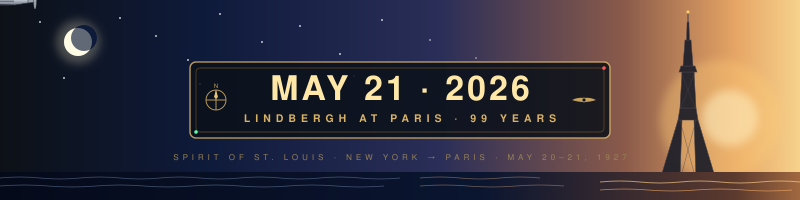

About this doodle

Spirit of St. Louis, first solo nonstop transatlantic flight; night-to-dawn sky, stars, moon, propeller plane, Eiffel Tower, Atlantic crossing

---

## May 21, 2026 — World Bee Day (May 20, UN observance) — honeycomb, bees, pollen, flowers, amber/gold palette

---

## May 20, 2026 — Halley's Comet — Earth passes through the tail (May 19, 1910), 116th anniversary; great comet, ion & dust tail, starfield, Earth in the tail


---

## May 19, 2026 — Mount St. Helens eruption 46th anniversary (May 18, 1980) — volcano silhouette, ash plume, pyroclastic cloud, lava glow, embers


---

## May 18, 2026 — World Telecommunication and Information Society Day / ITU founded May 17, 1865 (161st anniversary) — signal towers, radio waves, Morse code dots and dashes, networked nodes

---

## May 17, 2026 — First Academy Awards 97th anniversary (May 16, 1929) — Oscar statuette, art deco sunburst, spotlights, red carpet, golden age cinema


---

## May 16, 2026 — L. Frank Baum 170th birthday (May 15, 1856) — Wizard of Oz: tornado, yellow brick road, Emerald City, rainbow, ruby slippers, poppies

---

## May 15, 2026 — Skylab launch 53rd anniversary (May 14, 1973) — America's first space station, orbital workshop with Apollo Telescope Mount, Earth limb, stars, vacuum blue


---

## May 14, 2026 — Formula One World Championship 76th anniversary (May 13, 1950, Silverstone British GP)

About this doodle

race car, checkered flag, speed lines, asphalt and racing red

---

## May 13, 2026 — International Nurses Day / Florence Nightingale 206th birthday (May 12, 1820) — Lady with the Lamp, nightingale in flight, heartbeat, warm lamplight against night-ward teal


---

## May 12, 2026 — Deep Blue defeats Kasparov, 29th anniversary (May 11, 1997) — chessboard, fallen king, machine-blue glow


---

## May 11, 2026 — Mother's Day (US, 2nd Sunday of May = May 10, 2026) — bouquet, hearts, warm coral/rose palette

---

## May 10, 2026 — First laser beam reflected from the Moon — 64th anniversary (May 9, 1962, MIT Lincoln Lab); ruby-laser red beam, lunar disc, observatory ground station


---

## May 9, 2026 — David Attenborough centenary (May 8, 1926) — lush leaves, wildlife silhouettes, ocean-and-emerald palette, a quiet "100" laurel

---

## May 8, 2026 — Beethoven's 9th Symphony "Ode to Joy" 202nd anniversary (May 7, 1824) — staff lines, notes, conductor's baton

---

## May 7, 2026 — Roger Bannister 4-minute mile 72nd anniversary (May 6, 1954) — track, stopwatch, motion blur


---

## May 6, 2026 — Cinco de Mayo (May 5) — papel picado, marigolds, festive colors

---

## May 5, 2026 — Star Wars Day (May 4) — "May the Fourth Be With You"; crossed lightsabers, hyperspace, twin suns

---

## May 4, 2026 — World Press Freedom Day (May 3) — UNESCO observance; typewriter, newsprint masthead, ink


---

## May 3, 2026 — Leonardo da Vinci 507th death anniversary (May 2, 1519) — Vitruvian geometry, aerial screw, ornithopter wing, codex parchment


---

## May 2, 2026 — May Day (May 1) — maypole, ribbons, and spring bloom

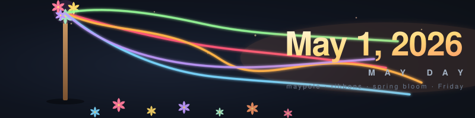

---

## April 30, 2026 — World Wide Web Public Domain 33rd anniversary (April 30, 1993) — CERN releases WWW source into the public domain


---

## April 29, 2026 — International Dance Day (April 29) — UNESCO observance honoring Jean-Georges Noverre's birthday

---

## April 28, 2026 — Kon-Tiki 79th anniversary (April 28, 1947) — Thor Heyerdahl's balsa raft sets sail across the Pacific.

---

## April 27, 2026 — Samuel Morse 235th birthday (April 27, 1791) — telegraph, dots & dashes traveling a wire.


---

## April 26, 2026 — Spring Bloom

About this doodle

Sunday, April 26, 2026. Late-April day-of-week fallback; chose a botanical scene to contrast yesterday's monochrome penguin doodle.

---

## April 25, 2026 — DNA Day

About this doodle

anniversary of Watson & Crick's 1953 Nature double-helix paper. Genomic-sequencing-tape interpretation, distinct from prior helix-tile rendering.

---

<!-- DOODLE-GALLERY:END -->
