# 🌲 Misty Forest Morning

A peaceful, atmospheric SVG scene reminiscent of the Kokiri Forest from Zelda: Ocarina of Time.

---



---

## 🎨 Scene Elements

### Depth Layers (Near to Far)
1. **Foreground** - Large detailed trees with organic branching structures, undergrowth, wooden platforms
2. **Mid-distance** - Detailed deciduous trees with path-based foliage clusters and swaying branches
3. **Far background** - Simplified conifer silhouettes
4. **Sky** - Warm green gradient with god rays

### Atmospheric Effects
- **Mist** - Using `feTurbulence` with animated frequency
- **Rain** - Gentle drops falling at varied speeds
- **Vines** - Hanging greenery swaying gently from canopy
- **Depth blur** - Far objects more blurred than near
- **God rays** - Soft sunlight filtering through trees

### Living Details
- **Fireflies** - 15 glowing insects at 3 depth levels with natural flickering
  - Far: Small (2.5px), dim
  - Mid: Medium (3.5px)
  - Near: Large (5px), bright
- **Trees** - Organic path-based shapes with:
  - Tapered trunks using bezier curves
  - Branch structures that sway independently
  - Irregular foliage clusters (not circles!)
  - Bark texture overlays
- **Movement** - Everything floats organically on prime duration cycles (17s, 23s, 19s)

---

## 🔧 3D Techniques Used

### 1. **Parallax Layering**
```css
@keyframes parallax-far { /* 15px movement, 40s */ }
@keyframes parallax-mid { /* 30px movement, 35s */ }
@keyframes parallax-near { /* 50px movement, 30s */ }
```
Layers move at different speeds creating depth perception.

### 2. **Atmospheric Perspective**
- Far mountains: `opacity: 0.4`, heavy blur
- Mid trees: `opacity: 0.6`, medium blur
- Near elements: `opacity: 0.9`, minimal blur

### 3. **Scale + Distance**
- Far fireflies: 2px radius
- Mid fireflies: 3px radius
- Near fireflies: 4px radius

### 4. **Layered Mist**
Two mist layers at different heights, each with 50-60s drift cycles, using fractal noise turbulence.

### 5. **Organic Animation**
- Fireflies: Prime durations (17s, 19s, 23s) = won't sync for hours
- Tree branches: Independent sway with transform-origin at base (6s cycles)
- Vines: Gentle sway from top center (8s cycles with staggered delays)
- Rain: Staggered delays create natural rhythm

---

## 🎭 Mood & Atmosphere

**Color Palette:**
- Sky: `#4a5f3a` → `#7a9a5a` → `#a8c898` (warm green gradient)
- Tree trunks: `#3a2820` → `#5a4230` (warm browns)
- Foliage: `#5a8a3a`, `#6a9a4a`, `#4a7a3a` (rich greens)
- Wooden structures: `#5a4230`, `#6a5240` (warm wood tones)
- Fireflies: `#f8ff88` (warm yellow-green glow)

**Inspired by:**
- Japanese mountain forests (misty, serene)
- Kokiri Forest (Zelda OoT) - peaceful, magical
- Pacific Northwest rainforest mornings
- Studio Ghibli landscapes (soft, atmospheric)

---

## 🌲 Organic Tree Design

Each tree is hand-crafted using SVG paths (not ellipses!):

**Trunk construction:**
- Quadratic bezier curves create natural taper
- Gradient fills add dimension
- Texture lines overlay for bark detail

**Branch structure:**
- Individual path elements extending from trunk
- Each has transform-origin at connection point
- Independent sway animation (6s cycles)
- Gradual color variation from trunk

**Foliage clusters:**
- Irregular closed paths using multiple Q curves
- Layered for depth (some in front, some behind)
- Varied opacity (0.8-0.85) for natural look
- Asymmetric shapes - no two identical

---

## ✨ Firefly Behavior

**Movement patterns:**
3 unique keyframe animations simulate organic flight:
- Curved paths (using translate X/Y)
- Opacity flicker (0.3 - 1.0) mimics natural blinking
- No two fireflies share timing or path

**Depth cueing:**
- Size decreases with distance
- Glow intensity decreases with distance
- Movement speed same (they're insects, not affected by distance)
- Blur increases with distance

---

## 📐 Technical Stats

- **Total elements:** ~150 (optimized for performance)
- **Animation cycles:** 20+ unique timings
- **Filters used:** 4 (mist turbulence, blur at 3 depths, firefly glow)
- **Layers:** 5 depth planes
- **Trees:** 14 unique detailed trees with organic shapes
- **File size:** ~18 KB
- **No JavaScript** - Pure CSS/SMIL

---

## 🎯 Usage Ideas

Perfect for:
- GitHub profile header banner
- Project README header (nature/environmental projects)
- Meditation/wellness app documentation
- Game dev portfolio (showing atmospheric capability)
- Any project needing peaceful, zen aesthetics

---

## 🔗 Related Techniques

See also:
- [3D-GALLERY.md](./3D-GALLERY.md) - Learn the 3D techniques
- [RANDOMNESS-GUIDE.md](./RANDOMNESS-GUIDE.md) - Organic movement patterns
- [INTERACTIVITY-LIMITS.md](./INTERACTIVITY-LIMITS.md) - What's possible on GitHub

---

*A moment of peace in code. Watch the rain fall, the fireflies dance, the mist drift.*

*Created: 2026-01-29*
