# 🎨 SVG Animation Gallery

A showcase of all custom animated SVGs created for this profile.

---

## 🌌 Transcendent / Psychedelic Theme

### Mycelium Universe

Fractal mycelium threads spreading from earth to infinity. Organic growth patterns with pulsing consciousness.

### Consciousness Explosion

12 fractal rays exploding from singularity with rotating mandala rings and dimensional portals.

---

## 🪐 Cosmic / Space Theme

### Tech Orbit

A solar system of skills - 6 tech planets orbiting in perpetual motion.

### Constellation

Projects connected like stars in the sky, forming patterns of legacy.

---

## 🌊 Nature / Organic Theme

### Code Garden

Five trees growing from seeds over 15 years. Leaves rustle, roots spread.

### Code Waves

Three waves flowing across time, showing peaks and valleys of the journey.

### Philosophy

Growing leaves circling wisdom: "If you're green, you're growing. If you're ripe, you're rotten."

---

## 💓 Life / Energy Theme

### Heartbeat

EKG-style heartbeat showing sustained commitment over 15 years.

### Impact Rings

Ripple effects showing reach and influence expanding outward.

---

## 📊 Timeline / Evolution Theme

### Decade Evolution

Five eras from 2011-2024+ with expanding circles and achievement stars.

### Journey

Timeline path with animated milestones marking the journey.

### Commit Art

Bar chart visualization spanning the decade.

---

## 🎯 Technical / Skills Theme

### Skills Matrix

Horizontal skill bars with animated fills showing capabilities.

### Signature Work

Six glowing project category boxes with neon borders.

### Masterpiece Showcase

3D card reveals for major projects.

---

## 🎨 Artistic / Signature Theme

### Signature

Elegant animated signature with color-shifting gradient and drawing effect.

### Banner

Neural networks with orbiting tech icons and code rain.

### Hero Banner

Epic entrance with multiple layered animations.

### Ultimate Header

Simple, bulletproof header with orbiting planets and spinning rings.

### Cosmic Header

Constellation design with energy waves and particles.

---

## 🔧 Project-Specific Animations

### Browsergeist HID

Physics-based cursor trajectories with OS-level HID injection visualization. Cyan, magenta, and amber motion paths.

### Oscilla Compiler

4-stage compiler pipeline (PARSE → VALIDATE → OPTIMIZE → EMIT) with data flow pulses.

### Firestorm Sync

Central hub with peripheral LED controllers, UDP beacon pulses, and synchronized LED color animations.

### PTYdriver Terminal

Virtual terminal buffer with blinking cursor, keystroke injection, and pattern matching visualization.

### Brain Canvas Render

JSON input flowing through a pipeline into rendered UI sections appearing sequentially.

### rad-shell Prompt

Hub-and-spoke plugin architecture around a central prompt with fast startup indicator.

### cc-dump Traffic

Three-lane packet inspection (CLIENT → PROXY → API) with diff markers for system prompt changes.

---

## 📈 Summary

**Total Animations:** 27+
**Themes:** 8 distinct artistic directions
**Animation Techniques:**
- Stroke-dasharray drawing
- Transform rotations and scales
- Opacity fading and pulsing
- Orbital mechanics
- Staggered delays
- Color cycling
- Organic growth patterns

All animations follow GitHub-compatible CSS @keyframes and SMIL patterns with `transform-box: fill-box` for reliable rendering. Prime-number durations (7s, 11s, 13s) with staggered delays for pseudo-random variety.
