# 🎨 SVG Animation Gallery

A showcase of all custom animated SVGs created for this profile.

---

## 🌌 Transcendent / Psychedelic Theme

### Mycelium Universe


Fractal mycelium threads spreading from earth to infinity. Organic growth patterns with pulsing consciousness.

### Consciousness Explosion

12 fractal rays exploding from singularity with rotating mandala rings and dimensional portals.

---

## 🪐 Cosmic / Space Theme

### Tech Orbit

A solar system of skills - 6 tech planets orbiting in perpetual motion.

### Constellation


Projects connected like stars in the sky, forming patterns of legacy.

---

## 🌊 Nature / Organic Theme

### Code Garden


Five trees growing from seeds over 15 years. Leaves rustle, roots spread.

### Code Waves


Three waves flowing across time, showing peaks and valleys of the journey.

### Philosophy


Growing leaves circling wisdom: "If you're green, you're growing. If you're ripe, you're rotten."

### Misty Forest Morning


Layered parallax forest scene with swaying trees in mist. Three depth layers (far/mid/near) moving at different rates. Organic Kokiri Forest aesthetic with warm amber and forest green tones.

---

## 💓 Life / Energy Theme

### Heartbeat

EKG-style heartbeat showing sustained commitment over 15 years.

### Impact Rings


Ripple effects showing reach and influence expanding outward.

---

## 📊 Timeline / Evolution Theme

### Decade Evolution


Five eras from 2011-2024+ with expanding circles and achievement stars.

### Journey


Timeline path with animated milestones marking the journey.

### Commit Art


Bar chart visualization spanning the decade.

---

## 🎯 Technical / Skills Theme

### Skills Matrix


Horizontal skill bars with animated fills showing capabilities.

### Signature Work

Six glowing project category boxes with neon borders.

### Masterpiece Showcase


3D card reveals for major projects.

---

## 🎨 Artistic / Signature Theme

### Signature


Elegant animated signature with color-shifting gradient and drawing effect.

### Banner


Neural networks with orbiting tech icons and code rain.

### Hero Banner


Epic entrance with multiple layered animations.

### Ultimate Header
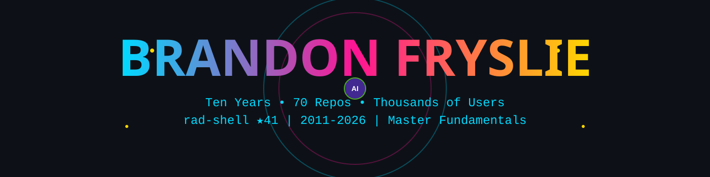

Simple, bulletproof header with orbiting planets and spinning rings.

### Cosmic Header


Constellation design with energy waves and particles.

---

## 🔧 Project-Specific Animations

### Browsergeist HID
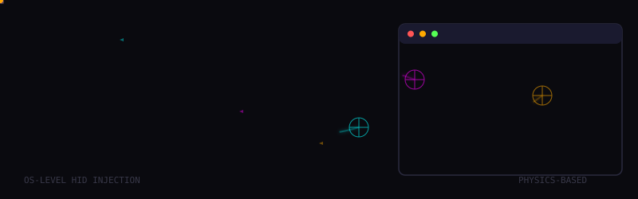

Physics-based cursor trajectories with OS-level HID injection visualization. Cyan, magenta, and amber motion paths.

### Oscilla Compiler
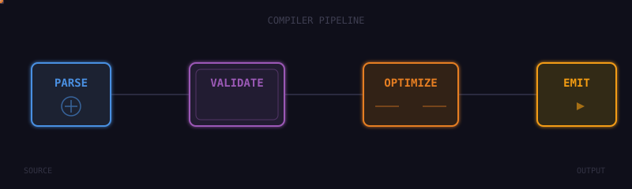

4-stage compiler pipeline (PARSE → VALIDATE → OPTIMIZE → EMIT) with data flow pulses.

### Firestorm Sync


Central hub with peripheral LED controllers, UDP beacon pulses, and synchronized LED color animations.

### PTYdriver Terminal
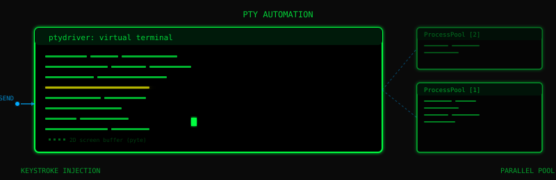

Virtual terminal buffer with blinking cursor, keystroke injection, and pattern matching visualization.

### Brain Canvas Render


JSON input flowing through a pipeline into rendered UI sections appearing sequentially.

### rad-shell Prompt


Hub-and-spoke plugin architecture around a central prompt with fast startup indicator.

### cc-dump Traffic


Three-lane packet inspection (CLIENT → PROXY → API) with diff markers for system prompt changes.

---

## 🏛️ Theme Banners

### Atelier Banner

Ivory parchment with wireframe grid overlay and subtle weaving thread animation. Burgundy accent line. "Machines That Dream in Geometry" aesthetic.

### Observatory Banner
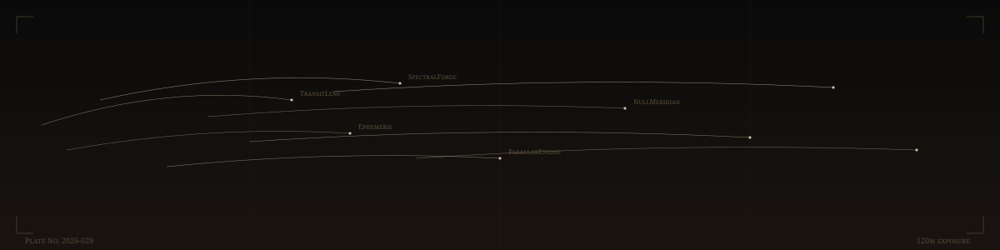

Night sky gradient with brass telescope icon and star trails representing commit arcs. Science and instrumentation theme.

### Court Banner
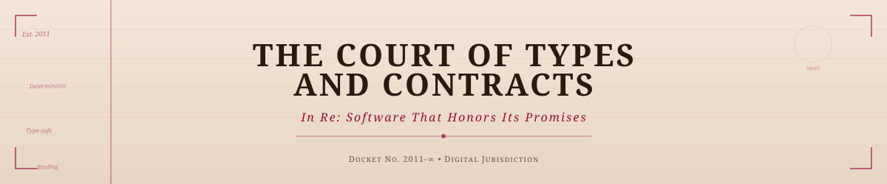

Aged vellum with margin lines and decorative corner flourishes. Medieval manuscript aesthetic with burgundy accents.

### Cyberpunk City


Neon-lit cityscape with rising buildings in pink/cyan gradients. Glowing windows and chrome atmosphere.

---

## 🎖️ Theme Seals & Marks

### Telescope Mark
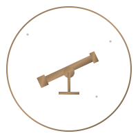

Brass telescope icon for Observatory theme. Scientific instrument detail.

### Brass Seal
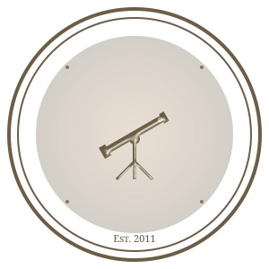

Observatory seal with brass finish and astronomical motifs.

### Court Seal (Detailed)
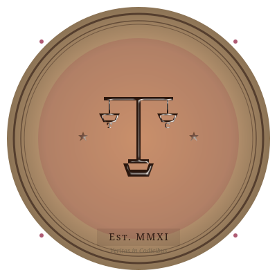

Elaborate wax seal with heraldic design for Court theme. Medieval authenticity.

### Wax Seal
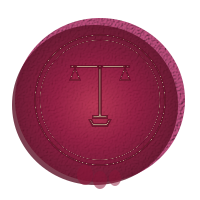

Simple wax seal stamp design. Royal red wax with embossed crest.

---

## 🎪 Interactive Demonstrations

### Planetarium Interactive


Interactive star chart with orbital paths and celestial mechanics. Observatory theme showcase piece.

### Interactivity Test

Test SVG demonstrating GitHub's interactivity limitations. Shows what works (SMIL, CSS animations) vs what's blocked (hover, links, JS).

### Pseudo-Randomness Demo
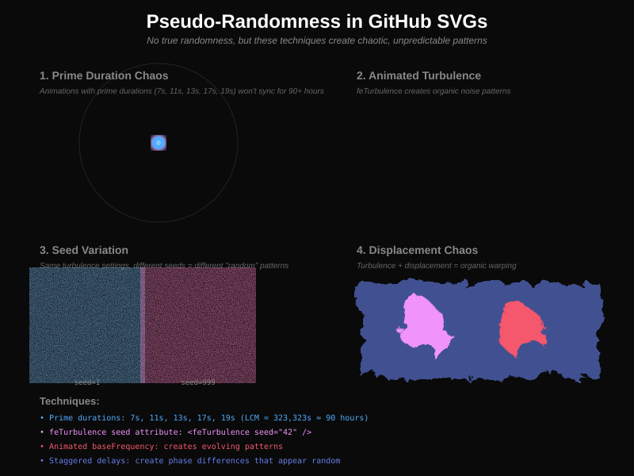

Demonstrates prime-number duration technique for creating pseudo-random motion patterns. Five circles with durations 7s, 11s, 13s, 17s, 19s won't sync for 90+ hours.

### Random Choice Demo


Shows staggered delay technique for creating appearance of random selection without JavaScript.

### Pattern Diagram

Technical diagram showing animation pattern architecture and timing relationships.

---

## 🔨 Atelier Icons

### Loom Icon
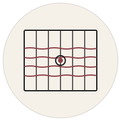

Weaving loom with animated warp threads. Represents the "craft" aspect of the Atelier theme.

### Geometric Knot
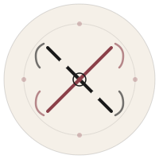

Celtic-style geometric knot with rotating accent points. Mathematical precision meets visual elegance.

### Atelier Daily Art
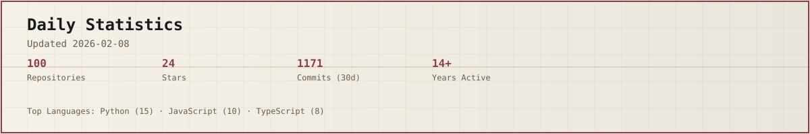

Daily practice visualization for the Atelier theme. Represents consistent craft and iteration.

---

## 🧊 3D Gallery Pieces

### 3D Cube Rotating
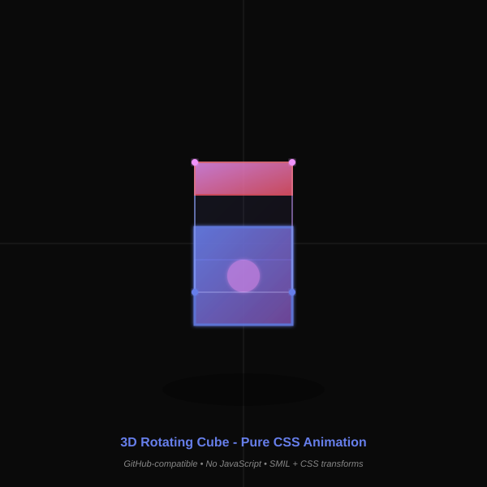

Rotating 3D cube with gradient faces demonstrating CSS 3D transforms in SVG. Shows front/back opacity variation.

### 3D Effects Demo
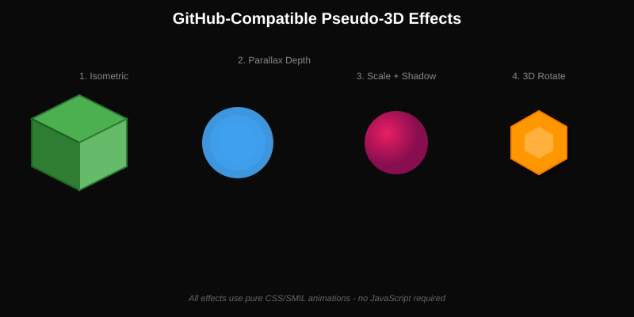

Comprehensive 3D transform showcase including perspective, rotation axes, and depth layering.

### 3D Isometric City
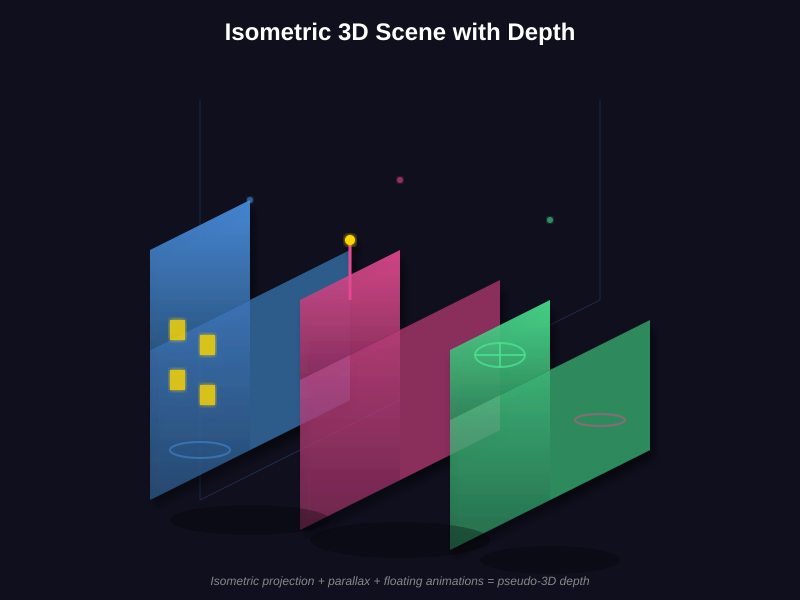

Isometric cityscape using 3D transforms. Buildings at various heights creating depth without perspective distortion.

---

## 🌍 Nature & Science Collection

### Neural Synapse


Firing neurons with branching dendrites and synaptic pulses.

### DNA Helix


Double helix with rotating base pairs and phosphate backbone.

### Wave Interference


Overlapping wave patterns creating constructive and destructive interference.

### Clockwork
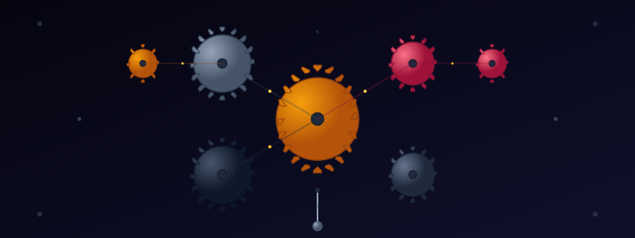

Interlocking gears and escapement mechanisms in perpetual motion.

### Cosmic Nebula


Swirling gas clouds with stellar nursery glow and particle fields.

### Snowflake Crystal


Hexagonal ice crystal with fractal branching and prismatic light.

### Enchanted Forest


Deep woodland with bioluminescent flora and drifting fireflies.

### Ocean Depths


Abyssal layers with bioluminescent creatures and pressure gradients.

### Ancient Temple


Weathered stone columns with sacred geometry and flickering torchlight.

### Aurora Borealis


Shimmering curtains of charged particles across a polar sky.

### Vision Quest
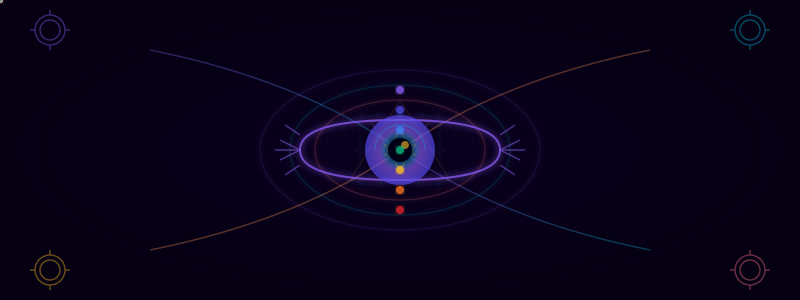

Meditative journey through layered consciousness and symbolic landscapes.

### Coral Reef

Living reef ecosystem with swaying polyps, darting fish, and current flow.

### Circuit Board


PCB traces with signal propagation, component outlines, and power planes.

### Galaxy Spiral


Barred spiral galaxy with rotating arms and stellar density waves.

### Zen Garden


Raked sand patterns around moss-covered stones with falling leaves.

### Volcanic Forge


Magma chamber with convection currents, eruption plumes, and cooling lava flows.

### Rain Window


Raindrops streaming down glass with refraction, pooling, and ambient light.

### Fractal Tree


Recursive branching with seasonal color shifts and wind response.

### Mycelium Web


Underground fungal network with nutrient pulses and fruiting bodies.

### Quantum Field


Particle-antiparticle fluctuations with probability clouds and field lines.

### Sacred Mandala


Concentric geometric patterns with rotational symmetry and color meditation.

### Celestial Orrery


Mechanical planetary model with brass armatures and orbital tracks.

### Tidal Pools
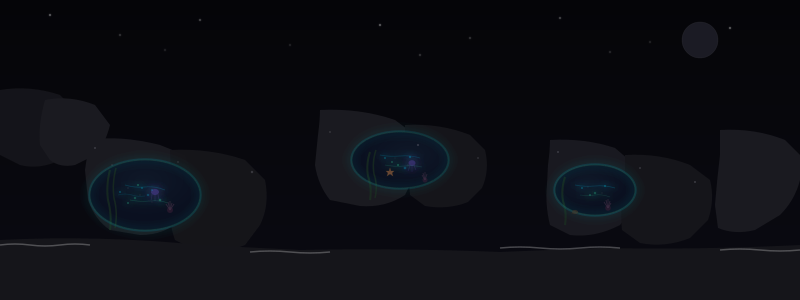

Rocky shore pools with anemones, starfish, and tidal rhythms.

### Sound Waves


Acoustic waveforms with harmonics, resonance, and frequency visualization.

### Crystal Cave


Geode interior with prismatic crystal formations and refracted light.

### Desert Oasis


Sand dunes with heat shimmer, palm grove, and mirage effects.

---

## 📈 Summary

**Total Animations:** 74 SVGs
**Themes:** 11 distinct artistic directions
**Animation Techniques:**
- Stroke-dasharray drawing
- Transform rotations and scales
- Opacity fading and pulsing
- Orbital mechanics
- Staggered delays
- Color cycling
- Organic growth patterns
- Parallax layering
- Prime-number pseudo-randomness
- 3D transforms

All animations follow GitHub-compatible CSS @keyframes and SMIL patterns with `transform-box: fill-box` for reliable rendering. Prime-number durations (7s, 11s, 13s) with staggered delays for pseudo-random variety.

## References

- [INTERACTIVITY-LIMITS.md](./INTERACTIVITY-LIMITS.md) — What works in GitHub's SVG sandbox
- [RANDOMNESS-GUIDE.md](./RANDOMNESS-GUIDE.md) — Pseudo-random techniques without JS
- [3D-GALLERY.md](./3D-GALLERY.md) — 3D transform techniques
