# 🎲 Pseudo-Randomness in GitHub SVGs

GitHub strips all JavaScript from SVGs, but you can still create **pseudo-random** and **choice-like** behavior using clever CSS and SMIL techniques.

---

## 🎰 Random Choice Machine



This "slot machine" cycles through different options at different speeds. With 8 options per slot and 3 slots at prime durations (7s, 11s, 13s), you get 512 unique combinations that won't repeat for over 16 minutes!

---

## 🌀 Chaos & Turbulence


Four different techniques for creating unpredictable, organic patterns without JavaScript.

---

## 🔧 Techniques Explained

### 1. **Prime Duration Cycling**

The most practical approach for "random choice":

```xml
<style>
  /* Cycle through 8 states at 7 second intervals */
  @keyframes state1 { 0%, 12.5% { opacity: 1; } 12.6%, 100% { opacity: 0; } }
  @keyframes state2 { 0%, 12.5% { opacity: 0; } 12.6%, 25% { opacity: 1; } 25.1%, 100% { opacity: 0; } }
  /* ... 6 more states ... */
  
  .option-a { animation: state1 7s infinite; }
  .option-b { animation: state2 7s infinite; }
  /* ... more options ... */
</style>

<text class="option-a">Option A</text>
<text class="option-b">Option B</text>
```

**Why prime numbers?** Using durations like 7s, 11s, 13s, 17s, 19s means they won't sync until their LCM (Least Common Multiple):
- 7 × 11 = 77 seconds
- 7 × 11 × 13 = 1,001 seconds (16.7 minutes)
- 7 × 11 × 13 × 17 × 19 = 323,323 seconds (89.8 hours!)

---

### 2. **feTurbulence Filter (True Pseudo-Randomness)**

SVG's `feTurbulence` filter generates Perlin noise - mathematically pseudo-random but deterministic:

```xml
<filter id="noise">
  <feTurbulence 
    type="fractalNoise" 
    baseFrequency="0.05" 
    numOctaves="3" 
    seed="42">
    <!-- Animate the frequency for evolving patterns -->
    <animate 
      attributeName="baseFrequency" 
      values="0.05;0.08;0.05" 
      dur="10s" 
      repeatCount="indefinite"/>
  </feTurbulence>
</filter>

<rect width="200" height="200" filter="url(#noise)"/>
```

**Parameters:**
- `seed`: Different values = different patterns (1-9999)
- `baseFrequency`: Lower = larger features (0.01-0.1)
- `numOctaves`: More = more detail (1-5)
- `type`: `fractalNoise` (smooth) or `turbulence` (chaotic)

---

### 3. **Staggered Animation Delays**

Start identical animations at different times:

```xml
<style>
  @keyframes float { 
    0%, 100% { transform: translateY(0); }
    50% { transform: translateY(-50px); }
  }
  
  .particle { animation: float 3s ease-in-out infinite; }
  .p1 { animation-delay: 0s; }
  .p2 { animation-delay: 0.3s; }
  .p3 { animation-delay: 0.7s; }
  .p4 { animation-delay: 1.2s; }
  .p5 { animation-delay: 1.9s; }
</style>

<circle class="particle p1" cx="50" cy="100" r="5"/>
<circle class="particle p2" cx="100" cy="100" r="5"/>
<!-- etc -->
```

Using non-uniform delays (0.3, 0.7, 1.2, 1.9) creates organic, unsynchronized movement.

---

### 4. **Displacement Maps**

Use turbulence to distort other elements:

```xml
<filter id="warped">
  <feTurbulence type="turbulence" baseFrequency="0.03" seed="5"/>
  <feDisplacementMap in="SourceGraphic" scale="20"/>
</filter>

<text filter="url(#warped)" x="100" y="100">Warped Text</text>
```

The `scale` parameter controls distortion intensity (1-50).

---

### 5. **Animated Seeds (Limited)**

You can animate the `seed` attribute, but it only accepts integer keyframe values:

```xml
<feTurbulence type="fractalNoise" baseFrequency="0.05" seed="1">
  <animate 
    attributeName="seed" 
    values="1;100;500;1" 
    dur="20s" 
    repeatCount="indefinite"/>
</feTurbulence>
```

Each seed value creates a completely different noise pattern!

---

## 💡 Practical Use Cases

### Random Tech Stack Display

Show different tech logos cycling through at prime durations:

```xml
<!-- Slot shows different techs every 7-13 seconds -->
<g class="tech-slot">
  <image class="tech-1" href="python.svg"/>
  <image class="tech-2" href="javascript.svg"/>
  <image class="tech-3" href="rust.svg"/>
  <image class="tech-4" href="go.svg"/>
</g>
```

### Organic Background Effects

```xml
<rect width="100%" height="100%" filter="url(#turbulence)"/>
```

### "Random" Quote Generator

Cycle through quotes at 11s, 13s, or 17s intervals.

### Particle Systems

Use turbulence to create smoke, fire, water, clouds.

---

## 🎯 Comparison: True Random vs Pseudo-Random

| Feature | True Random | GitHub SVG Pseudo-Random |
|---------|-------------|--------------------------|
| Unpredictable | ✅ Yes | ❌ Repeats eventually |
| Deterministic | ❌ No | ✅ Same seed = same result |
| User-specific | ✅ Different per user | ❌ Same for everyone |
| Needs JS | ✅ Yes | ✅ No |
| Works on GitHub | ❌ No (JS stripped) | ✅ Yes |
| Pattern length | ∞ | 90+ hours with primes |

---

## 📊 Prime Duration Chart

Period until synchronization:

| Durations | LCM | Time | Unique States |
|-----------|-----|------|---------------|
| 7s, 11s | 77s | 1.3 min | 2 slots × 8 = 64 |
| 7s, 11s, 13s | 1,001s | 16.7 min | 3 slots × 8 = 512 |
| 7s, 11s, 13s, 17s | 17,017s | 4.7 hours | 4 slots × 8 = 4,096 |
| 7s, 11s, 13s, 17s, 19s | 323,323s | 89.8 hours | 5 slots × 8 = 32,768 |

---

## 🚀 Code Templates

### Template 1: Choice Cycler

```xml
<svg width="200" height="200" xmlns="http://www.w3.org/2000/svg">
  <defs>
    <style>
      @keyframes opt1 { 0%, 33% { opacity: 1; } 34%, 100% { opacity: 0; } }
      @keyframes opt2 { 0%, 33% { opacity: 0; } 34%, 66% { opacity: 1; } 67%, 100% { opacity: 0; } }
      @keyframes opt3 { 0%, 66% { opacity: 0; } 67%, 100% { opacity: 1; } }
      
      .choice-1 { animation: opt1 9s infinite; }
      .choice-2 { animation: opt2 9s infinite; }
      .choice-3 { animation: opt3 9s infinite; }
    </style>
  </defs>
  
  <text class="choice-1" x="100" y="100" text-anchor="middle">Choice A</text>
  <text class="choice-2" x="100" y="100" text-anchor="middle">Choice B</text>
  <text class="choice-3" x="100" y="100" text-anchor="middle">Choice C</text>
</svg>
```

### Template 2: Turbulence Background

```xml
<svg width="800" height="400" xmlns="http://www.w3.org/2000/svg">
  <defs>
    <filter id="bg">
      <feTurbulence type="fractalNoise" baseFrequency="0.02" numOctaves="4" seed="42">
        <animate attributeName="baseFrequency" values="0.02;0.04;0.02" dur="15s" repeatCount="indefinite"/>
      </feTurbulence>
      <feColorMatrix type="hueRotate">
        <animate attributeName="values" from="0" to="360" dur="10s" repeatCount="indefinite"/>
      </feColorMatrix>
    </filter>
  </defs>
  
  <rect width="800" height="400" filter="url(#bg)" opacity="0.3"/>
</svg>
```

---

## ⚠️ Limitations

1. **Not truly random** - patterns eventually repeat
2. **Same for all users** - everyone sees the same sequence
3. **No user interaction** - can't react to clicks (GitHub strips events)
4. **No URL-based seeding** - can't use username/date as seed (needs JS)
5. **Performance** - complex turbulence can be slow

---

## ✅ Best Practices

1. **Use prime numbers** for maximum period before repetition
2. **Combine techniques** - prime cycling + turbulence = very organic
3. **Test performance** - too much turbulence can lag
4. **Semantic meaning** - use "randomness" purposefully, not just decoration
5. **Fallback thinking** - ensure static view makes sense if animations fail

---

**Bottom line:** You can't get true randomness without JavaScript, but these techniques create patterns complex enough that they *feel* random for 90+ hours of viewing!

*Created: 2026-01-29*
