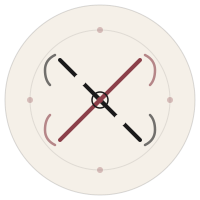

# Brandon Fryslie

Developer tools · Terminal systems · LED art installations · 15 years of shipping

---

## Now

<table><tr><td width="65%" valign="top">

**[Oscilla Animator v2](https://github.com/brandon-fryslie/oscilla-animator-v2)** — Animation tool with custom type system and compiler. Pattern-based keyframe generation, SVG export, mathematical expressions.

**[Cherry Chrome MCP](https://github.com/brandon-fryslie/cherry-chrome-mcp)** — Chrome DevTools for AI coding agents. Network inspection, console access, DOM manipulation via Model Context Protocol.

**This profile** — 41 animated SVGs within GitHub's security sandbox. SMIL animations, prime-number durations, pseudo-random effects without JavaScript.

</td><td width="35%" valign="top" align="center">

</td></tr></table>

---

## Signature Work

<table>
<tr>
<td width="50%" valign="top">

### [rad-shell](https://github.com/brandon-fryslie/rad-shell)
**41★ · Shell · 8+ years**

Zsh framework with plugin architecture and fast Git status rendering. Modular design, lazy loading, performance optimizations. Active maintenance since 2017.

### [Tesseract](https://github.com/brandon-fryslie/tesseract-react)
**2★ · JavaScript + Java + Hardware**

Kinetic LED sculpture control system. React UI, Java backend, physical hardware integration. Real-time pattern generation and motor control.

### [pb-sync](https://github.com/brandon-fryslie/pb-sync) / [esp-bloom](https://github.com/brandon-fryslie/esp-bloom)
**2★ · TypeScript + Python**

PixelBlaze and ESP8266 LED art tools. Pattern synchronization, wireless updates, animation libraries for addressable LEDs.

</td>
<td width="50%" valign="top">

### [ptydriver](https://github.com/brandon-fryslie/ptydriver)
**Python · 2025**

Programmatic terminal automation. PTY management, command execution, output parsing. Foundation for AI terminal agents.

### [claude-powerline](https://github.com/brandon-fryslie/claude-powerline)
**Shell · 2025**

Vim-style statusline for Claude Code. Git integration, directory context, customizable segments. Clear visual feedback in AI coding sessions.

### [chaperone-auth-gateway](https://github.com/brandon-fryslie/chaperone-auth-gateway)
**Go · 2026**

Authentication gateway with session management. JWT handling, middleware architecture, secure token validation.

</td>
</tr>
</table>

---

## Arc

<table>
<tr>
<td width="20%" valign="top" align="right"><strong>2011–2014</strong></td>
<td width="80%" valign="top">

**PHP/Ruby foundations** — [Smoke framework](https://github.com/brandon-fryslie/Smoke) (4★), early web tools, MVC patterns, database abstraction

</td>
</tr>
<tr>
<td width="20%" valign="top" align="right"><strong>2015–2018</strong></td>
<td width="80%" valign="top">

**JavaScript/CoffeeScript era** — DevOps, [rad-shell](https://github.com/brandon-fryslie/rad-shell) matures, [ember-rest.coffee](https://github.com/brandon-fryslie/ember-rest.coffee), terminal tooling

</td>
</tr>
<tr>
<td width="20%" valign="top" align="right"><strong>2019–2021</strong></td>
<td width="80%" valign="top">

**Hardware** — ESP8266 LED art, [pb-sync](https://github.com/brandon-fryslie/pb-sync), [esp-bloom](https://github.com/brandon-fryslie/esp-bloom), keyboard firmware, physical computing

</td>
</tr>
<tr>
<td width="20%" valign="top" align="right"><strong>2024–2025</strong></td>
<td width="80%" valign="top">

**AI tooling explosion** — [browsergeist](https://github.com/brandon-fryslie/browsergeist), [ptydriver](https://github.com/brandon-fryslie/ptydriver), [macos-tts-via-openai](https://github.com/brandon-fryslie/macos-tts-via-openai), 23 repos in one year

</td>
</tr>
<tr>
<td width="20%" valign="top" align="right"><strong>2026</strong></td>
<td width="80%" valign="top">

**Animation compilers** — [oscilla-animator-v2](https://github.com/brandon-fryslie/oscilla-animator-v2), custom type systems, [cherry-chrome-mcp](https://github.com/brandon-fryslie/cherry-chrome-mcp)

</td>
</tr>
</table>

---

## Languages & Domains

---

## Stats

---

## More Projects

<strong>AI & Automation (2024–2026)</strong>

- **[browsergeist](https://github.com/brandon-fryslie/browsergeist)** — Browser automation for AI agents
- **[macos-tts-via-openai](https://github.com/brandon-fryslie/macos-tts-via-openai)** — Text-to-speech via OpenAI API
- **[mcp-server-template](https://github.com/brandon-fryslie/mcp-server-template)** — Model Context Protocol server template

<strong>DevOps & Infrastructure (2015–2020)</strong>

- **[dotfiles](https://github.com/brandon-fryslie/dotfiles)** (3★) — Personal development environment configuration
- **[terraform-provider-datadog](https://github.com/brandon-fryslie/terraform-provider-datadog)** — Datadog Terraform provider contributions
- **[gradle-baseline](https://github.com/brandon-fryslie/gradle-baseline)** — Gradle plugin development

<strong>Hardware & Embedded (2019–2021)</strong>

- **[qmk_firmware](https://github.com/brandon-fryslie/qmk_firmware)** — Custom keyboard firmware
- **[ergodox-layout](https://github.com/brandon-fryslie/ergodox-layout)** — ErgoDox keyboard layout

<strong>Web & Frameworks (2011–2018)</strong>

- **[Smoke](https://github.com/brandon-fryslie/Smoke)** (4★) — PHP MVC framework
- **[ember-rest.coffee](https://github.com/brandon-fryslie/ember-rest.coffee)** — Ember.js REST adapter

---

## Principles

<table>
<tr>
<td width="25%" valign="top">

**Restraint**

Few projects, finished well. Every repo earns its place.

</td>
<td width="25%" valign="top">

**Coherence**

Consistent naming, structure, voice. Not a storage unit.

</td>
<td width="25%" valign="top">

**Finish**

The last 10% is half the work. Polish the READMEs. Draw the diagrams. Write the tests that prove the claim.

</td>
<td width="25%" valign="top">

**Seasonality**

Work in focused arcs. Complete, then archive and begin again.

</td>
</tr>
</table>

---

## Alternate Views

This profile can be read through different lenses:

<table>
<tr>
<td width="25%" align="center">

**[Observatory](./README-OBSERVATORY.md)**

Science and instrumentation

</td>
<td width="25%" align="center">

**[Court](./README-COURT.md)**

Contracts and ceremony

</td>
<td width="25%" align="center">

**[Cyberpunk](./README-CYBERPUNK.md)**

Neon and chrome

</td>
<td width="25%" align="center">

**[Maximum Ridiculous](./README-MAXIMUM-RIDICULOUS.md)**

Zero chill

</td>
</tr>
</table>

---

## Colophon

**Banner:** Custom SVG with SMIL animations — faint wireframe over ivory, single burgundy accent

**Typography:** System fonts, no external dependencies

**Technique:** All animations work within GitHub's SVG security sandbox (no JS, no hover, no links)

**Updated:** January 2026

View the [Gallery](./GALLERY.md) for all 41 animated SVGs.

---

**— Brandon Fryslie**

*Winter 2026*

