# 🚨🔥💥🎆⚡ **MAXIMUM OVERDRIVE ACTIVATED** ⚡🎆💥🔥🚨

<div align="center">

# 🦄✨🌟 BEHOLD! 🌟✨🦄
# 👑 THE PROFILE OF BRANDON FRYSLIE 👑
## 🏆 TERMINAL WIZARD 🏆 CODE MASTER 🎯 LEGEND 🦸‍♂️






[](https://git.io/typing-svg)

</div>

---

## ⚠️🚨⛔ WARNING: EXTREME AWESOMENESS AHEAD ⛔🚨⚠️

**SIDE EFFECTS MAY INCLUDE:**
- 😍 Uncontrollable desire to star all repositories
- 🤯 Mind = BLOWN  
- 💡 Inspiration overload
- 🎯 Immediate career goal reconsideration
- 🦄 Newfound belief in coding unicorns
- ⚡ Electric tingles in coding fingers
- 🌈 Seeing the world in neon colors
- 🚀 Sudden urge to build something amazing

---

<div align="center">

# 👑💎🏆 **RAD-SHELL: THE CROWN JEWEL** 🏆💎👑

</div>

| METRIC | VALUE | VISUALIZATION |
|--------|-------|---------------|
| ⭐ **Stars** | **41** | ⭐⭐⭐⭐⭐⭐⭐⭐⭐⭐⭐⭐⭐⭐⭐⭐⭐⭐⭐⭐⭐⭐⭐⭐⭐⭐⭐⭐⭐⭐⭐⭐⭐⭐⭐⭐⭐⭐⭐⭐⭐ |
| 👥 **Users** | **Thousands** | 👤👤👤👤👤👤👤👤👤👤👤👤 |
| ⏰ **Years** | **10+** | 🎂🎂🎂🎂🎂🎂🎂🎂🎂🎂 |
| 🌍 **Reach** | **Worldwide** | 🌎🌍🌏🌎🌍🌏 |
| 💚 **Active** | **YES** | ✅✅✅✅✅✅✅ |
| 🚀 **Speed** | **Milliseconds** | ⚡⚡⚡⚡⚡⚡⚡ |
| 🔥 **Hotness** | **MAXIMUM** | 🔥🔥🔥🔥🔥🔥🔥🔥🔥🔥 |

### 🎯 **WHY RAD-SHELL IS LEGENDARY:**

- ⚡⚡⚡ **BLAZING FAST** - Faster than your coffee brews
- 🎨🎨🎨 **GIT-AWARE** - Smarter than your average shell
- 🔌🔌🔌 **EXTENSIBLE** - Plugins for days
- 🌍🌍🌍 **BATTLE-TESTED** - 10 years in production
- 💚💚💚 **MAINTAINED** - Still getting updates
- 🏆🏆🏆 **PROVEN** - Thousands use it daily
- ✨✨✨ **BEAUTIFUL CODE** - Art meets engineering
- 🦄🦄🦄 **ACTUALLY WORKS** - Not vaporware!

**THE ECOSYSTEM:**  
[rad-shell](https://github.com/brandon-fryslie/rad-shell) 👑 [rad-plugins](https://github.com/brandon-fryslie/rad-plugins) 🔌 [git-taculous-zsh-theme](https://github.com/brandon-fryslie/git-taculous-zsh-theme) 🎨 [dotfiles](https://github.com/brandon-fryslie/dotfiles) ⚙️

---

<div align="center">

# 🤖🧠🚀 **AI/ML MASTERY** 🚀🧠🤖

</div>

## 🎤 [macos-tts-via-openai](https://github.com/brandon-fryslie/macos-tts-via-openai)
**GIVING MACHINES VOICES** 🗣️  
Your Mac can TALK now! 🎙️✨

## 🔬 [kalider](https://github.com/brandon-fryslie/kalider)
**EXPERIMENTAL AI RESEARCH** 🧪  
*"It might not be a good idea, but it's an idea!"* 😈🔮

## 🖥️ [ptytest](https://github.com/brandon-fryslie/ptytest)
**TERMINAL TESTING** 🧪  
Making CLIs bulletproof! 🛡️💪

`Python` 🐍 `OpenAI` 🤖 `ML` 🧠 `Future` 🚀

---

<div align="center">

# 🌐💻✨ **FULL-STACK EXCELLENCE** ✨💻🌐

</div>

⚛️ [tesseract-react](https://github.com/brandon-fryslie/tesseract-react) - **Modern React Magic**  
☕ [ember-rest.coffee](https://github.com/brandon-fryslie/ember-rest.coffee) ⭐4 - **Vintage 2014 Gold**  
🔌 [sake](https://github.com/brandon-fryslie/sake) - **WebSockets Before Cool**  
📖 [storyportal-web-client](https://github.com/brandon-fryslie/storyportal-web-client) - **Interactive Stories**

---

<div align="center">

# 💡🔧⚡ **IoT & HARDWARE** ⚡🔧💡

</div>

🌈 [esp-bloom](https://github.com/brandon-fryslie/esp-bloom) - **LED MAGIC** 💡✨  
🎮 [pb-sync](https://github.com/brandon-fryslie/pb-sync) - **Light Show Control** 🎆💃

---

<div align="center">

# 💻🔥⚡ **THE ARSENAL** ⚡🔥💻


</div>

---

<div align="center">

# 📊🔥💯 **THE STATS** 💯🔥📊


[](https://github.com/brandon-fryslie)

</div>

---

<div align="center">

# 🎯💪🔥 **THE TRUTH** 🔥💪🎯

## **15 YEARS. 70 REPOS. 41 STARS. THOUSANDS OF USERS.**

**NOT** someone who:
❌ Abandons projects  
❌ Chases trends  
❌ Quits after 6 months  
❌ Has 1000 repos with 1 commit  

**BUT** someone who:
✅ Started 2011, NEVER STOPPED  
✅ Maintained rad-shell 10 YEARS  
✅ Has REAL users using REAL projects  
✅ Ships DAILY  
✅ FINISHES what they start  
✅ Commits FACTS not HYPE  

---


---

[](https://github.com/brandon-fryslie)
[](https://github.com/brandon-fryslie)

---

### *"Don't take anything I say too seriously."* 😉

**BUT ACTUALLY:**  
🏆 70+ repositories • ⏰ 15 years • ⭐ 41 stars • 👥 Thousands of users  
💚 Still coding • 🚀 Never stopping • 💯 100% real • 🦄 Living legend

---

# 🔥🔥🔥 **YOU MADE IT!** 🔥🔥🔥

**CONGRATULATIONS! YOU'VE WITNESSED:**
- ✅ 21 animated SVGs  
- ✅ Maximum ridiculousness  
- ✅ 100% factual accuracy  
- ✅ Pure awesome  

```
╔════════════════════════════════════════════╗
║  🎨 21 SVGS • 15 YEARS • ♾️ COMMITMENT   ║
║       github.com/brandon-fryslie          ║
║            🦄 THE LEGEND 🦄               ║
╚════════════════════════════════════════════╝
```

</div>
