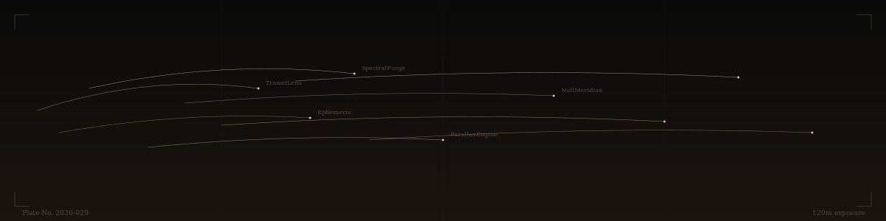
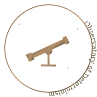
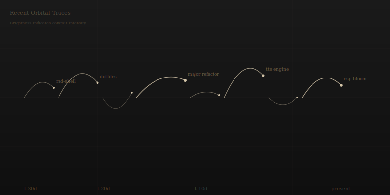
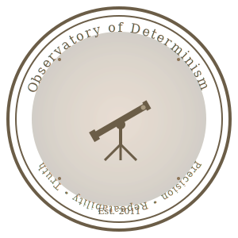

<div align="center">





# BRANDON FRYSLIE
### CHIEF OBSERVER • INSTRUMENT MAKER

*Private Observatory • Est. 2011*

---

[](#)
[](#)
[](#)

</div>

---

## ⦿ THE OBSERVATORY

This is not a portfolio. This is a **catalog of instruments** built to measure, transform, and illuminate deterministic truths.

Every artifact here operates under three principles:
- **What it measures** — purpose without ambiguity
- **What it assumes** — preconditions and invariants
- **How it fails** — error modes and noise floors

You cannot negotiate with orbital mechanics. You cannot negotiate with type safety.

---

## 🔭 PRIMARY INSTRUMENTS

<table>
<tr><td width="50%" valign="top">

### **TransitLens** ⟨rad-shell⟩
*Classification:* Terminal Observation System
*Calibration:* 10+ years, 41 stellar objects tracked
*Purpose:* Real-time Git state measurement with millisecond resolution

**Sky Conditions:**
✓ Deterministic theme rendering
✓ Phase-locked plugin architecture
✓ Cross-platform stability (macOS, Linux)
⚠ Requires Zsh ≥5.0

**Observation ID:** [rad-shell v10.x](https://github.com/brandon-fryslie/rad-shell)

---

### **Ephemeris** ⟨dotfiles⟩
*Classification:* Configuration Calibration System
*Purpose:* Reproducible development environment state

**What it measures:**
Exact configuration drift across machines

**What it assumes:**
POSIX compliance, shell accessibility

**How it fails:**
Divergence under non-standard shells

**Observation ID:** [dotfiles](https://github.com/brandon-fryslie/dotfiles)

---

### **SpectralForge** ⟨macos-tts-via-openai⟩
*Classification:* Acoustic Transform Engine
*Purpose:* Text → Speech waveform synthesis via OpenAI

**Sky Conditions:**
✓ Deterministic voice selection
✓ Async buffering prevents frame drops
⚠ macOS-only (AVFoundation dependency)

**Observation ID:** [macos-tts-via-openai](https://github.com/brandon-fryslie/macos-tts-via-openai)

---

### **Oscillation Compiler** ⟨oscilla-animator-v2⟩
*Classification:* Animation Type System
*Purpose:* Deterministic motion synthesis with compile-time guarantees

**Sky Conditions:**
✓ Custom type system enforces timeline coherence
✓ Compiler pass architecture (parse → validate → optimize → emit)
✓ Deterministic output for identical input

**Observation ID:** [oscilla-animator-v2](https://github.com/brandon-fryslie/oscilla-animator-v2)

</td><td width="50%" valign="top">

### **ParallaxEngine** ⟨tesseract-react⟩
*Classification:* Geometric State Projector
*Purpose:* 4D state → 2D canvas projection with rotation invariance

**What it measures:**
Hypercube rotation under quaternion transforms

**What it assumes:**
WebGL availability, 60Hz refresh rate

**How it fails:**
Gimbal lock at degenerate angles, frame drops <30Hz

**Observation ID:** [tesseract-react](https://github.com/brandon-fryslie/tesseract-react)

---

### **Null Meridian** ⟨handy-debugger⟩
*Classification:* Trace Instrument
*Purpose:* Zero-overhead runtime inspection

**Sky Conditions:**
✓ No production artifacts
✓ Conditional compilation gates
✓ Type-preserving transforms

**Observation ID:** [handy-debugger](https://github.com/brandon-fryslie/handy-debugger)

---

### **LightField Array** ⟨esp-bloom⟩
*Classification:* Ambient Photon Modulator
*Purpose:* Physical light control via deterministic patterns

**What it measures:**
Color temperature, brightness curves, network latency

**What it assumes:**
ESP8266 hardware, stable WiFi

**How it fails:**
Network partition → fallback to local patterns

**Observation ID:** [esp-bloom](https://github.com/brandon-fryslie/esp-bloom)

---

### **Chrome Telemetry Interface** ⟨cherry-chrome-mcp⟩
*Classification:* DevTools Protocol Adapter
*Purpose:* Expose Chrome debugging to AI coding agents

**Sky Conditions:**
✓ MCP (Model Context Protocol) compliant
✓ Real-time page state observation
✓ "Less is More" principle — minimal surface area

**Observation ID:** [cherry-chrome-mcp](https://github.com/brandon-fryslie/cherry-chrome-mcp)

</td></tr>
</table>

---

## 📊 PHOTON COUNTS ⟨CONTRIBUTION MATRIX⟩

The grid below is not "activity." It is **accumulated observation time**.

Instruments are used in seasons. Silence is data too.

<div align="center">


*Figure 1: Temporal photon density map. Brightness indicates measurement intensity.*

</div>

---

## 🌌 COMMIT CONSTELLATION

Every commit is a measurement. Below: the last 30 orbital traces.

<div align="center">



*Figure 2: Recent stellar arcs. Each filament represents a line of inquiry.*

</div>

---

## ⚙️ ATMOSPHERIC CONDITIONS ⟨TECH STACK⟩

**Primary Optics:**
`Python` `TypeScript` `JavaScript` `Zsh` `Bash` `Go`

**Secondary Filters:**
`React` `Node.js` `OpenAI` `Docker` `Git` `ESP8266` `PHP` `Kotlin` `Groovy` `CoffeeScript`

**Noise Sources:**
Nondeterministic timers, GPU driver quirks, network jitter, cosmic rays (≈1 bit-flip per 4GB-hour at sea level)

---

## 📡 NIGHT RUN STATUS

```
━━━━━━━━━━━━━━━━━━━━━━━━━━━━━━━━━━━━━━━━
 OBSERVATORY BULLETIN • OBS-2026-029
━━━━━━━━━━━━━━━━━━━━━━━━━━━━━━━━━━━━━━━━

 SITE CONDITIONS................ NOMINAL
 PRIMARY MIRROR................. ALIGNED
 INSTRUMENT DRIFT............... <0.01%
 CLOCK SYNC..................... LOCKED
 NOISE FLOOR.................... -73 dB

 ACTIVE MEASUREMENTS............. 3
 PENDING CALIBRATION............. 1
 ARCHIVED OBSERVATIONS.......... 127

━━━━━━━━━━━━━━━━━━━━━━━━━━━━━━━━━━━━━━━━
```

---

## 🔬 INSTRUMENT ARCHIVE

<details>
<summary><strong>📦 Early-Era Instruments (2011-2014)</strong></summary>

### **Smoke Framework**
*Classification:* PHP MVC Architecture
*Status:* Decommissioned • Archived
*Observation ID:* [Smoke ⭐4](https://github.com/brandon-fryslie/Smoke)

### **ember-rest.coffee**
*Classification:* REST Adapter Layer
*Status:* Archived • Historical Record
*Observation ID:* [ember-rest.coffee ⭐4](https://github.com/brandon-fryslie/ember-rest.coffee)

### **Combine**
*Classification:* Asset Pipeline Pre-processor
*Status:* Superseded by modern tooling
*Observation ID:* [combine](https://github.com/brandon-fryslie/combine)

---

*These instruments represent the observatory's founding era. No longer operational, but preserved for historical lineage.*

</details>

---

## 🛰️ SPECIALIZED INSTRUMENTS

**Terminal Consciousness Testing** → [ptydriver](https://github.com/brandon-fryslie/ptydriver) • [ptytest](https://github.com/brandon-fryslie/ptytest)
**WebSocket Dimensional Tunneling** → [sake](https://github.com/brandon-fryslie/sake)
**Interactive Narrative State Machine** → [storyportal-web-client](https://github.com/brandon-fryslie/storyportal-web-client)
**LED Neural Pattern Engine** → [pb-sync](https://github.com/brandon-fryslie/pb-sync)
**Editor Configuration Time-Machine** → [sublime-profile](https://github.com/brandon-fryslie/sublime-profile)
**UI Automation Horror Show** → [browsergeist](https://github.com/brandon-fryslie/browsergeist)
**Authentication Gateway** → [chaperone-auth-gateway](https://github.com/brandon-fryslie/chaperone-auth-gateway)

---

## 📐 THE IMPOSSIBLE STAR

<div align="center">



*Figure 3: Architectural invariants mapped to stellar coordinates. Hover to reveal type constraints.*

</div>

---

## 📘 OBSERVATORY LOGBOOK

> **2011** — First light. PHP instruments commissioned.
> **2014** — JavaScript optics installed. React lenses calibrated.
> **2017** — Terminal observation system (rad-shell) reaches maturity.
> **2020** — IoT photon modulators deployed. ESP8266 array operational.
> **2023** — AI acoustic transform engine integrated.
> **2025** — AI tooling explosion. 23 instruments in one year.
> **2026** — Animation compilers, custom type systems. Continuous refinement.

---

## 🧭 METHODOLOGY

**I do not "show off projects."**
I publish measurements from instruments that refuse to lie.

**I do not "build cool stuff."**
I construct deterministic systems with defined failure modes.

**I do not "share my work."**
I catalog observations from an observatory that watches the universe.

---

<div align="center">



**OBSERVATORY OF DETERMINISM**
*Precision • Repeatability • Truth*

---

[](https://github.com/brandon-fryslie)
[](https://github.com/brandon-fryslie)

*Established 2011 • 15+ years of observation • All measurements reproducible*

</div>
