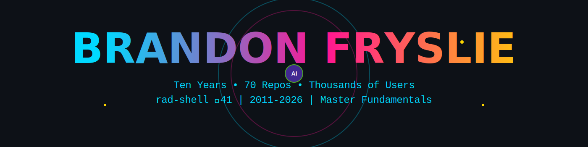

---

## The Simple Truth

Most developers: **Weekend project** → Bored → Next shiny thing

Me: **rad-shell** → 10 years → 41★ → Thousands of users → **Still evolving**

---

---

---

## 🐚 rad-shell: A Decade of Commitment

**★ 41 • 👥 Thousands • 🌍 Worldwide • ⏰ 10+ Years**

Not a weekend hack. A complete Zsh framework refined over a decade.

**What makes it different:**
- ⚡ Millisecond startup times (not seconds)
- 🎨 Git-aware intelligent theming
- 🔌 Plugin architecture that actually works
- 🌍 Used in production globally
- 💚 Ten years of continuous improvement

**The Ecosystem:**

[rad-shell](https://github.com/brandon-fryslie/rad-shell) • [rad-plugins](https://github.com/brandon-fryslie/rad-plugins) • [git-taculous-zsh-theme](https://github.com/brandon-fryslie/git-taculous-zsh-theme) • [dotfiles](https://github.com/brandon-fryslie/dotfiles)

---

---

## 🤖 AI/ML: Real Integration

**[macos-tts-via-openai](https://github.com/brandon-fryslie/macos-tts-via-openai)** — Natural voice synthesis for macOS accessibility

**[kalider](https://github.com/brandon-fryslie/kalider)** — Experimental AI research: *"It might not be a good idea, but it's an idea!"*

**[ptytest](https://github.com/brandon-fryslie/ptytest)** — Terminal emulation testing for robust CLI apps

`Python` `OpenAI` `macOS` `ML` `PTY`

---

## 🌐 Full-Stack Evolution

**[tesseract-react](https://github.com/brandon-fryslie/tesseract-react)** — Modern React with clean architecture

**[ember-rest.coffee](https://github.com/brandon-fryslie/ember-rest.coffee) ⭐ 4** — Built in 2014 when Ember was cutting edge

**[sake](https://github.com/brandon-fryslie/sake)** — WebSockets made easy, built before they were everywhere

**[storyportal-web-client](https://github.com/brandon-fryslie/storyportal-web-client)** — Interactive web storytelling

---

## 🎨 IoT & Hardware: Physical Computing

**[esp-bloom](https://github.com/brandon-fryslie/esp-bloom)** — Ambient bias lighting with ESP8266

**[pb-sync](https://github.com/brandon-fryslie/pb-sync)** — PixelBlaze LED controller integration

`Python` `ESP8266` `TypeScript` `IoT` `LEDs`

---

## 📚 Framework Development (2011)

**[Smoke](https://github.com/brandon-fryslie/Smoke) ⭐ 4** — Complete reinterpretation of CodeIgniter from first principles

**[combine](https://github.com/brandon-fryslie/combine)** — Asset combination built before Webpack existed

`PHP` `MVC` `2011` `Build Tools`

---

---

## 💻 The Stack

---

## 🛠️ Developer Tools

[handy-debugger](https://github.com/brandon-fryslie/handy-debugger) • [stacker](https://github.com/brandon-fryslie/stacker) • [sublime-profile](https://github.com/brandon-fryslie/sublime-profile)

**One principle:** If I wouldn't use it daily, why should you?

---

## 📊 The Numbers

---

## 🎯 The Difference

**10 years • 70 repos • Thousands of users • 41 stars**

Not someone who starts projects.  
Someone who **finishes, maintains, evolves, and never stops.**

---

---

---

### *"Don't take anything I say too seriously."* 😉

**70+ repos • 10+ years • ∞ commits • 100% commitment**

---

*Custom SVG animations • Pure CSS • GitHub-tested*

