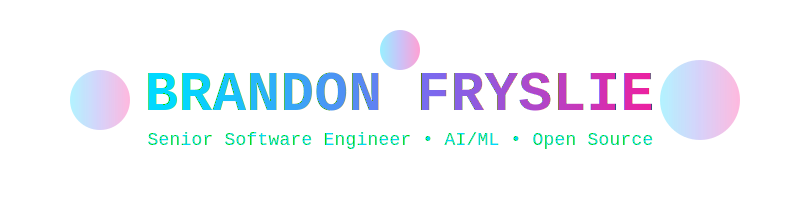
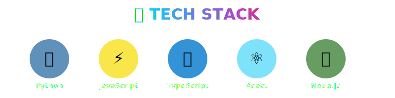

<div align="center">



[](https://git.io/typing-svg)

[](https://github.com/brandon-fryslie)
[](https://github.com/brandon-fryslie)

</div>

---

## 🚀 About Me

```javascript
const brandon = {
    status: "🔥 Currently: Crushing it in AI/ML & DevTools",
    location: "🌎 Earth // 🚀 The Future",
    languages: ["Python", "JavaScript", "TypeScript", "Shell", "PHP", "CoffeeScript"],
    expertise: {
        ai_ml: ["OpenAI APIs", "LLMs", "TTS/STT", "AI Integration", "Prompt Engineering"],
        fullstack: ["React", "Node.js", "Express", "REST APIs", "WebSockets", "Real-time"],
        devtools: ["CLI Tools", "Zsh Framework", "Terminal Magic", "Dev Experience"],
        devops: ["Docker", "CI/CD", "Automation", "Infrastructure as Code"],
        creative: ["IoT", "ESP8266", "LED Programming", "Hardware Hacking"]
    },
    currentFocus: "🤖 AI-powered developer tools that blow minds",
    philosophy: "If you're green, you're growing. If you're ripe, you're rotten. 🌱",
    superpower: "Turning complex problems into elegant solutions ✨",
    funFact: "Built a Zsh framework used by thousands of developers worldwide! 🎯"
};
```

---

## 🔥 Featured Projects

### 🐚 [rad-shell](https://github.com/brandon-fryslie/rad-shell) ⭐ 41 stars

**Ultra-fast, feature-filled Zsh installation framework** - A complete shell framework that thousands of developers rely on for their daily workflow. Plugin system, custom themes, blazing fast performance.

**Tech Stack:** `Shell` `Zsh` `Terminal Automation` `Developer Experience` `Productivity Tools`

**Key Features:** ⚡ Lightning-fast startup • 🔌 Extensible plugins • 🎨 Beautiful themes • 📦 Easy installation

---

### 🤖 AI & Machine Learning Projects

<table>
<tr>
<td width="50%">

#### 🗣️ [macos-tts-via-openai](https://github.com/brandon-fryslie/macos-tts-via-openai)

**OpenAI-Powered Screen Reader** - Natural voice synthesis you could listen to all day. Brings high-quality AI voices to macOS accessibility.

`Python` `OpenAI API` `TTS` `macOS` `Accessibility` `AI`

**Features:** 🎙️ Natural voices • 🔄 Real-time processing • 🎯 macOS integration

</td>
<td width="50%">

#### 🧪 [kalider](https://github.com/brandon-fryslie/kalider)

**Experimental AI Project** - Pushing the boundaries of what's possible. *"It might not be a good idea, but it's an idea!"*

`Python` `Machine Learning` `AI` `Experimental`

**Status:** 🚧 Active development • 🔬 R&D phase • 💡 Innovative approaches

</td>
</tr>
<tr>
<td width="50%">

#### 🖥️ [ptytest](https://github.com/brandon-fryslie/ptytest)

**Terminal Emulation Toolkit** - PTY testing utilities for building robust CLI applications. Essential for terminal app development.

`Python` `PTY` `Terminal` `Testing` `CLI`

**Use Cases:** 🧪 CLI testing • 🔧 Terminal debugging • 📦 Dev tools

</td>
<td width="50%">

**AI/ML Focus Areas**

- 🤖 LLM Integration & APIs
- 🗣️ Speech Synthesis (TTS/STT)
- ⚡ Real-time AI Processing
- 🔌 AI Tool Development
- 🎯 Practical AI Applications

</td>
</tr>
</table>

---

### 🌐 Full-Stack Web Applications

<table>
<tr>
<td width="50%">

#### ⚛️ [tesseract-react](https://github.com/brandon-fryslie/tesseract-react)

**Modern React Frontend** - Clean architecture, smooth UX, responsive design. Built for scale and maintainability.

`React` `JavaScript` `Modern Web` `SPA`

</td>
<td width="50%">

#### 📱 [storyportal-web-client](https://github.com/brandon-fryslie/storyportal-web-client)

**Interactive Storytelling Platform** - Engaging web experience for digital narratives.

`JavaScript` `Web APIs` `Interactive`

</td>
</tr>
<tr>
<td width="50%">

#### ☕ [ember-rest.coffee](https://github.com/brandon-fryslie/ember-rest.coffee) ⭐ 4

**Ember.js REST Utilities** - CoffeeScript port of essential REST functions. Early adopter of modern JS frameworks.

`CoffeeScript` `Ember.js` `REST APIs`

</td>
<td width="50%">

#### 🌐 [sake](https://github.com/brandon-fryslie/sake)

**Websockets Made Easy** - Clean abstractions for real-time communication. Simplifying the complex.

`CoffeeScript` `WebSockets` `Real-time`

</td>
</tr>
</table>

---

### 🛠️ Developer Tools Arsenal

<table>
<tr>
<td width="33%">

#### 🔌 [rad-plugins](https://github.com/brandon-fryslie/rad-plugins)

**Plugin System** - Extensible architecture for rad-shell. Modular, clean, powerful.

`Shell` `Plugins` `Architecture`

</td>
<td width="33%">

#### 🐛 [handy-debugger](https://github.com/brandon-fryslie/handy-debugger)

**Node.js Debugging** - Enhanced developer experience for debugging.

`Node.js` `JavaScript` `DevTools`

</td>
<td width="33%">

#### 🎨 [git-taculous-zsh-theme](https://github.com/brandon-fryslie/git-taculous-zsh-theme)

**Zsh Theme** - Beautiful git-aware terminal theme. Fast and gorgeous.

`Zsh` `Git` `Theme`

</td>
</tr>
<tr>
<td width="33%">

#### 📦 [stacker](https://github.com/brandon-fryslie/stacker)

**Stack Orchestration** - Boot your stack with ease. Dev environment management.

`CoffeeScript` `DevOps`

</td>
<td width="33%">

#### ⚙️ [dotfiles](https://github.com/brandon-fryslie/dotfiles)

**Dev Environment** - Personal configuration that powers productivity.

`Shell` `Config` `Dotfiles`

</td>
<td width="33%">

#### 🎯 [sublime-profile](https://github.com/brandon-fryslie/sublime-profile)

**Editor Config** - Sublime Text customizations for optimal coding.

`Python` `Editor` `Config`

</td>
</tr>
</table>

---

### 🎨 Creative Tech & IoT

<table>
<tr>
<td width="50%">

#### 💡 [esp-bloom](https://github.com/brandon-fryslie/esp-bloom)

**Ambient Bias Lighting** - ESP8266 microcontroller-based lighting system. Inspired by ScreenBloom, enhanced with custom features.

`Python` `ESP8266` `IoT` `Hardware` `LED`

**Features:** 🌈 Dynamic colors • 📺 Screen sync • 🎮 Custom patterns

</td>
<td width="50%">

#### 🎆 [pb-sync](https://github.com/brandon-fryslie/pb-sync)

**PixelBlaze Integration** - TypeScript tool for LED controller interaction. Clean API, robust tooling.

`TypeScript` `IoT` `Hardware` `LED` `API`

**Capabilities:** 🔌 Hardware control • 🎨 Pattern sync • 📡 Remote management

</td>
</tr>
</table>

---

<div align="center">



</div>

---

<div align="center">



### Tech Badges


</div>

---

## 📊 GitHub Stats

<div align="center">
  
  
</div>

<div align="center">
  
[](https://github.com/brandon-fryslie)

</div>

---

## 🌟 Philosophy & Approach

<div align="center">

> *"If you're green, you're growing. If you're ripe, you're rotten."*  
> **— I stay green for life** 🌱

</div>

<table>
<tr>
<td width="33%" align="center">

### 🎯 Precision
Ship working code  
Iterate rapidly  
Solve real problems

</td>
<td width="33%" align="center">

### 🤝 Collaboration
Team success first  
Clear communication  
Empower others

</td>
<td width="33%" align="center">

### 🌱 Growth
Lifelong learning  
Stay curious  
Never stop improving

</td>
</tr>
</table>

---

## 🎨 More Projects

<details>
<summary><b>🤖 AI & Machine Learning</b></summary>
<br>

- **[ptytest](https://github.com/brandon-fryslie/ptytest)** - Terminal emulation and PTY testing utilities for robust CLI apps
- **[kalider](https://github.com/brandon-fryslie/kalider)** - Experimental AI project pushing boundaries  
- **[macos-tts-via-openai](https://github.com/brandon-fryslie/macos-tts-via-openai)** - OpenAI-powered natural voice screen reader

</details>

<details>
<summary><b>🌐 Full-Stack Applications</b></summary>
<br>

- **[tesseract-react](https://github.com/brandon-fryslie/tesseract-react)** - Modern React frontend with clean architecture
- **[storyportal-web-client](https://github.com/brandon-fryslie/storyportal-web-client)** - Interactive web storytelling platform
- **[sake](https://github.com/brandon-fryslie/sake)** - Websockets Made Easy - clean real-time abstractions
- **[ember-rest.coffee](https://github.com/brandon-fryslie/ember-rest.coffee)** ⭐ 4 - REST utilities for Ember.js

</details>

<details>
<summary><b>🛠️ Developer Tools</b></summary>
<br>

- **[rad-shell](https://github.com/brandon-fryslie/rad-shell)** ⭐ 41 - Ultra-fast Zsh installation framework
- **[rad-plugins](https://github.com/brandon-fryslie/rad-plugins)** - Extensible plugin system for rad-shell
- **[git-taculous-zsh-theme](https://github.com/brandon-fryslie/git-taculous-zsh-theme)** - Beautiful git-aware Zsh theme
- **[handy-debugger](https://github.com/brandon-fryslie/handy-debugger)** - Enhanced Node.js debugging experience
- **[dotfiles](https://github.com/brandon-fryslie/dotfiles)** - Personal development environment configuration
- **[stacker](https://github.com/brandon-fryslie/stacker)** - Boot your stack - container orchestration made easy
- **[sublime-profile](https://github.com/brandon-fryslie/sublime-profile)** - Sublime Text customizations

</details>

<details>
<summary><b>🎨 Creative Tech & IoT</b></summary>
<br>

- **[esp-bloom](https://github.com/brandon-fryslie/esp-bloom)** - Ambient bias lighting with ESP8266 microcontrollers
- **[pb-sync](https://github.com/brandon-fryslie/pb-sync)** - TypeScript tool for PixelBlaze LED controller integration

</details>

<details>
<summary><b>📚 Framework Development</b></summary>
<br>

- **[Smoke](https://github.com/brandon-fryslie/Smoke)** ⭐ 4 - Reinterpretation of CodeIgniter 2.0.2 demonstrating framework expertise
- **[combine](https://github.com/brandon-fryslie/combine)** - PHP script to combine and minify resources

</details>

---

<div align="center">

## �� Open to Opportunities

**Ready to collaborate on cutting-edge AI projects or build tools that developers love?**  
**I'm always open to interesting conversations and opportunities!**

🤖 **AI/ML Engineering** • 💻 **Senior Software Engineering** • 👨‍💼 **Technical Leadership** • 🛠️ **Developer Tools**

[](https://github.com/brandon-fryslie)
[](https://github.com/brandon-fryslie)

---


**70+ repositories • 10+ years experience • ∞ curiosity**


</div>
