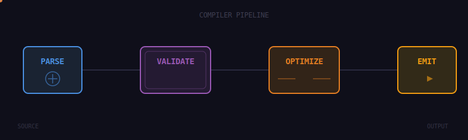
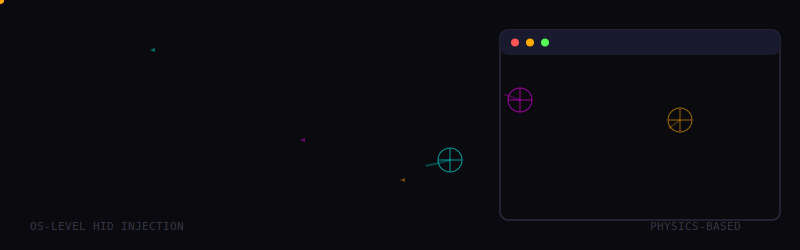
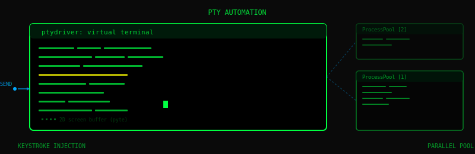

# Brandon Fryslie

Terminal systems, OS-level browser automation, animation compilers, distributed LED sync, and 15 years of finishing what I start.

---

## Now

<table><tr><td width="55%" valign="top">

**[oscilla-animator-v2](https://github.com/brandon-fryslie/oscilla-animator-v2)** *(753 commits, pushed today)*

Custom type system and compiler for animation. Block-graph architecture: blocks process/emit signals through typed connections (domains, payloads, cardinality). Compiler pipeline: parse → validate → optimize → emit. Not a tool — a domain-specific language.

**[cherry-chrome-mcp](https://github.com/brandon-fryslie/cherry-chrome-mcp)** *(last push Jan 27 2026)*

Chrome DevTools for AI agents. CSS selectors, not accessibility tree. "Less is More" — caps results at 5 elements. Dynamic tool visibility based on connection state.

**This profile** — 41 animated SVGs within GitHub's security sandbox. SMIL animations, prime-number durations (7s, 11s, 13s), pseudo-random effects without JavaScript.

</td><td width="45%" valign="top" align="center">

</td></tr></table>

---

## Recent Activity

<!-- RECENT-ACTIVITY:START -->

*Updated automatically · Last 5 repositories*

**[chaperone-auth-gateway](https://github.com/brandon-fryslie/chaperone-auth-gateway)** — Chaperone Auth Gateway
 Go · today

**[oscilla-animator-v2](https://github.com/brandon-fryslie/oscilla-animator-v2)** — Animation compiler with custom type system. Block-graph architecture, typed connections, 4-stage pipeline: parse → validate → optimize → emit.
 TypeScript · today

**[ha-gingerizer](https://github.com/brandon-fryslie/ha-gingerizer)** — Home Assistant Configuration + Jinja2!  Let's Gingerize!
 Python · today

**[brandon-fryslie](https://github.com/brandon-fryslie/brandon-fryslie)** — GitHub profile with animated SVG themes and multiple artistic lenses
 Unknown · yesterday

**[cc-dump](https://github.com/brandon-fryslie/cc-dump)** — HTTP proxy intercepting Anthropic API calls. Shows unified diffs of system prompt changes between requests.
 Python · yesterday

<!-- RECENT-ACTIVITY:END -->

---

## Signature Work

<table>
<tr>
<td width="50%" valign="top">

### [rad-shell](https://github.com/brandon-fryslie/rad-shell)
**41★ · 7 forks · 8 years active**

Preconfigured Zsh with Prezto + Zgen. The `.rad-plugins` composition model: user config is single source of truth, plugins loaded from any GitHub repo. Lazy-load NVM for fast startup. Includes rad-spinner: procedural braille-grid animations (12×4 grid, geometric rules).

### [browsergeist](https://github.com/brandon-fryslie/browsergeist)
**Python · macOS**

macOS browser automation via virtual HID drivers at OS level. NOT Selenium/Puppeteer — undetectable by JavaScript. Physics-based cursor movement with acceleration curves and behavioral randomization. Vision pipeline: OpenCV template matching, SIFT feature descriptors, OCR. Motion profiles: NATURAL, CAREFUL, FAST.

### [ptydriver](https://github.com/brandon-fryslie/ptydriver) + [ptytest](https://github.com/brandon-fryslie/ptytest)
**Python · MIT**

PTY automation: spawns processes in virtual terminals (pyte library), maintains 2D screen buffer, sends keystrokes, matches output patterns. ProcessPool for parallel instances. ptytest adds pytest integration with app-specific key abstractions: `FzfKeys.NAVIGATE_DOWN`, `VimKeys.ENTER_INSERT_MODE`, `TmuxKeys.SPLIT_HORIZONTAL`.

### [Firestorm](https://github.com/brandon-fryslie/Firestorm)

Centralized control for multiple Pixelblaze WiFi LED controllers. NTP-like time sync via UDP beacons — leverages Pixelblaze's discovery protocol. Client-driven sequence choreography. Automatic recovery: disconnected devices get cached commands within 5 minutes.

</td>
<td width="50%" valign="top">

### [oscilla-animator-v2](https://github.com/brandon-fryslie/oscilla-animator-v2)
**TypeScript · 753 commits**

Animation compiler with custom type system. Block-graph architecture: blocks process/emit signals through typed connections (domains, payloads, cardinality). Compiler pipeline: parse → validate → optimize → emit. Not a tool — a domain-specific language.

### [tesseract-react](https://github.com/brandon-fryslie/tesseract-react)
**2★ · JavaScript**

React UI controlling "Draco" kinetic LED sculpture. Real physical art installation. Docker deployment, iPad/local network access.

### [chaperone-auth-gateway](https://github.com/brandon-fryslie/chaperone-auth-gateway)
**Go · 99.2% · MIT**

JWT/session auth gateway with multi-stage release pipeline (beta → production). Multi-platform binaries (Linux/macOS/Windows × amd64/arm64). Has PROJECT_SPEC.md, ROADMAP.md, SECURITY.md — properly planned infrastructure.

### [brain-canvas](https://github.com/brandon-fryslie/brain-canvas)
**JavaScript · 220 lines, 13 KB**

Zero dependencies. Any LLM sends JSON → browser renders interactive UI. 10 section types. One command: `npx brain-canvas`.

### [Smoke](https://github.com/brandon-fryslie/Smoke)
**4★ · PHP · 2011**

NOT an MVC framework. Service locator extracting CodeIgniter's libraries for standalone scripts. `smoke()->calendar->generate()`. Deliberately excluded routing, controllers, caching. Predates widespread DI adoption.

</td>
</tr>
</table>

---

## More Projects

<strong>Developer Tools</strong>

 

- **[cc-dump](https://github.com/brandon-fryslie/cc-dump)** — HTTP proxy intercepting Anthropic API calls. Shows unified diffs of system prompt changes between requests. Debug Claude Code itself.

- **[claude-powerline](https://github.com/brandon-fryslie/claude-powerline)** — Vim-style statusline for Claude Code. Session cost, 5-hour rate-limit window, daily spend. Opus tokens weighted 5x Sonnet. "Today" segment cached: ~50ms after first ~250ms load.

- **[long-term](https://github.com/brandon-fryslie/long-term)** (Go) — PTY wrapper reporting fake terminal height. Solves tmux rendering bugs. Interactive mode: Ctrl+\ ×3 enters overlay UI, adjust height live, watch app re-render.

- **[kalider](https://github.com/brandon-fryslie/kalider)** (Python, Apache 2.0) — Natural language → Kali Linux commands. Review-before-execute safety model. Chains: "Found SSH on port 22 → suggest Hydra commands?"

<strong>Hardware & LED Art</strong>

 

- **[esp-bloom](https://github.com/brandon-fryslie/esp-bloom)** — Bias lighting: macOS screen capture → color processing → SK6812 RGBW LEDs via ESP8266 at 115200 baud. RGBW over RGB for better luminosity precision.

- **[pb-sync](https://github.com/brandon-fryslie/pb-sync)** — Version control for LED patterns. Backup .epe files + metadata from Pixelblaze devices. Planned: bi-directional sync, watch directory, auto-upload.

<strong>Legacy</strong>

 

- **[Smoke](https://github.com/brandon-fryslie/Smoke)** (4★, 2011) — NOT an MVC framework. Service locator extracting CodeIgniter's libraries for standalone scripts. `smoke()->calendar->generate()`. Deliberately excluded routing, controllers, caching. Predates widespread DI adoption.

- **[ember-rest.coffee](https://github.com/brandon-fryslie/ember-rest.coffee)** (CoffeeScript, 2014) — REST adapter for Ember.js pre-Ember Data era. Auto-serialization, validation, `save()`/`destroy()`.

- **[sake](https://github.com/brandon-fryslie/sake)** — WebSocket REPL. `./sake server [PORT]`, `./sake client [PORT]`, interactive message sending.

- **[combine](https://github.com/brandon-fryslie/combine)** — PHP asset pipeline (CSS/JS minification) from the pre-npm era.

---

## Case Studies

In-depth writeups exploring how specific projects evolved:

<table>
<tr>
<td width="33%" valign="top">

**[rad-shell: From Personal Tool to Open Source](./case-studies/rad-shell.md)**

How a personal shell configuration became a maintained project with 41 stars and 8 years of active development. Plugin architecture, composition model, and what makes personal tools worth maintaining.

</td>
<td width="33%" valign="top">

**[LED Art Stack: Building a Hardware Art Pipeline](./case-studies/led-art-stack.md)**

From ESP8266 bias lighting to PixelBlaze sync tools to kinetic sculpture installations. Building a multi-layer stack for controlling LED art, including network synchronization and physical deployments.

</td>
<td width="33%" valign="top">

**[AI Productivity: Force Multiplier, Not Replacement](./case-studies/ai-productivity.md)**

23 repos in 2025 vs ~5/year historically. What changed, what stayed the same, and how AI accelerates iteration without replacing architecture, taste, or decision-making.

</td>
</tr>
</table>

---

## Arc

<table>
<tr>
<td width="20%" valign="top" align="right"><strong>2011–2014</strong></td>
<td width="80%" valign="top">

**PHP/Ruby foundations** — [Smoke framework](https://github.com/brandon-fryslie/Smoke) (service locator predating DI adoption), early asset pipelines

</td>
</tr>
<tr>
<td width="20%" valign="top" align="right"><strong>2015–2018</strong></td>
<td width="80%" valign="top">

**JavaScript/Shell era** — [rad-shell](https://github.com/brandon-fryslie/rad-shell) matures (still most-starred work at 41★), Ember, CoffeeScript, DevOps

</td>
</tr>
<tr>
<td width="20%" valign="top" align="right"><strong>2019–2021</strong></td>
<td width="80%" valign="top">

**Hardware** — ESP8266 LED art, [Firestorm](https://github.com/brandon-fryslie/Firestorm) distributed sync, Pixelblaze pattern management, ErgoDox keyboard firmware

</td>
</tr>
<tr>
<td width="20%" valign="top" align="right"><strong>2022–2023</strong></td>
<td width="80%" valign="top">

**Quiet period** — Few public repos (private/corporate work)

</td>
</tr>
<tr>
<td width="20%" valign="top" align="right"><strong>2024–2025</strong></td>
<td width="80%" valign="top">

**AI tooling explosion** — 23 repos in one year. [ptydriver](https://github.com/brandon-fryslie/ptydriver), [browsergeist](https://github.com/brandon-fryslie/browsergeist), [cherry-chrome-mcp](https://github.com/brandon-fryslie/cherry-chrome-mcp), [kalider](https://github.com/brandon-fryslie/kalider), [cc-dump](https://github.com/brandon-fryslie/cc-dump), [brain-canvas](https://github.com/brandon-fryslie/brain-canvas), [claude-powerline](https://github.com/brandon-fryslie/claude-powerline)

</td>
</tr>
<tr>
<td width="20%" valign="top" align="right"><strong>2026</strong></td>
<td width="80%" valign="top">

**Animation compilers** — [oscilla-animator-v2](https://github.com/brandon-fryslie/oscilla-animator-v2) (753 commits), auth infrastructure ([chaperone](https://github.com/brandon-fryslie/chaperone-auth-gateway)), active daily development

</td>
</tr>
</table>

---

## Languages & Domains

**Domains:** Terminal/CLI · AI/MCP · LED/Hardware · Auth/Infra · Animation Systems · Security

**Real distribution** (from GitHub): Python 30% (21 repos) · JavaScript 10% · TypeScript 8% · Shell 8% · Go 4%

---

## Stats

---

## Principles

<table>
<tr>
<td width="25%" valign="top">

**Restraint**

Few projects, finished well

</td>
<td width="25%" valign="top">

**Coherence**

Consistent naming, structure, voice

</td>
<td width="25%" valign="top">

**Finish**

The last 10% is half the work

</td>
<td width="25%" valign="top">

**Seasonality**

Work in focused arcs, then archive

</td>
</tr>
</table>

---

## Alternate Views

This profile can be read through different lenses:

<table>
<tr>
<td width="25%" align="center">

**[Observatory](./README-OBSERVATORY.md)**

Science and instrumentation

</td>
<td width="25%" align="center">

**[Court](./README-COURT.md)**

Contracts and ceremony

</td>
<td width="25%" align="center">

**[Cyberpunk](./README-CYBERPUNK.md)**

Neon and chrome

</td>
<td width="25%" align="center">

**[Maximum Ridiculous](./README-MAXIMUM-RIDICULOUS.md)**

Zero chill

</td>
</tr>
</table>

---

## Colophon

**Banner:** Custom SVG with SMIL animations — faint wireframe over ivory, single burgundy accent

**Typography:** System fonts, no external dependencies

**Technique:** All animations work within GitHub's SVG security sandbox (no JS, no hover, no links). Prime-number durations (7s, 11s, 13s) with staggered delays for pseudo-random visual variety. Prefer SMIL over CSS animations for better GitHub rendering compatibility.

**Updated:** January 2026

View the [Gallery](./GALLERY.md) for all 41+ animated SVGs.

---

**— Brandon Fryslie**

*Winter 2026*

