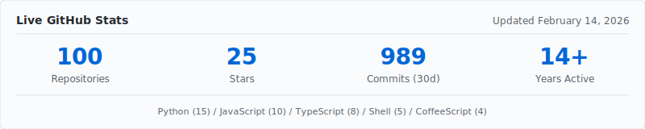
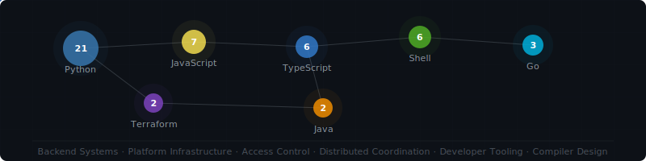

# Brandon Fryslie

**Backend & Platform Engineer** · Boulder, CO · brandon@fryslie.com

---

I build backend systems, platform infrastructure, and the tooling that connects them. Most of my career has been spent inside large engineering organizations, working on the kinds of systems that stay invisible when they're working correctly — access layers, deployment pipelines, environment management. The projects here are personal and open-source work in the same vein.

---

## Recent Repositories

<!-- RECENT-ACTIVITY:START -->

*Last updated February 14, 2026 · 5 most recently active repositories*

**[brandon-fryslie](https://github.com/brandon-fryslie/brandon-fryslie)** — GitHub profile with animated SVG themes and multiple artistic lenses
 Unknown · Feb 14, 2026

**[cc-dump](https://github.com/brandon-fryslie/cc-dump)** — HTTP proxy intercepting Anthropic API calls. Shows unified diffs of system prompt changes between requests.
 Python · Feb 13, 2026

**[rad-plugins](https://github.com/brandon-fryslie/rad-plugins)** — Plugins for rad-shell zsh setup
 Shell · ⭐ 3 · Feb 12, 2026

**[dotfiles](https://github.com/brandon-fryslie/dotfiles)** — No description
 Shell · ⭐ 3 · Feb 09, 2026

**[oscilla-animator-v2](https://github.com/brandon-fryslie/oscilla-animator-v2)** — Animation compiler with custom type system. Block-graph architecture, typed connections, 4-stage pipeline: parse → validate → optimize → emit.
 TypeScript · Feb 08, 2026

<!-- RECENT-ACTIVITY:END -->

---

## Selected Projects

<table>
<tr>
<td width="50%" valign="top">

### [chaperone-auth-gateway](https://github.com/brandon-fryslie/chaperone-auth-gateway)
**Go · MIT**

Authentication gateway supporting JWT and session-based auth with a multi-stage release pipeline. Cross-platform binaries for Linux, macOS, and Windows across amd64/arm64. Composable credential handling with documented security model.

### [oscilla-animator-v2](https://github.com/brandon-fryslie/oscilla-animator-v2)
**TypeScript · 753 commits**

Compiler for a domain-specific animation language. Custom type system built on a block-graph architecture: blocks process and emit signals through typed connections with enforced domain, payload, and cardinality constraints. Pipeline: parse, validate, optimize, emit.

### [rad-shell](https://github.com/brandon-fryslie/rad-shell)
**41★ · 7 forks · 8 years maintained**

Preconfigured Zsh environment with declarative plugin composition. Plugins resolve from any GitHub repository with a single-file manifest. Lazy-load architecture keeps startup fast under heavy plugin load. Includes rad-spinner: procedural braille-grid animations for terminal spinners.

</td>
<td width="50%" valign="top">

### [Firestorm](https://github.com/brandon-fryslie/Firestorm)
**Distributed coordination**

Control layer for networked WiFi LED controllers. NTP-style time synchronization via UDP, client-driven sequence choreography, and automatic recovery for disconnected devices. Deployed across physical art installations running continuously for multi-day events.

### [cherry-chrome-mcp](https://github.com/brandon-fryslie/cherry-chrome-mcp)
**TypeScript**

Chrome DevTools bridge for AI agents via Model Context Protocol. CSS selector-based element targeting with bounded result sets. Tool visibility adapts dynamically based on browser connection state.

### [browsergeist](https://github.com/brandon-fryslie/browsergeist)
**Python · macOS**

Browser automation through macOS virtual HID drivers — operates at the OS level, below the browser layer. Physics-based cursor movement with acceleration profiles and behavioral randomization. Vision pipeline: OpenCV template matching, SIFT feature descriptors, OCR.

</td>
</tr>
</table>

---

## More Projects

<strong>Developer Tooling</strong>

 

- **[cc-dump](https://github.com/brandon-fryslie/cc-dump)** — HTTP proxy intercepting Anthropic API calls. Displays unified diffs of system prompt changes between requests.
- **[claude-powerline](https://github.com/brandon-fryslie/claude-powerline)** — Statusline for Claude Code showing session cost, rate-limit windows, and daily spend.
- **[long-term](https://github.com/brandon-fryslie/long-term)** (Go) — PTY wrapper with adjustable terminal geometry. Solves rendering issues in multiplexed terminals.
- **[brain-canvas](https://github.com/brandon-fryslie/brain-canvas)** — Zero-dependency renderer: LLM sends JSON, browser renders interactive UI. One command: `npx brain-canvas`.
- **[ptydriver](https://github.com/brandon-fryslie/ptydriver) + [ptytest](https://github.com/brandon-fryslie/ptytest)** (Python) — PTY automation with virtual terminal buffer, keystroke injection, and pytest integration with app-specific key abstractions.

<strong>Hardware & Real-Time Systems</strong>

 

- **[tesseract-react](https://github.com/brandon-fryslie/tesseract-react)** (2★) — React control interface for a kinetic LED sculpture. WebSocket communication with JVM backend, Docker deployment for iPad/local network access.
- **[esp-bloom](https://github.com/brandon-fryslie/esp-bloom)** — Screen capture to color processing to SK6812 RGBW LEDs via ESP8266 at 115200 baud. RGBW for better luminosity precision.
- **[pb-sync](https://github.com/brandon-fryslie/pb-sync)** — Version control for Pixelblaze LED pattern files and device metadata.

<strong>Earlier Work</strong>

 

- **[Smoke](https://github.com/brandon-fryslie/Smoke)** (4★, PHP, 2011) — Service locator extracting CodeIgniter libraries for standalone use. Predates widespread dependency injection adoption.
- **[ember-rest.coffee](https://github.com/brandon-fryslie/ember-rest.coffee)** (CoffeeScript, 2014) — REST adapter for Ember.js before Ember Data existed.
- **[sake](https://github.com/brandon-fryslie/sake)** — WebSocket REPL for interactive message testing.
- **[combine](https://github.com/brandon-fryslie/combine)** — PHP asset pipeline from the pre-npm era.

---

## Technical Writing

<table>
<tr>
<td width="33%" valign="top">

**[From Personal Tool to Open Source](./case-studies/rad-shell.md)**

How a shell configuration grew into a maintained project over 8 years. Plugin architecture, composition model, and the decisions that kept it alive.

</td>
<td width="33%" valign="top">

**[Building a Hardware Art Pipeline](./case-studies/led-art-stack.md)**

Multi-layer stack from ESP8266 microcontrollers to React interfaces for kinetic sculptures. Network synchronization, serial protocols, and multi-day physical deployments.

</td>
<td width="33%" valign="top">

**[AI as Force Multiplier](./case-studies/ai-productivity.md)**

23 repos in one year vs ~5 historically. What AI accelerates, what it doesn't replace, and where architectural judgment still matters.

</td>
</tr>
</table>

---

## Publication

*Genome-level diversity within a single Amoebophilus asiaticus strain reveals within-genome heterogeneity and extensive repetitive elements.*
 The ISME Journal (Nature Publishing Group), 2013
 [doi:10.1038/ismej.2013.159](https://www.nature.com/articles/ismej2013159)

---

## Languages & Domains

---

## Education

**University of Arizona** — Computer Science & Philosophy

---

brandon@fryslie.com · Boulder, CO

