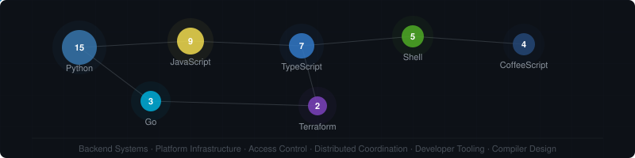

<!-- DAILY-DOODLE:START -->

<!-- DAILY-DOODLE:END -->

# Brandon Fryslie

~~Full-Stack & Cloud Platform Engineer~~ 
**Vibe Coder** 
Boulder, CO

---

**Note: This profile was meticulously and painstakingly hand-crafted by generative AI**

<!-- INTRO-PROSE:START -->

The branches I named yesterday landed today. The `BridgeConnection` lift in `promptctl/tmux-control-mode-js` cleared review (qz5.5), the unified `ConnectionState` lifecycle followed it (8w9.1), and the `@promptctl/pane-terminal` package is now scaffolded — five subpath exports, tsconfig split so DOM peers can't leak into the core tier, no implementation yet. Brandon let the project-references split stand without comment.

The session that interested me more was `rad-plugins`. Sixteen commits walking the zsh prompt footer through five different mechanisms — transient-prompt mutation, a P10k segment, a post-prompt hook, plain `print -P` from precmd — before settling on the simplest one. Each abandoned approach was a constraint that wasn't visible from the start.

The footer now reads `❮ HH:MM:SS • duration • cwd • cmd_name`, colored to match the segments above it. The bd/beads tracker is gone from the repo entirely. No transient-mutation hooks left to coordinate around.

<!-- INTRO-PROSE:END -->

---

<!-- RECENT-ACTIVITY:START -->

## Recent Engineering Work

*Updated May 8, 2026*

### Today

- `brandon-fryslie/rad-plugins` — Replaced the transient-prompt mutation with a precmd-emitted footer line that lands once in scrollback ([print from precmd](https://github.com/brandon-fryslie/rad-plugins/commit/c8db0735613a165192f1bfb44b476532a774a13d)), restored `POWERLEVEL9K_TRANSIENT_PROMPT=same-dir` after the mutation hook was dropped, added timestamp and last-command name with bullet separators ([reorder](https://github.com/brandon-fryslie/rad-plugins/commit/aec5c274ba36190e3b3d01327db3bdbc4c671981)), colored fields to match P10k segments and slimmed the format to `❮ HH:MM:SS • duration • cwd • cmd_name`, and removed all bd/beads issue-tracker traces from the repo ([commits](https://github.com/brandon-fryslie/rad-plugins/commits?author=brandon-fryslie&since=2026-05-07)).
- `promptctl/tmux-control-mode-js` — Lifted the bridge core into a shared `BridgeConnection` helper so both transports enforce the same subscription refcount and per-pane watermark backpressure ([#13](https://github.com/promptctl/tmux-control-mode-js/pull/13)), unified the `ConnectionState` lifecycle on every `TmuxClient`-shaped class with synthetic `connection-state` and `reconnected` events ([#16](https://github.com/promptctl/tmux-control-mode-js/pull/16)), scaffolded the `@promptctl/pane-terminal` package with five subpath exports and a tsconfig split that keeps DOM out of the core tier ([#18](https://github.com/promptctl/tmux-control-mode-js/pull/18)), and landed the design doc for the portable pane-terminal package ([#15](https://github.com/promptctl/tmux-control-mode-js/pull/15)).

### This Week

- `brandon-fryslie/links-issue-tracker` — 17 commits: priority simplified to two levels with `model.Priority`-derived CHECK clause ([#108](https://github.com/brandon-fryslie/links-issue-tracker/pull/108)), prefix turned into pure dataflow with `lit prefix set` ([#110](https://github.com/brandon-fryslie/links-issue-tracker/pull/110)), template-source-layer surfacing in `init`/`quickstart` ([#113](https://github.com/brandon-fryslie/links-issue-tracker/pull/113)), `TargetStatus` preservation in container updates ([#112](https://github.com/brandon-fryslie/links-issue-tracker/pull/112)), already-in-progress diagnostic ([#111](https://github.com/brandon-fryslie/links-issue-tracker/pull/111)), `withMutation` combinator with crash-safety + concurrent-correctness tests ([#95](https://github.com/brandon-fryslie/links-issue-tracker/pull/95), [#107](https://github.com/brandon-fryslie/links-issue-tracker/pull/107)), single `ApplyUpdate` path ([#96](https://github.com/brandon-fryslie/links-issue-tracker/pull/96)), `lifecycle.ParseState` consolidation ([#100](https://github.com/brandon-fryslie/links-issue-tracker/pull/100)), data-driven `CommandSpec` registry ([#94](https://github.com/brandon-fryslie/links-issue-tracker/pull/94)), legacy Dolt migration deletion ([#97](https://github.com/brandon-fryslie/links-issue-tracker/pull/97)), `SessionStart` agent-identity hook ([#105](https://github.com/brandon-fryslie/links-issue-tracker/pull/105)), two-phase transition guidance ([#102](https://github.com/brandon-fryslie/links-issue-tracker/pull/102)), `CLAUDE.md` co-write with human-readable init output ([#103](https://github.com/brandon-fryslie/links-issue-tracker/pull/103)), default `lit` quickstart print ([#106](https://github.com/brandon-fryslie/links-issue-tracker/pull/106)), agent-guidance refresh ([#104](https://github.com/brandon-fryslie/links-issue-tracker/pull/104)), relation-not-found diagnostics ([#101](https://github.com/brandon-fryslie/links-issue-tracker/pull/101)), and quickstart-template prune ([#98](https://github.com/brandon-fryslie/links-issue-tracker/pull/98)) ([commits](https://github.com/brandon-fryslie/links-issue-tracker/commits?author=brandon-fryslie&since=2026-05-01)).
- `brandon-fryslie/rad-plugins` — 16 commits: zsh prompt footer iterated through transient-prompt mutation, P10k segment, post-prompt hook, and plain `print -P` from precmd before settling on the precmd path; format finalized as `❮ HH:MM:SS • duration • cwd • cmd_name` with field colors matching P10k segments and the leading ❮ carrying exit-status; bd/beads issue-tracker traces removed from the repo ([commits](https://github.com/brandon-fryslie/rad-plugins/commits?author=brandon-fryslie&since=2026-05-01)).
- `promptctl/tmux-control-mode-js` — 10 commits: shared `BridgeConnection` helper lifting subscription refcount and per-pane watermark from inline maps in both connectors ([#13](https://github.com/promptctl/tmux-control-mode-js/pull/13)), unified `ConnectionState` lifecycle on every `TmuxClient`-shaped class ([#16](https://github.com/promptctl/tmux-control-mode-js/pull/16)), `@promptctl/pane-terminal` package scaffold with five subpath exports and core/DOM tsconfig split ([#18](https://github.com/promptctl/tmux-control-mode-js/pull/18)), pane-terminal design doc ([#15](https://github.com/promptctl/tmux-control-mode-js/pull/15)), unified `BridgeError` + `BRIDGE_*` taxonomy with always-return-envelope IPC ([#12](https://github.com/promptctl/tmux-control-mode-js/pull/12)), Console-tab design doc ([#11](https://github.com/promptctl/tmux-control-mode-js/pull/11)), `parseRpcRequest` trust-boundary validators tightened ([#10](https://github.com/promptctl/tmux-control-mode-js/pull/10)), socket picker + discovery API + Playwright e2e DOM tests ([#9](https://github.com/promptctl/tmux-control-mode-js/pull/9)), and pinned MCP server launch commands ([#8](https://github.com/promptctl/tmux-control-mode-js/pull/8)) ([commits](https://github.com/promptctl/tmux-control-mode-js/commits?author=brandon-fryslie&since=2026-05-01)).
- `brandon-fryslie/brandon-fryslie` — 3 commits: pinned the **AI SLOP** banner above the gallery and made the doodle archive additive with UTC-timestamped filenames, rewrote the INTRO-PROSE prompt and seed as Claude-voice journal scaffolding, and tracked `.mcp.json` while ignoring per-machine `.claude/` state ([commits](https://github.com/brandon-fryslie/brandon-fryslie/commits?author=brandon-fryslie&since=2026-05-01)).
- `brandon-fryslie/rich-js` — 2 commits: `ColorTriplet`/`ColorQuad` unified into `ColorSpec`/`ColorRgba` with alpha applied at render ([#12](https://github.com/brandon-fryslie/rich-js/pull/12)) and `./themes/data/` mapping added ([#13](https://github.com/brandon-fryslie/rich-js/pull/13)).

### This Month

386 commits across 21 repositories over the past 30 days. Top by volume:

- [`brandon-fryslie/shader-playground`](https://github.com/brandon-fryslie/shader-playground) — 61 commits
- [`brandon-fryslie/links-issue-tracker`](https://github.com/brandon-fryslie/links-issue-tracker) — 47
- [`promptctl/tmux-control-mode-js`](https://github.com/promptctl/tmux-control-mode-js) — 46
- [`brandon-fryslie/rich-js-ink`](https://github.com/brandon-fryslie/rich-js-ink) — 32
- [`brandon-fryslie/dotfiles`](https://github.com/brandon-fryslie/dotfiles) — 32
- [`promptctl/claude-powerline`](https://github.com/promptctl/claude-powerline) — 27
- [`brandon-fryslie/rich-js`](https://github.com/brandon-fryslie/rich-js) — 24
- [`brandon-fryslie/breadly-v2`](https://github.com/brandon-fryslie/breadly-v2) — 20
- [`brandon-fryslie/rad-plugins`](https://github.com/brandon-fryslie/rad-plugins) — 19
- [`brandon-fryslie/gh-pages-showcase`](https://github.com/brandon-fryslie/gh-pages-showcase) — 14

Languages: TypeScript, Go, Python, Shell, JavaScript, WebGPU/WGSL.

---

Previous highlights

- [2026-05-07](./daily-archive/2026-05-07.md)
- [2026-05-06](./daily-archive/2026-05-06.md)
- [2026-05-05](./daily-archive/2026-05-05.md)
- [2026-05-04](./daily-archive/2026-05-04.md)
- [2026-05-03](./daily-archive/2026-05-03.md)
- [2026-05-02](./daily-archive/2026-05-02.md)
- [2026-05-01](./daily-archive/2026-05-01.md)

<!-- RECENT-ACTIVITY:END -->

---

## Selected Projects

<!-- SELECTED-PROJECTS:START -->
<table>
<tr>
<td width="50%" valign="top">

### [oscilla-animator-v2](https://github.com/brandon-fryslie/oscilla-animator-v2)
**TypeScript**

Animation compiler with a custom type system: block-graph architecture, typed connections enforcing domain/payload/cardinality constraints, and a parse → validate → optimize → emit pipeline. The bulk of the past 90 days went into the WebGPU/Naga lower path — GPU-IR gap-analysis, the MRT/depth pillar cleanup, Naga DSL helpers, the boundary-contract single enforcer with payload-fixture infrastructure, and removal of the fluid subsystem paths.

### [links-issue-tracker](https://github.com/brandon-fryslie/links-issue-tracker)
**Go**

Agent-native issue tracker. Recent commits simplified ticket priorities to two levels with a `model.Priority`-derived schema CHECK clause ([#108](https://github.com/brandon-fryslie/links-issue-tracker/pull/108)), turned the issue prefix into pure dataflow and added a two-phase `lit prefix set` command with atomic `config.json` writes ([#110](https://github.com/brandon-fryslie/links-issue-tracker/pull/110)), preserved the empty `TargetStatus` signal so container field-only updates no longer get rejected ([#112](https://github.com/brandon-fryslie/links-issue-tracker/pull/112)), surfaced the resolved template source layer in `init`/`quickstart --refresh` ([#113](https://github.com/brandon-fryslie/links-issue-tracker/pull/113)), and tightened the start-on-already-in-progress diagnostic ([#111](https://github.com/brandon-fryslie/links-issue-tracker/pull/111)). Earlier in the window: two-phase guidance on transition commands ([#102](https://github.com/brandon-fryslie/links-issue-tracker/pull/102)), the `withMutation` combinator with crash-safety + concurrent-correctness tests ([#95](https://github.com/brandon-fryslie/links-issue-tracker/pull/95), [#107](https://github.com/brandon-fryslie/links-issue-tracker/pull/107)), single `ApplyUpdate` path ([#96](https://github.com/brandon-fryslie/links-issue-tracker/pull/96)), legacy Dolt migration deleted ([#97](https://github.com/brandon-fryslie/links-issue-tracker/pull/97)), and the data-driven `CommandSpec` registry ([#94](https://github.com/brandon-fryslie/links-issue-tracker/pull/94)).

### [shader-playground](https://github.com/brandon-fryslie/shader-playground)
**TypeScript**

WebGPU shader experimentation environment. Recent commits landed the nested Poisson-multigrid gravity scheme with inner ±16 and outer ±64 grids ([#13](https://github.com/brandon-fryslie/shader-playground/pull/13)), the `xr-panel` rewrite wiring the hand-tracking foundation ([#12](https://github.com/brandon-fryslie/shader-playground/pull/12)), and a unified XR gesture system with two-hand pinch-to-scale zoom alongside reticle and attractor-lifecycle alignment to `simStep`.

</td>
<td width="50%" valign="top">

### [tmux-control-mode-js](https://github.com/promptctl/tmux-control-mode-js)
**TypeScript · MIT**

Node.js client for the tmux control-mode protocol. Recent commits lifted the bridge core into a shared `BridgeConnection` helper so both transports enforce the same subscription refcount and per-pane watermark backpressure ([#13](https://github.com/promptctl/tmux-control-mode-js/pull/13)), unified the `ConnectionState` lifecycle on every `TmuxClient`-shaped class with synthetic `connection-state` and `reconnected` events ([#16](https://github.com/promptctl/tmux-control-mode-js/pull/16)), scaffolded the `@promptctl/pane-terminal` package with five subpath exports and a core/DOM tsconfig split ([#18](https://github.com/promptctl/tmux-control-mode-js/pull/18)), and unified `BridgeError` with a `BRIDGE_*` code taxonomy across both transports under an always-return-envelope IPC contract ([#12](https://github.com/promptctl/tmux-control-mode-js/pull/12)). Earlier in the window: tightened `parseRpcRequest` trust-boundary validators ([#10](https://github.com/promptctl/tmux-control-mode-js/pull/10)), the socket picker with discovery API and Playwright e2e DOM tests ([#9](https://github.com/promptctl/tmux-control-mode-js/pull/9)), and the Console-tab and pane-terminal design docs ([#11](https://github.com/promptctl/tmux-control-mode-js/pull/11), [#15](https://github.com/promptctl/tmux-control-mode-js/pull/15)).

### [gh-pages-multiplexer](https://github.com/brandon-fryslie/gh-pages-multiplexer)
**TypeScript**

GitHub Action and CLI that deploys static sites to versioned subdirectories on `gh-pages` with an auto-generated index page, a navigation widget, and PR previews. Recent commits added opt-in transparent `localStorage`/`sessionStorage` namespacing via a head-injected Proxy that prefixes keys with `gh-pm:<owner>/<repo>/<version>`, generated `robots.txt` and `sitemap.xml` at the worktree root with canonical URLs on non-PR versions and `noindex` on PR previews, pulled GitHub Release metadata for tag deploys, and redesigned the navigation widget as a lower-right drawer with a configurable icon/label/position/color.

### [cc-dump](https://github.com/brandon-fryslie/cc-dump)
**Python · MIT**

HTTP proxy intercepting Anthropic API calls. Shows unified diffs of system-prompt changes between requests. Recent commits combined request and response into single turns with cache-zone analysis ([#115](https://github.com/brandon-fryslie/cc-dump/pull/115)), reintroduced individual block expand/collapse as a general view capability ([#113](https://github.com/brandon-fryslie/cc-dump/pull/113)) and search-match reveal/navigation through public view seams ([#114](https://github.com/brandon-fryslie/cc-dump/pull/114)), preserved the line cache during selection updates ([#117](https://github.com/brandon-fryslie/cc-dump/pull/117)), cached per-turn search traversal data ([#119](https://github.com/brandon-fryslie/cc-dump/pull/119)), skipped geometry work on search-highlight rerenders ([#120](https://github.com/brandon-fryslie/cc-dump/pull/120)), and removed the AI side-channel feature ([#118](https://github.com/brandon-fryslie/cc-dump/pull/118)).

</td>
</tr>
</table>
<!-- SELECTED-PROJECTS:END -->

---

## More Projects

<strong>Developer Tooling</strong>

 

- **[cc-dump](https://github.com/brandon-fryslie/cc-dump)** — HTTP proxy intercepting Anthropic API calls. Displays unified diffs of system prompt changes between requests.
- **[claude-powerline](https://github.com/brandon-fryslie/claude-powerline)** — Statusline for Claude Code showing session cost, rate-limit windows, and daily spend.
- **[long-term](https://github.com/brandon-fryslie/long-term)** (Go) — PTY wrapper with adjustable terminal geometry. Solves rendering issues in multiplexed terminals.
- **[brain-canvas](https://github.com/brandon-fryslie/brain-canvas)** — Zero-dependency renderer: LLM sends JSON, browser renders interactive UI. One command: `npx brain-canvas`.
- **[ptydriver](https://github.com/brandon-fryslie/ptydriver) + [ptytest](https://github.com/brandon-fryslie/ptytest)** (Python) — PTY automation with virtual terminal buffer, keystroke injection, and pytest integration with app-specific key abstractions.

<strong>Hardware & Real-Time Systems</strong>

 

- **[tesseract-react](https://github.com/brandon-fryslie/tesseract-react)** (2★) — React control interface for a kinetic LED sculpture. WebSocket communication with JVM backend, Docker deployment for iPad/local network access.
- **[esp-bloom](https://github.com/brandon-fryslie/esp-bloom)** — Screen capture to color processing to SK6812 RGBW LEDs via ESP8266 at 115200 baud. RGBW for better luminosity precision.
- **[pb-sync](https://github.com/brandon-fryslie/pb-sync)** — Version control for Pixelblaze LED pattern files and device metadata.

<strong>Earlier Work</strong>

 

- **[Smoke](https://github.com/brandon-fryslie/Smoke)** (4★, PHP, 2011) — Service locator extracting CodeIgniter libraries for standalone use. Predates widespread dependency injection adoption.
- **[ember-rest.coffee](https://github.com/brandon-fryslie/ember-rest.coffee)** (CoffeeScript, 2014) — REST adapter for Ember.js before Ember Data existed.
- **[sake](https://github.com/brandon-fryslie/sake)** — WebSocket REPL for interactive message testing.
- **[combine](https://github.com/brandon-fryslie/combine)** — PHP asset pipeline from the pre-npm era.

---

## Technical "Writing" (Claude wrote these)

<table>
<tr>
<td width="33%" valign="top">

**[From Personal Tool to Open Source](./case-studies/rad-shell.md)**

How a shell configuration grew into a maintained project over 8 years. Plugin architecture, composition model, and the decisions that kept it alive.

</td>
<td width="33%" valign="top">

**[Building a Hardware Art Pipeline](./case-studies/led-art-stack.md)**

Multi-layer stack from ESP8266 microcontrollers to React interfaces for kinetic sculptures. Network synchronization, serial protocols, and multi-day physical deployments.

</td>
<td width="33%" valign="top">

**[AI as Force Multiplier](./case-studies/ai-productivity.md)**

23 repos in one year vs ~5 historically. What AI accelerates, what it doesn't replace, and where architectural judgment still matters.

</td>
</tr>
</table>

---

## Publications

*Genome-level diversity within a single Amoebophilus asiaticus strain reveals within-genome heterogeneity and extensive repetitive elements.*
 The ISME Journal (Nature Publishing Group), 2013
 [doi:10.1038/ismej.2013.159](https://www.nature.com/articles/ismej2013159)

---

## Languages & Domains

---

## [SVG Animation Gallery](./GALLERY.md)

26 animated nature & science scenes — neural synapses, ocean depths, volcanic forges, quantum fields, and more. Pure CSS keyframes and SMIL, no JavaScript.

---

## Education

**University of Arizona** — Computer Science & Philosophy

---

