# Daily Stats Cards

Every "Live GitHub Stats" card that has appeared on this profile, newest first. The card at the top of [README.md](./README.md) is overwritten every morning; this page is where the previous ones keep living.

The gallery between the `<!-- STATS-GALLERY:START -->` and `<!-- STATS-GALLERY:END -->` markers below is generated by `.github/scripts/sync-stats-archive.py` from the files in [`stats-archive/`](./stats-archive/). Which days appear is recovered from this repository's git history. Nothing here is hand-maintained — see [`stats-archive/README.md`](./stats-archive/README.md) for how that works and why.

From August 2026 the card is composed fresh each morning by a Claude invocation reading a rich data seam, so the *shape* of the picture changes daily along with the data it encodes. Cards through July 2026 were drawn by a deterministic generator instead — the same four-tile layout every day, only the numbers moving — and those are being **remastered**: redrawn by the same daily process, from the same day's real numbers reconstructed as of that day. A remastered card is not the card that was live that morning; it is a better drawing of what that morning's data actually said.

Captions carry each day's headline numbers so the gallery can be skimmed without opening anything. A handful of the earliest not-yet-remastered cards have no caption — those predate the data seam and did not render their metrics in a form that could be read back without guessing at them.

<!-- STATS-GALLERY:START -->

## August 16, 2026 · 06:24 UTC



Days Active 21/30 (30 Days) · Longest Streak 82 (1 Year) · Commits 327 (30 Days) · PRs Merged 2072 (All Time)

---

## August 15, 2026 · 17:37 UTC

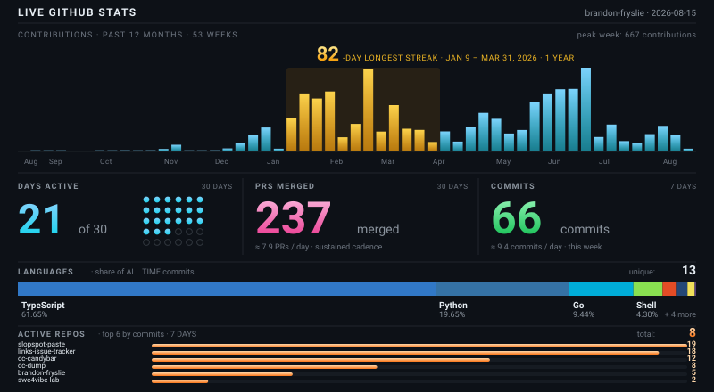

Days Active 21/30 (30 Days) · Longest Streak 82 (1 Year) · PRs Merged 237 (30 Days) · Commits 66 (7 Days) · Languages 13 (All Time) · Active Repos 8 (7 Days)

---

## August 15, 2026 · 06:24 UTC

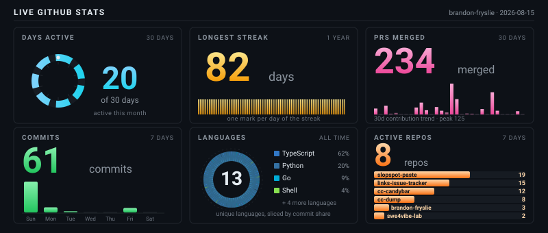

Days Active 20/30 (30 Days) · Longest Streak 82 (1 Year) · PRs Merged 234 (30 Days) · Commits 61 (7 Days) · Languages 13 (All Time) · Active Repos 8 (7 Days)

---

## August 14, 2026 · 06:45 UTC



Languages 13 (All Time) · Days Active 19/30 (30 Days) · Commits 6243 (All Time) · PRs Merged 2059 (All Time) · Active Repos 9 (7 Days)

---

## August 13, 2026 · 06:50 UTC



Commits 67 (7 Days) · Languages 8 (1 Year) · Active Repos 55 (1 Year) · Days Active 19/30 (30 Days) · My Issues Closed 68 (1 Year)

---

## August 12, 2026 · 06:42 UTC



Longest Streak 82 (1 Year) · Languages 8 (1 Year) · Active Repos 16 (30 Days) · Commits 69 (7 Days) · PRs Merged 62 (7 Days) · Days Active 255/365 (1 Year)

---

## August 11, 2026 · 06:31 UTC



Active Repos 16 (30 Days) · Days Active 255/365 (1 Year) · Commits 73 (7 Days) · Languages 8 (1 Year) · Longest Streak 82 (1 Year)

---

## August 10, 2026 · 06:44 UTC



Longest Streak 82 (1 Year) · Languages 8 (1 Year) · Days Active 254/365 (1 Year) · PRs Merged 1973 (1 Year)

---

## August 10, 2026 · 01:09 UTC



Longest Streak 82 (1 Year) · Languages 8 (1 Year) · Days Active 253/365 (1 Year) · PRs Merged 1951 (1 Year)

---

## August 9, 2026 · 18:22 UTC



Days Active 253/365 (1 Year) · My Issues Closed 87 (All Time) · Active Repos 55 (1 Year) · Commits 6202 (All Time) · Longest Streak 82 (1 Year)

---

## August 9, 2026 · 06:30 UTC



Days Active 252/365 (1 Year) · My Issues Closed 87 (All Time) · Active Repos 55 (1 Year) · Commits 6188 (All Time) · Longest Streak 82 (1 Year)

---

## August 8, 2026 · 06:24 UTC



Active Repos 57 (1 Year) · Longest Streak 82 (1 Year) · My Issues Closed 87 (All Time) · Languages 9 (1 Year)

---

## August 7, 2026 · 06:29 UTC



Active Repos 17 (30 Days) · Longest Streak 82 (1 Year) · Commits 5603 (1 Year) · Days Active 20/30 (30 Days) · My Issues Closed 68 (1 Year) · Languages 9 (1 Year)

---

## August 5, 2026 · 07:12 UTC



PRs Merged 103 (7 Days) · Commits 6174 (All Time) · Active Repos 18 (30 Days) · Days Active 21/30 (30 Days) · Languages 9 (1 Year) · My Issues Closed 87 (All Time)

---

## August 4, 2026 · 06:58 UTC



Longest Streak 82 (1 Year) · Commits 366 (30 Days) · Active Repos 57 (1 Year) · PRs Merged 296 (30 Days) · Languages 5 (30 Days) · My Issues Closed 68 (1 Year)

---

## August 4, 2026 · 00:35 UTC



Longest Streak 82 (1 Year) · Commits 366 (30 Days) · Active Repos 57 (1 Year) · PRs Merged 296 (30 Days) · Languages 5 (30 Days) · My Issues Closed 68 (1 Year)

---

## August 3, 2026 · 07:14 UTC



Commits 6169 (All Time) · PRs Reviewed 2 (30 Days) · PRs Merged 1996 (All Time) · Days Active 21/30 (30 Days) · Active Repos 57 (1 Year)

---

## August 2, 2026 · 06:59 UTC



My Issues Closed 87 (All Time) · Active Repos 10 (7 Days) · Commits 130 (7 Days) · Repos Created 181 (All Time)

---

## August 2, 2026 · 02:33 UTC



My Issues Closed 87 (All Time) · Active Repos 10 (7 Days) · Commits 133 (7 Days) · Repos Created 181 (All Time)

---

## August 2, 2026 · 00:19 UTC



My Issues Closed 87 (All Time) · Active Repos 10 (7 Days) · Commits 134 (7 Days) · Repos Created 181 (All Time)

---

## August 1, 2026 · 23:37 UTC



Code Reviews 29 (1 Year) · Active Repos 17 (30 Days) · PRs Merged 1962 (All Time)

---

## August 1, 2026 · 11:48 UTC



Code Reviews 29 (1 Year) · Active Repos 15 (30 Days) · PRs Merged 1957 (All Time)

---

## August 1, 2026 · 06:50 UTC

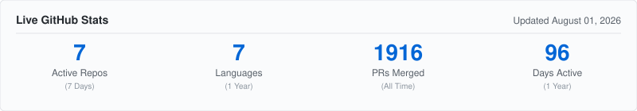

Active Repos 17 (30 Days) · Days Active 250/365 (1 Year) · PRs Merged 1916 (All Time)

---

## July 31, 2026 · 07:00 UTC



Languages 5 (30 Days) · Longest Streak 82 (1 Year) · Active Repos 7 (7 Days) · PRs Merged 54 (7 Days)

---

## July 30, 2026 · 06:50 UTC



My Issues Closed 69 (1 Year) · Days Active 249/365 (1 Year) · Commits 312 (30 Days) · PRs Merged 1832 (1 Year) · Longest Streak 82 (1 Year)

---

## July 29, 2026 · 14:44 UTC

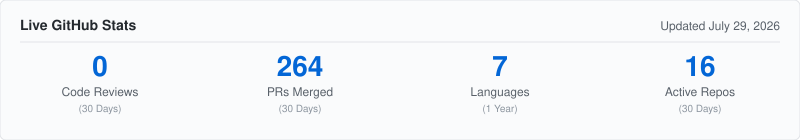

My Issues Closed 69 (1 Year) · Languages 9 (1 Year) · Days Active 248/365 (1 Year) · PRs Merged 264 (30 Days)

---

## July 29, 2026 · 06:52 UTC

My Issues Closed 69 (1 Year) · Languages 9 (1 Year) · Days Active 248/365 (1 Year) · PRs Merged 263 (30 Days)

---

## July 28, 2026 · 06:51 UTC



Active Repos 15 (30 Days) · Languages 9 (1 Year) · Longest Streak 82 (1 Year) · PRs Merged 265 (30 Days)

---

## July 27, 2026 · 07:04 UTC



Active Repos 55 (1 Year) · Commits 66 (7 Days) · Languages 9 (1 Year) · Longest Streak 82 (1 Year)

---

## July 26, 2026 · 06:54 UTC

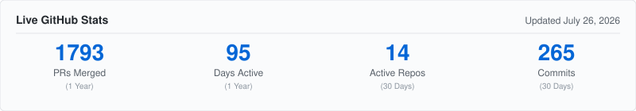

Longest Streak 82 (1 Year) · Active Repos 55 (1 Year) · Languages 5 (30 Days) · Commits 6005 (All Time) · Days Active 22/30 (30 Days)

---

## July 25, 2026 · 06:47 UTC



My Issues Closed 69 (1 Year) · Longest Streak 82 (1 Year) · Languages 5 (30 Days) · Active Repos 7 (7 Days) · PRs Merged 289 (30 Days) · Days Active 22/30 (30 Days)

---

## July 24, 2026 · 06:51 UTC



My Issues Closed 69 (1 Year) · Languages 13 (All Time) · Days Active 245/365 (1 Year) · Active Repos 15 (30 Days) · Longest Streak 82 (1 Year)

---

## July 23, 2026 · 06:49 UTC



Active Repos 6 (7 Days) · Languages 5 (30 Days) · Commits 5404 (1 Year) · Longest Streak 82 (1 Year) · My Issues Closed 87 (All Time)

---

## July 22, 2026 · 06:49 UTC



Languages 9 (1 Year) · Commits 41 (7 Days) · PRs Merged 28 (7 Days) · Active Repos 55 (1 Year) · Days Active 24/30 (30 Days) · Longest Streak 82 (1 Year)

---

## July 21, 2026 · 06:49 UTC



PRs Merged 1780 (1 Year) · Longest Streak 82 (1 Year) · My Issues Closed 69 (1 Year) · Days Active 25/30 (30 Days)

---

## July 20, 2026 · 07:00 UTC

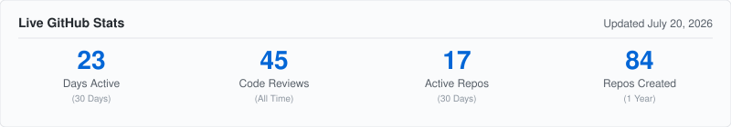

Languages 9 (1 Year) · My Issues Closed 69 (1 Year) · Commits 619 (30 Days) · Longest Streak 82 (1 Year)

---

## July 19, 2026 · 06:49 UTC

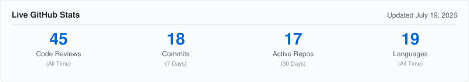

Languages 5 (30 Days) · My Issues Closed 87 (All Time) · Active Repos 17 (30 Days)

---

## July 18, 2026 · 06:37 UTC

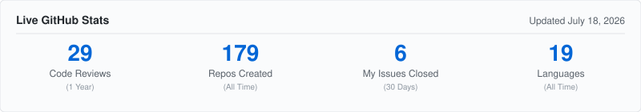

Languages 5 (30 Days) · Longest Streak 82 (1 Year) · Active Repos 17 (30 Days) · PRs Merged 16 (7 Days) · Days Active 24/30 (30 Days) · Commits 5946 (All Time)

---

## July 17, 2026 · 06:46 UTC



Active Repos 17 (30 Days) · My Issues Closed 6 (30 Days) · Languages 13 (All Time) · PRs Merged 1753 (1 Year) · Longest Streak 82 (1 Year) · Days Active 243/365 (1 Year)

---

## July 16, 2026 · 06:47 UTC



Commits 52 (7 Days) · Longest Streak 82 (1 Year) · Active Repos 18 (30 Days) · Languages 13 (All Time) · My Issues Closed 87 (All Time)

---

## July 15, 2026 · 06:44 UTC

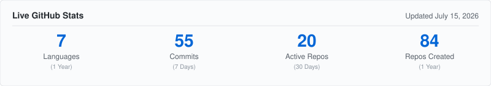

Commits 688 (30 Days) · Days Active 26/30 (30 Days) · Languages 13 (All Time) · Active Repos 7 (7 Days) · My Issues Closed 6 (30 Days) · PRs Merged 1753 (1 Year)

---

## July 14, 2026 · 06:41 UTC



PRs Merged 1832 (All Time) · Active Repos 54 (1 Year) · Days Active 243/365 (1 Year)

---

## July 13, 2026 · 07:01 UTC

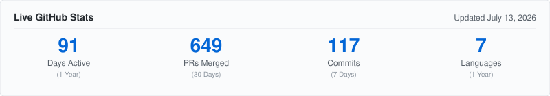

PRs Merged 124 (7 Days) · Languages 6 (30 Days) · Active Repos 11 (7 Days) · My Issues Closed 87 (All Time) · Longest Streak 82 (1 Year) · Days Active 28/30 (30 Days)

---

## July 12, 2026 · 06:51 UTC



Longest Streak 82 (1 Year) · Languages 13 (All Time) · Active Repos 11 (7 Days) · Days Active 29/30 (30 Days)

---

## July 11, 2026 · 06:43 UTC



Longest Streak 82 (1 Year) · Days Active 29/30 (30 Days) · Languages 6 (30 Days) · PRs Merged 1823 (All Time) · Commits 848 (30 Days)

---

## July 10, 2026 · 07:07 UTC

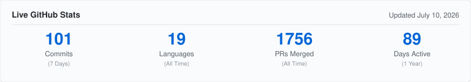

Languages 9 (1 Year) · Days Active 29/30 (30 Days) · Longest Streak 82 (1 Year) · My Issues Closed 87 (All Time)

---

## July 9, 2026 · 07:14 UTC

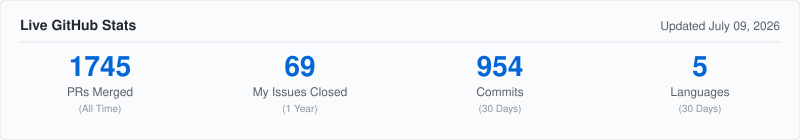

Longest Streak 82 (1 Year) · Days Active 29/30 (30 Days) · My Issues Closed 87 (All Time) · Commits 94 (7 Days) · PRs Merged 98 (7 Days)

---

## July 8, 2026 · 06:47 UTC

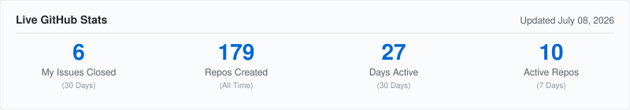

Days Active 239/365 (1 Year) · PRs Merged 1698 (1 Year) · My Issues Closed 87 (All Time) · Longest Streak 82 (1 Year)

---

## July 7, 2026 · 07:07 UTC

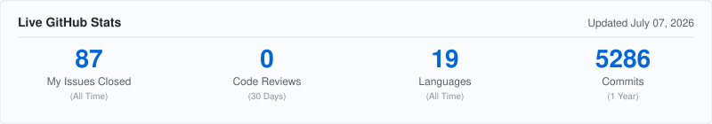

Longest Streak 82 (1 Year) · Active Repos 20 (30 Days) · Commits 5861 (All Time) · My Issues Closed 6 (30 Days)

---

## July 6, 2026 · 07:26 UTC

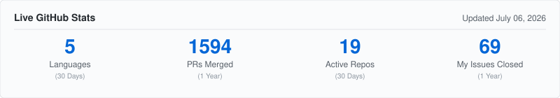

PRs Merged 1709 (All Time) · Days Active 237/365 (1 Year) · Active Repos 54 (1 Year) · Languages 13 (All Time) · My Issues Closed 87 (All Time)

---

## July 5, 2026 · 07:05 UTC



Commits 5236 (1 Year) · My Issues Closed 87 (All Time) · Longest Streak 82 (1 Year) · PRs Merged 1621 (1 Year)

---

## July 4, 2026 · 07:03 UTC

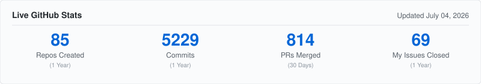

Commits 63 (7 Days) · Languages 5 (30 Days) · PRs Merged 814 (30 Days) · Active Repos 53 (1 Year) · Days Active 29/30 (30 Days) · My Issues Closed 6 (30 Days)

---

## July 3, 2026 · 07:05 UTC



Commits 988 (30 Days) · Active Repos 7 (7 Days) · Days Active 234/365 (1 Year) · PRs Merged 1684 (All Time) · Longest Streak 82 (1 Year) · My Issues Closed 69 (1 Year)

---

## July 2, 2026 · 07:08 UTC

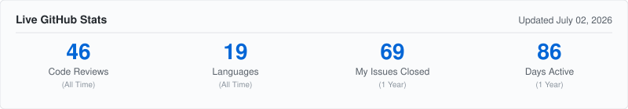

Days Active 233/365 (1 Year) · PRs Merged 110 (7 Days) · Languages 9 (1 Year)

---

## July 1, 2026 · 07:23 UTC

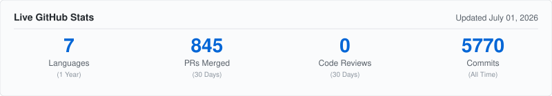

My Issues Closed 6 (30 Days) · Days Active 29/30 (30 Days) · Longest Streak 82 (1 Year) · Active Repos 53 (1 Year)

---

## June 30, 2026 · 07:12 UTC



My Issues Closed 6 (30 Days) · Active Repos 51 (1 Year) · Languages 5 (30 Days) · Days Active 231/365 (1 Year) · PRs Merged 161 (7 Days) · Longest Streak 82 (1 Year)

---

## June 27, 2026 · 07:00 UTC



My Issues Closed 69 (1 Year) · Days Active 229/365 (1 Year) · Active Repos 17 (30 Days) · Longest Streak 82 (1 Year) · Commits 394 (7 Days) · PRs Merged 894 (30 Days)

---

## June 26, 2026 · 07:13 UTC



PRs Merged 921 (30 Days) · Active Repos 51 (1 Year) · Languages 9 (1 Year) · Days Active 30/30 (30 Days)

---

## June 25, 2026 · 07:07 UTC

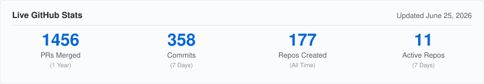

PRs Merged 217 (7 Days) · Longest Streak 82 (1 Year) · Days Active 228/365 (1 Year) · Active Repos 11 (7 Days) · Languages 13 (All Time) · My Issues Closed 63 (1 Year)

---

## June 24, 2026 · 07:08 UTC

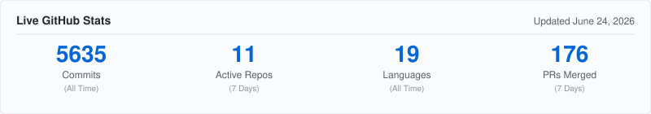

Active Repos 12 (7 Days) · PRs Merged 857 (30 Days) · Days Active 227/365 (1 Year) · Longest Streak 82 (1 Year)

---

## June 23, 2026 · 07:11 UTC

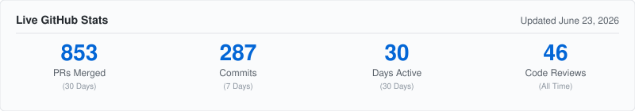

PRs Merged 856 (30 Days) · Active Repos 52 (1 Year) · Commits 1059 (30 Days)

---

## June 22, 2026 · 07:50 UTC



PRs Merged 1348 (1 Year) · Days Active 30/30 (30 Days) · Languages 13 (All Time) · Longest Streak 82 (1 Year)

---

## June 21, 2026 · 07:33 UTC



Languages 10 (1 Year) · Longest Streak 82 (1 Year) · Days Active 225/365 (1 Year) · Active Repos 17 (30 Days)

---

## June 20, 2026 · 07:18 UTC

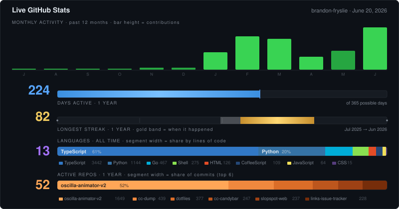

Longest Streak 82 (1 Year) · Languages 13 (All Time) · Days Active 224/365 (1 Year) · Active Repos 52 (1 Year)

---

## June 19, 2026 · 10:10 UTC

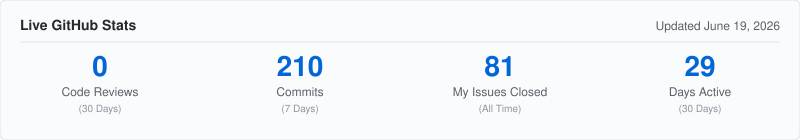

Languages 13 (All Time) · Longest Streak 82 (1 Year) · Active Repos 52 (1 Year) · Days Active 30/30 (30 Days)

---

## June 18, 2026 · 10:03 UTC

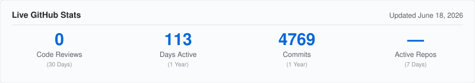

Longest Streak 82 (1 Year) · Commits 260 (7 Days) · PRs Merged 1362 (All Time) · Days Active 223/365 (1 Year) · Active Repos 52 (1 Year)

---

## June 17, 2026 · 10:24 UTC

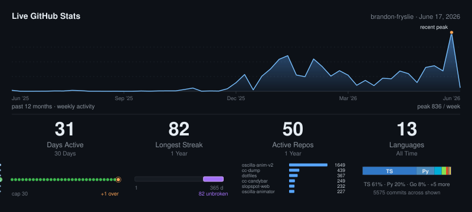

Days Active 31/30 (30 Days) · Longest Streak 82 (1 Year) · Active Repos 50 (1 Year) · Languages 13 (All Time)

---

## June 16, 2026 · 10:50 UTC

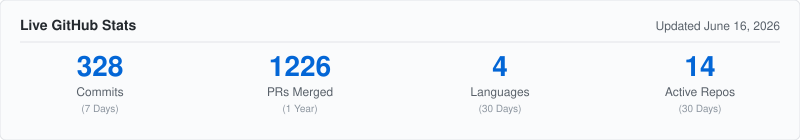

Languages 10 (1 Year) · Days Active 31/30 (30 Days) · Longest Streak 82 (1 Year)

---

## June 15, 2026 · 11:41 UTC



Longest Streak 82 (1 Year) · Days Active 31/30 (30 Days) · PRs Merged 1237 (1 Year) · My Issues Closed 81 (All Time) · Active Repos 15 (30 Days) · Commits 4701 (1 Year)

---

## June 14, 2026 · 09:05 UTC

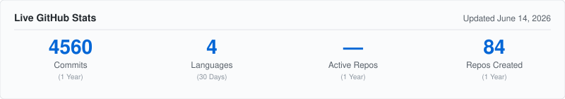

Active Repos 15 (30 Days) · Longest Streak 82 (1 Year) · Languages 10 (1 Year)

---

## June 13, 2026 · 08:45 UTC

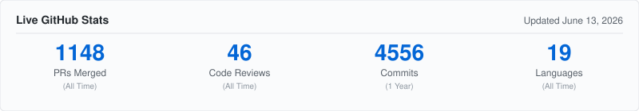

Commits 5132 (All Time) · Languages 5 (30 Days) · Longest Streak 82 (1 Year) · Days Active 218/365 (1 Year)

---

## June 12, 2026 · 09:55 UTC

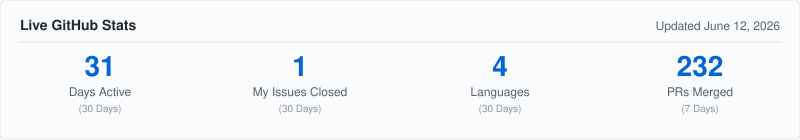

PRs Merged 232 (7 Days) · My Issues Closed 81 (All Time) · Days Active 31/30 (30 Days) · Commits 746 (30 Days)

---

## June 11, 2026 · 10:01 UTC



PRs Merged 230 (7 Days) · Days Active 217/365 (1 Year) · Commits 4516 (1 Year)

---

## June 9, 2026 · 08:57 UTC

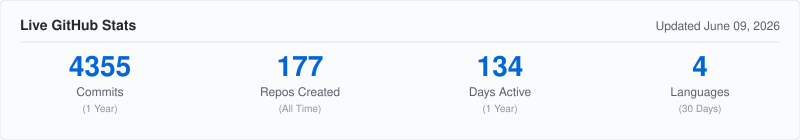

Languages 13 (All Time) · Days Active 30/30 (30 Days) · Longest Streak 82 (1 Year) · Active Repos 15 (30 Days)

---

## June 8, 2026 · 10:12 UTC



Active Repos 10 (7 Days) · Commits 564 (30 Days) · PRs Merged 439 (30 Days)

---

## June 5, 2026 · 07:25 UTC



Languages 10 (1 Year) · Active Repos 52 (1 Year) · Longest Streak 82 (1 Year)

---

## June 4, 2026 · 07:32 UTC

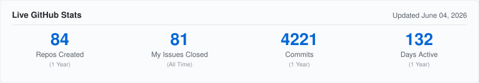

Days Active 214/365 (1 Year) · Active Repos 52 (1 Year) · Languages 13 (All Time) · Longest Streak 82 (1 Year)

---

## June 3, 2026 · 07:35 UTC



Active Repos 53 (1 Year) · Languages 5 (30 Days) · Longest Streak 82 (1 Year) · Days Active 214/365 (1 Year)

---

## June 2, 2026 · 07:31 UTC

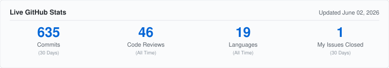

Active Repos 9 (7 Days) · Longest Streak 82 (1 Year) · Commits 4785 (All Time) · My Issues Closed 64 (1 Year)

---

## June 1, 2026 · 07:37 UTC



Longest Streak 82 (1 Year) · Languages 10 (1 Year) · Commits 195 (7 Days) · Active Repos 53 (1 Year) · Days Active 213/365 (1 Year) · My Issues Closed 64 (1 Year)

---

## May 31, 2026 · 07:14 UTC

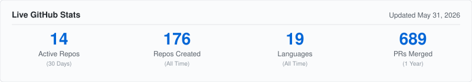

Active Repos 53 (1 Year) · PRs Merged 725 (1 Year) · Days Active 29/30 (30 Days)

---

## May 30, 2026 · 06:57 UTC

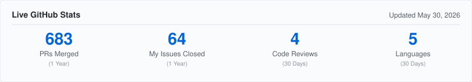

Languages 13 (All Time) · PRs Merged 180 (7 Days) · Active Repos 53 (1 Year) · Commits 4155 (1 Year) · Longest Streak 82 (1 Year) · My Issues Closed 64 (1 Year)

---

## May 29, 2026 · 07:13 UTC

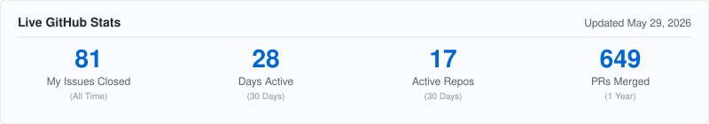

Days Active 212/365 (1 Year) · Longest Streak 82 (1 Year) · Commits 4111 (1 Year)

---

## May 28, 2026 · 07:13 UTC



Active Repos 8 (7 Days) · Languages 10 (1 Year) · Commits 4646 (All Time) · PRs Merged 736 (All Time) · Days Active 29/30 (30 Days)

---

## May 27, 2026 · 07:19 UTC



Longest Streak 82 (1 Year) · Languages 5 (30 Days) · My Issues Closed 1 (30 Days) · Commits 4617 (All Time) · Days Active 29/30 (30 Days) · Active Repos 8 (7 Days)

---

## May 26, 2026 · 07:06 UTC

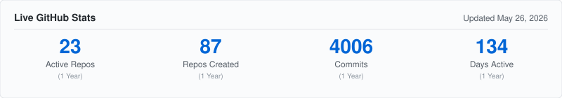

Longest Streak 82 (1 Year) · My Issues Closed 1 (30 Days) · Languages 13 (All Time) · Days Active 29/30 (30 Days) · Commits 4053 (1 Year)

---

## May 25, 2026 · 07:26 UTC

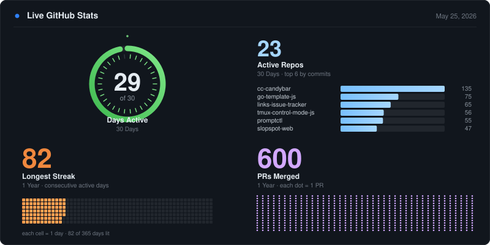

Longest Streak 82 (1 Year) · Days Active 29/30 (30 Days) · PRs Merged 600 (1 Year) · Active Repos 23 (30 Days)

---

## May 24, 2026 · 07:03 UTC



Languages 13 (All Time) · Days Active 29/30 (30 Days) · Active Repos 23 (30 Days) · PRs Merged 619 (All Time) · Longest Streak 82 (1 Year) · Commits 638 (30 Days)

---

## May 23, 2026 · 06:52 UTC

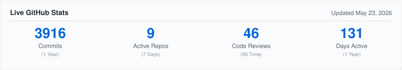

Commits 3956 (1 Year) · Active Repos 9 (7 Days) · My Issues Closed 2 (30 Days)

---

## May 22, 2026 · 07:07 UTC

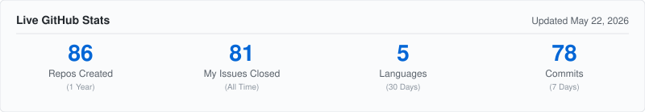

Active Repos 24 (30 Days) · Longest Streak 82 (1 Year) · PRs Merged 177 (30 Days) · Languages 5 (30 Days)

---

## May 21, 2026 · 07:11 UTC



Longest Streak 82 (1 Year) · My Issues Closed 2 (30 Days) · Commits 3903 (1 Year) · Active Repos 25 (30 Days)

---

## May 20, 2026 · 07:07 UTC

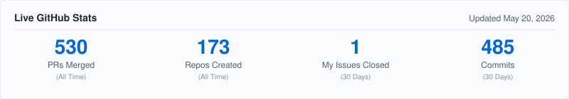

Active Repos 9 (7 Days) · Longest Streak 82 (1 Year) · My Issues Closed 63 (1 Year) · PRs Merged 46 (7 Days) · Languages 6 (30 Days)

---

## May 19, 2026 · 07:07 UTC



Commits 3897 (1 Year) · Languages 13 (All Time) · PRs Merged 152 (30 Days)

---

## May 18, 2026 · 07:14 UTC



Longest Streak 82 (1 Year) · Days Active 29/30 (30 Days) · Active Repos 10 (7 Days) · My Issues Closed 1 (30 Days)

---

## May 17, 2026 · 06:54 UTC

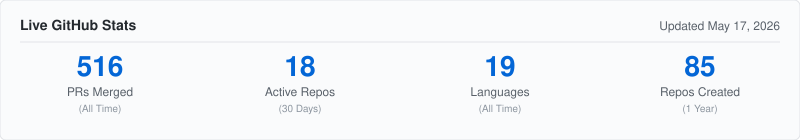

Longest Streak 82 (1 Year) · PRs Merged 36 (7 Days) · Days Active 29/30 (30 Days) · Languages 13 (All Time) · Active Repos 25 (30 Days) · Commits 677 (30 Days)

---

## May 16, 2026 · 06:44 UTC



PRs Merged 136 (30 Days) · Days Active 29 (30 Days) · Commits 543 (30 Days) · Languages 6 (30 Days)

---

## May 15, 2026 · 07:02 UTC

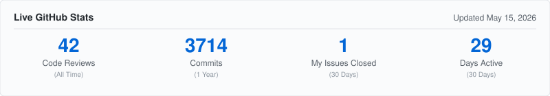

Code Reviews 42 (All Time) · Commits 3714 (1 Year) · My Issues Closed 1 (30 Days) · Days Active 29 (30 Days)

---

## May 14, 2026 · 06:57 UTC



My Issues Closed 64 (1 Year) · Longest Streak 82 (1 Year) · PRs Merged 524 (All Time) · Active Repos 50 (1 Year)

---

## May 13, 2026 · 06:57 UTC



Days Active 28 (30 Days) · Code Reviews 26 (1 Year) · My Issues Closed 80 (All Time) · Repos Created 173 (All Time)

---

## May 12, 2026 · 06:53 UTC



Languages 10 (1 Year) · PRs Merged 448 (1 Year) · Longest Streak 82 (1 Year) · Days Active 197/365 (1 Year) · My Issues Closed 1 (30 Days)

---

## May 11, 2026 · 07:03 UTC



Active Repos 24 (1 Year) · Code Reviews 0 (30 Days) · PRs Merged 410 (1 Year) · Days Active 29 (30 Days)

---

## May 10, 2026 · 06:52 UTC

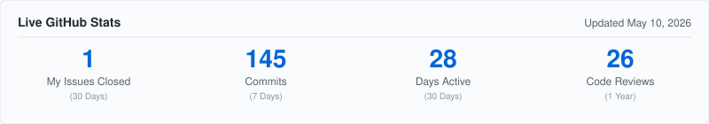

My Issues Closed 1 (30 Days) · Commits 145 (7 Days) · Days Active 28 (30 Days) · Code Reviews 26 (1 Year)

---

## May 9, 2026 · 06:41 UTC

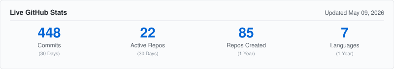

Commits 448 (30 Days) · Active Repos 22 (30 Days) · Repos Created 85 (1 Year) · Languages 7 (1 Year)

---

## May 8, 2026 · 06:34 UTC



PRs Merged 391 (1 Year) · Commits 3499 (1 Year) · My Issues Closed 1 (30 Days) · Code Reviews 26 (1 Year)

---

## May 7, 2026 · 06:55 UTC

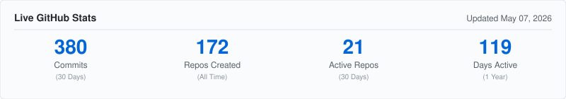

Commits 380 (30 Days) · Repos Created 172 (All Time) · Active Repos 21 (30 Days) · Days Active 119 (1 Year)

---

## May 6, 2026 · 06:52 UTC



My Issues Closed 64 (1 Year) · Commits 3480 (1 Year) · Days Active 28 (30 Days) · Active Repos 10 (7 Days)

---

## May 5, 2026 · 06:42 UTC



My Issues Closed 1 (30 Days) · Languages 7 (30 Days) · PRs Merged 448 (All Time) · Days Active 118 (1 Year)

---

## May 4, 2026 · 06:56 UTC

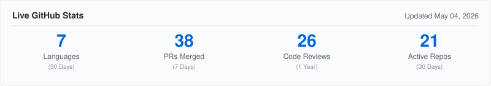

Languages 7 (30 Days) · PRs Merged 38 (7 Days) · Code Reviews 26 (1 Year) · Active Repos 21 (30 Days)

---

## May 3, 2026 · 06:48 UTC



Commits 3454 (1 Year) · PRs Merged 356 (1 Year) · My Issues Closed 80 (All Time) · Repos Created 84 (1 Year)

---

## May 2, 2026 · 06:36 UTC

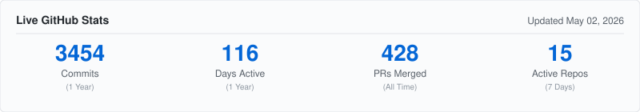

Commits 3454 (1 Year) · Days Active 116 (1 Year) · PRs Merged 428 (All Time) · Active Repos 15 (7 Days)

---

## May 1, 2026 · 06:50 UTC

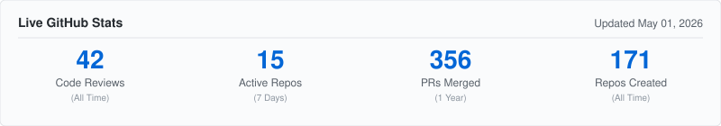

Code Reviews 42 (All Time) · Active Repos 15 (7 Days) · PRs Merged 356 (1 Year) · Repos Created 171 (All Time)

---

## April 30, 2026 · 06:49 UTC



My Issues Closed 64 (1 Year) · Active Repos 20 (30 Days) · Days Active 115 (1 Year) · Code Reviews 0 (30 Days)

---

## April 29, 2026 · 06:46 UTC



Days Active 28 (30 Days) · Active Repos 18 (30 Days) · Repos Created 171 (All Time) · Languages 7 (1 Year)

---

## April 28, 2026 · 06:51 UTC



My Issues Closed 64 (1 Year) · Repos Created 81 (1 Year) · Active Repos 16 (30 Days) · Code Reviews 25 (All Time)

---

## April 27, 2026 · 06:48 UTC

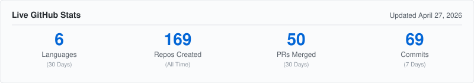

Languages 6 (30 Days) · Repos Created 169 (All Time) · PRs Merged 50 (30 Days) · Commits 69 (7 Days)

---

## April 26, 2026 · 10:20 UTC



Active Repos 16 (30 Days) · Days Active 112 (1 Year) · Repos Created 81 (1 Year) · Code Reviews 26 (1 Year)

---

## April 26, 2026 · 06:39 UTC



Active Repos 15 (30 Days) · Days Active 111 (1 Year) · Repos Created 81 (1 Year) · Code Reviews 26 (1 Year)

---

## April 25, 2026 · 21:52 UTC



Languages 6 (1 Year) · Days Active 26 (30 Days) · Active Repos 8 (7 Days) · Commits 316 (30 Days)

---

## April 25, 2026 · 08:28 UTC



Languages 6 (1 Year) · Days Active 26 (30 Days) · Active Repos 7 (7 Days) · Commits 311 (30 Days)

---

## April 25, 2026 · 06:34 UTC



Languages 6 (1 Year) · Days Active 25 (30 Days) · Active Repos 6 (7 Days) · Commits 317 (30 Days)

---

## April 25, 2026 · 05:10 UTC

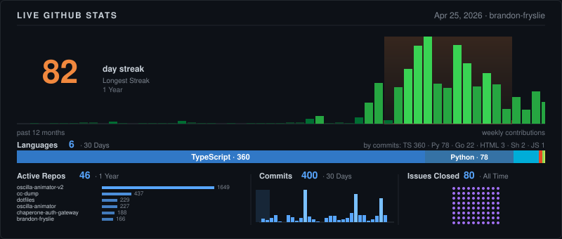

Languages 6 (1 Year) · Days Active 25 (30 Days) · Active Repos 6 (7 Days) · Commits 316 (30 Days)

---

## April 24, 2026 · 23:57 UTC

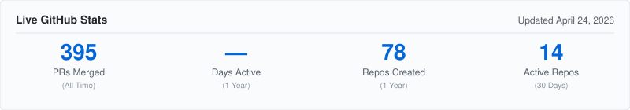

PRs Merged 395 (All Time) · Days Active — (1 Year) · Repos Created 78 (1 Year) · Active Repos 14 (30 Days)

---

## April 24, 2026 · 22:54 UTC



PRs Merged 392 (All Time) · Days Active — (1 Year) · Repos Created 77 (1 Year) · Active Repos 13 (30 Days)

---

## April 24, 2026 · 22:37 UTC



PRs Merged 390 (All Time) · Days Active — (1 Year) · Repos Created 77 (1 Year) · Active Repos 13 (30 Days)

---

## March 17, 2026 · 06:29 UTC



Repositories 100 · Stars 23 · Commits (30d) 841 · Years Active 14+

---

## March 16, 2026 · 06:40 UTC

Repositories 100 · Stars 23 · Commits (30d) 854 · Years Active 14+

---

## March 15, 2026 · 06:27 UTC



Repositories 100 · Stars 23 · Commits (30d) 886 · Years Active 14+

---

## March 14, 2026 · 06:21 UTC

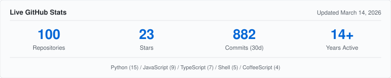

Repositories 100 · Stars 23 · Commits (30d) 882 · Years Active 14+

---

## March 13, 2026 · 06:23 UTC

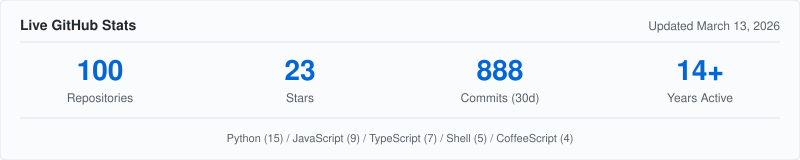

Repositories 100 · Stars 23 · Commits (30d) 888 · Years Active 14+

---

## March 12, 2026 · 06:24 UTC

Repositories 100 · Stars 23 · Commits (30d) 927 · Years Active 14+

---

## March 11, 2026 · 06:23 UTC



Repositories 100 · Stars 23 · Commits (30d) 938 · Years Active 14+

---

## March 10, 2026 · 06:21 UTC



Repositories 100 · Stars 23 · Commits (30d) 897 · Years Active 14+

---

## March 9, 2026 · 06:29 UTC

Repositories 100 · Stars 23 · Commits (30d) 886 · Years Active 14+

---

## March 8, 2026 · 06:19 UTC



Repositories 100 · Stars 23 · Commits (30d) 882 · Years Active 14+

---

## March 7, 2026 · 06:15 UTC

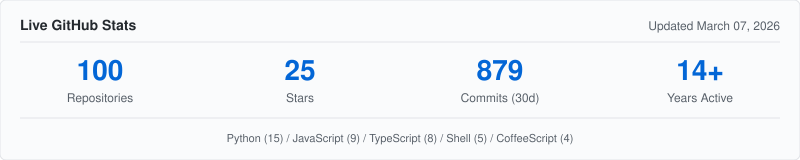

Repositories 100 · Stars 25 · Commits (30d) 879 · Years Active 14+

---

## March 6, 2026 · 06:21 UTC



Repositories 100 · Stars 25 · Commits (30d) 909 · Years Active 14+

---

## March 5, 2026 · 06:23 UTC



Repositories 100 · Stars 25 · Commits (30d) 964 · Years Active 14+

---

## March 4, 2026 · 06:21 UTC

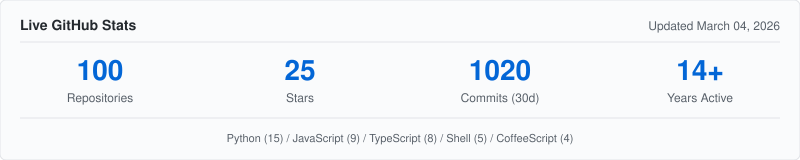

Repositories 100 · Stars 25 · Commits (30d) 1020 · Years Active 14+

---

## March 3, 2026 · 06:23 UTC

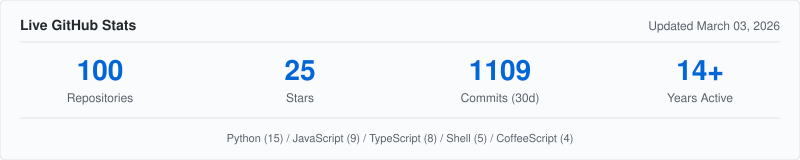

Repositories 100 · Stars 25 · Commits (30d) 1109 · Years Active 14+

---

## March 2, 2026 · 06:26 UTC



Repositories 100 · Stars 25 · Commits (30d) 1138 · Years Active 14+

---

## March 1, 2026 · 06:20 UTC



Repositories 100 · Stars 25 · Commits (30d) 1222 · Years Active 14+

---

## February 28, 2026 · 06:13 UTC



Repositories 100 · Stars 25 · Commits (30d) 1248 · Years Active 14+

---

## February 27, 2026 · 06:23 UTC



Repositories 100 · Stars 25 · Commits (30d) 1291 · Years Active 14+

---

## February 26, 2026 · 06:27 UTC

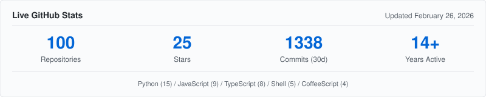

Repositories 100 · Stars 25 · Commits (30d) 1338 · Years Active 14+

---

## February 25, 2026 · 06:30 UTC

Repositories 100 · Stars 25 · Commits (30d) 1366 · Years Active 14+

---

## February 24, 2026 · 06:28 UTC



Repositories 100 · Stars 25 · Commits (30d) 1311 · Years Active 14+

---

## February 23, 2026 · 06:31 UTC



Repositories 100 · Stars 25 · Commits (30d) 1226 · Years Active 14+

---

## February 22, 2026 · 06:21 UTC



Repositories 100 · Stars 25 · Commits (30d) 1172 · Years Active 14+

---

## February 21, 2026 · 06:18 UTC

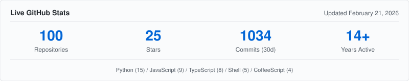

Repositories 100 · Stars 25 · Commits (30d) 1034 · Years Active 14+

---

## February 20, 2026 · 06:25 UTC

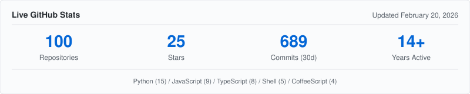

Repositories 100 · Stars 25 · Commits (30d) 689 · Years Active 14+

---

## February 19, 2026 · 06:28 UTC

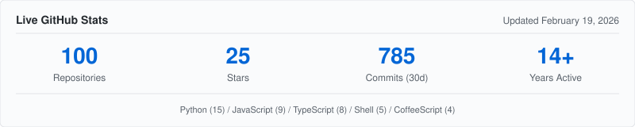

Repositories 100 · Stars 25 · Commits (30d) 785 · Years Active 14+

---

## February 18, 2026 · 06:29 UTC



Repositories 100 · Stars 25 · Commits (30d) 842 · Years Active 14+

---

## February 17, 2026 · 06:27 UTC



Repositories 100 · Stars 25 · Commits (30d) 920 · Years Active 14+

---

## February 16, 2026 · 06:31 UTC



Repositories 100 · Stars 25 · Commits (30d) 960 · Years Active 14+

---

## February 15, 2026 · 06:23 UTC



Repositories 100 · Stars 25 · Commits (30d) 978 · Years Active 14+

---

## February 14, 2026 · 06:19 UTC



Repositories 100 · Stars 25 · Commits (30d) 989 · Years Active 14+

---

## February 14, 2026 · 02:21 UTC



Repositories 71 · Stars 78 · Commits (30d) 150 · Years Active 15+

---

## February 14, 2026 · 01:22 UTC

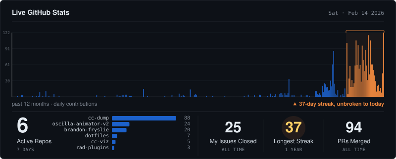

Repositories 71 · Stars 78 · Commits (30d) 150 · Years Active 15+

---
<!-- STATS-GALLERY:END -->
